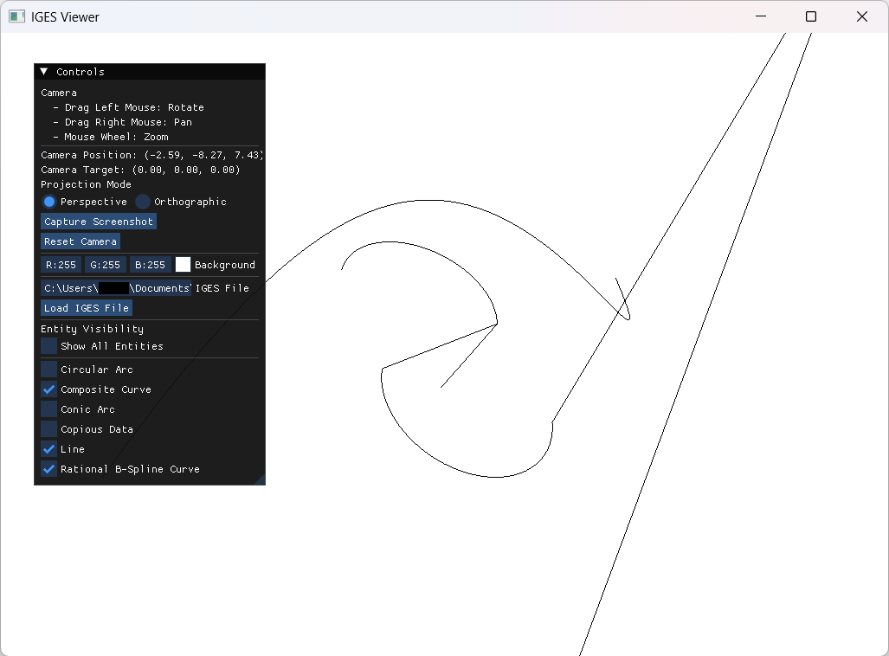

# IGESio C++ Library

[](https://github.com/YayoiHabami/IGESio/actions)
[](https://codecov.io/github/YayoiHabami/IGESio)
[](LICENSE)

For English documentation, see [README.md](README.md).

## 概要

IGESioは、IGES (Initial Graphics Exchange Specification) ファイルフォーマットを扱うためのモダンなC++ライブラリです。本ライブラリは、IGES 5.3 仕様に基づいてIGESファイルの入出力、描画、および関連データの操作機能を包括的に提供します。

現在のバージョンは [`igesio::GetVersion()`](src/common/versions.cpp) で確認できます (例: 0.5.0)。

ライブラリの設計方針やIGES仕様の解釈については、[docs/policy_ja.md](docs/policy_ja.md) を参照してください。

また、現在の実装状況については、[docs/implementation_progress.md](docs/implementation_progress.md) を参照してください。

<!-- omit in toc -->
## Table of Contents

- [概要](#概要)
- [主な機能](#主な機能)
- [使用方法](#使用方法)
  - [GUIアプリケーションへの組み込み例](#guiアプリケーションへの組み込み例)
  - [IGESファイルの入出力](#igesファイルの入出力)
  - [エンティティの作成](#エンティティの作成)
- [要求システム](#要求システム)
  - [動作確認環境](#動作確認環境)
  - [環境セットアップ](#環境セットアップ)
    - [Windows環境](#windows環境)
    - [Ubuntu環境](#ubuntu環境)
  - [Third-Party Dependencies](#third-party-dependencies)
- [ビルド方法](#ビルド方法)
- [ディレクトリ構造](#ディレクトリ構造)
- [ドキュメント](#ドキュメント)
- [著作権・ライセンス](#著作権ライセンス)

## 主な機能

　IGESioライブラリでは、主に以下のような機能を提供します：

- **IGESファイルの入出力**: [`igesio::ReadIges`](src/reader.cpp)/[`igesio::WriteIges`](src/writer.cpp) による入出力
- **エンティティのサポート**: 円弧や直線のような基本的なエンティティから、NURBS曲線・曲面まで、様々なエンティティをサポート
  - すべてのエンティティは`EntityBase`クラスを基底とした、共通のインターフェースを持つクラスとして実装（[実装状況](docs/implementation_progress.md) / [詳細説明](docs/entities/entities_ja.md)）
  - すべての曲線・曲面エンティティに、パラメトリックな操作や微分、法線の計算など、共通のジオメトリ計算機能を提供（[ジオメトリ計算機能の詳細](docs/entities/geometric_properties_ja.md)）
  - 未対応のエンティティを含むIGESファイルも読み込み可能（[`UnsupportedEntity`クラス](docs/entities/entities_ja.md#unsupportedentity)として読み込まれ、パラメータは取得/変更可能）
- **エンティティの描画**: OpenGLを使用したエンティティの視覚化
  - GUIに依存した処理を分離しているため、GUIアプリケーションへの統合が容易

## 使用方法

### GUIアプリケーションへの組み込み例

　本ライブラリを使用してIGESファイルを読み込み、OpenGLで描画するシンプルなGUIアプリケーションの例として、[IGES viewer](docs/examples_ja.md#gui)を実装しています。このアプリケーションは、ImGuiとGLFWを使用しており、IGESioにより描画機能を提供しています。



### IGESファイルの入出力

　本ライブラリでは、`igesio::ReadIges`および`igesio::WriteIges`関数を使用して、IGESファイルの読み込みと書き出しを行います。以下は、基本的な使用例です。両関数ともに戻り値/引数は`igesio::models::IgesData`型であり、IGESファイルの全データを保持します。

　本ライブラリで未対応（未実装）のエンティティは`igesio::entities::UnsupportedEntity`クラスとして読み込まれます。このクラスでは、各パラメータはパースされて読み込まれますが、エンティティ固有の機能は提供されません。このクラスの詳細については、[entities/UnsupportedEntity](docs/entities/entities_ja.md#UnsupportedEntity)を参照してください。

```cpp
#include <iostream>
#include <unordered_map>
#include <igesio/reader.h>
#include <igesio/writer.h>

// IGESファイルの読み込み
auto data = igesio::ReadIges("path/to/file.igs");

// エンティティタイプごとに数をカウント
// また、本ライブラリがサポート（実装）しているかどうかも確認
std::unordered_map<igesio::entities::EntityType, int> type_counts;
std::unordered_map<igesio::entities::EntityType, bool> is_supported;
for (const auto& [id, entity] : data.GetEntities()) {
    type_counts[entity->GetType()]++;
    is_supported[entity->GetType()] = entity->IsSupported();
}

// IGESファイルの書き出し
// 未対応のエンティティが含まれている場合DataFormatError例外が投げられる
try {
    auto success = igesio::WriteIges(data, "path/to/output.igs");
    if (!success) {
        std::cerr << "Failed to write IGES file." << std::endl;
    }
} catch (const igesio::DataFormatError& e) {
    std::cerr << "Data format error: " << e.what() << std::endl;
}
```

　本ライブラリのデータ構造については、[クラス構造](docs/class_structure_ja.md)を参照して下さい。また、基本的な使用方法については、[examples](docs/examples_ja.md)および[entities](docs/entities/entities_ja.md)を参照してください。

### エンティティの作成

　本ライブラリでは、プログラム上でエンティティを作成することも可能です。以下は、中心点が $(3, 0)$、半径が $1$ の円を作成し、色を設定してからIGESファイルに書き出す例です。エンティティごとの作成例については、[entities](docs/entities/entities_ja.md)を参照してください。

```cpp
#include <memory>
#include <array>
#include <iostream>
#include <igesio/entities/curves/circular_arc.h>
#include <igesio/entities/structures/color_definition.h>
#include <igesio/writer.h>

// Circular Arcエンティティを作成
// 中心点 (3.0, 0.0)、半径 1.0 の円
auto circle = std::make_shared<igesio::entities::CircularArc>(
        igesio::Vector2d{3.0, 0.0}, 1.0);

// Color Definitionエンティティを使用して色を設定 (≈ #4C7FFF)
auto color_def = std::make_shared<igesio::entities::ColorDefinition>(
        std::array<double, 3>{30.0, 50.0, 100.0}, "Bright Blue");
circle->OverwriteColor(color_def);

// IgesDataクラスを作成してエンティティを追加
igesio::models::IgesData iges_data;
iges_data.AddEntity(color_def);
iges_data.AddEntity(circle);

// IGESファイルに書き出し
auto success = igesio::WriteIges(iges_data, "created_circle.igs");
if (!success) {
    std::cerr << "Failed to write IGES file." << std::endl;
}
```

## 要求システム

IGESioライブラリをビルドするには以下の環境が必要です：

- **C++17 対応コンパイラ**: モダンなC++機能を使用するため
- **CMake 3.14以上**: ビルドシステムとして使用

### 動作確認環境

このライブラリは以下の環境でビルドとテストを確認しています：

| OS | Compilers |
|----|----|
|  |   |
|  |    |
|  <sup>*1</sup> |   |

> **クロスプラットフォーム対応**: このライブラリはWindows、Ubuntu、macOSで動作確認済みです。
>
> - **他のLinux環境**: 類似の環境（GCC、CMakeが利用可能なLinuxディストリビューション）では動作する可能性が高いですが、未検証です
> - **コンパイラ**: GCC、Clang、MSVC（Windows）での動作を確認済みです

> *1: 本ライブラリではOpenGL4.3以降を要求していますが、macOSではOpenGL4.1までのサポートとなっているため、ほとんどグラフィックス機能は利用できません

### 環境セットアップ

#### Windows環境

1. **MinGW-W64**をインストール
2. **CMake**をインストール（[公式サイト](https://cmake.org/)から）
3. **Ninja**をインストール（オプション、`build.bat`使用時のみ必要）

#### Ubuntu環境

```bash
# 必要なパッケージのインストール
sudo apt update
sudo apt install build-essential cmake ninja-build

# バージョン確認
gcc --version
cmake --version
ninja --version
```

### Third-Party Dependencies

このライブラリには、互換性のあるライセンスを持つオプションの依存関係が含まれています：

| ライブラリ | ライセンス | 用途 | オプション |
|-----------|-----------|------|-----------|
| [Eigen3](https://eigen.tuxfamily.org/) | MPL-2.0 | 線形代数演算 | Yes (`-DIGESIO_ENABLE_EIGEN=OFF` で無効化) |
| [Google Test](https://github.com/google/googletest) | BSD-3-Clause | 単体テスト | Yes (`IGESIO_BUILD_TESTING` 有効時のみ) |
| [glad](https://github.com/Dav1dde/glad) | MIT, Apache-2.0 | OpenGLローダー | Yes (`IGESIO_ENABLE_GRAPHICS` または `IGESIO_BUILD_GUI` 有効時のみ) |
| [glfw](https://www.glfw.org/) | Zlib | ウィンドウ作成と入力処理 | Yes (`IGESIO_BUILD_GUI` 有効時のみ) |
| [imgui](https://github.com/ocornut/imgui) | MIT | GUI作成 | Yes (`IGESIO_BUILD_GUI` 有効時のみ) |
| [stb](https://github.com/nothings/stb) | MIT | 画像読み込み・書き出し | Yes (`IGESIO_ENABLE_TEXTURE_IO` 有効時のみ) |

**ライセンス互換性**: すべての依存関係はMITと互換性のあるライセンスを使用しています。完全なライセンステキストについては [THIRD_PARTY_LICENSES](THIRD_PARTY_LICENSES.md) を参照してください。

**注意**:
- Eigenはヘッダーオンリーライブラリで、明示的に有効化された場合のみインクルードされます
- Google Testは開発時のみ使用され、ライブラリと一緒に配布されません
- gladは`IGESIO_ENABLE_GRAPHICS`または`IGESIO_BUILD_GUI`が有効な場合のみ含まれます。gladのソースコードはMITライセンス、Khronos XML API RegistryはApache License 2.0でライセンスされています
- このライブラリはサードパーティの依存関係なしでビルドできます

## ビルド方法

IGESioライブラリは、CMakeの`FetchContent`を利用して簡単にプロジェクトに組み込むことができます。例えば、以下のように`CMakeLists.txt`を記述することで、IGESioを依存ライブラリとして利用できます。

````cmake
cmake_minimum_required(VERSION 3.16)
project(my_project)

# FetchContentを使用してIGESioを取得
include(FetchContent)
FetchContent_Declare(
    igesio
    GIT_REPOSITORY https://github.com/YayoiHabami/IGESio.git
    GIT_TAG main
)

# EigenおよびOpenGLサポートの下でIGESioを有効化
set(IGESIO_ENABLE_EIGEN ON)
set(IGESIO_ENABLE_GRAPHICS ON)
FetchContent_MakeAvailable(igesio)

# 実行ファイルを作成
add_executable(my_app main.cpp)
target_link_libraries(my_app PRIVATE IGESio::IGESio)
````

より詳細な情報やCMakeオプションについては、[docs/build_ja.md](docs/build_ja.md)を参照してください。

また、コード例の実行やテストのために、リポジトリをクローンしてスタンドアロンでビルドすることも可能です。Windows環境では、`build.bat`スクリプトを、Linux環境では`build.sh`スクリプトを使用してビルドできます。

````bat
.\build.bat debug ex
````

```bash
./build.sh debug ex
```

詳細はdocs/build_ja.mdをご覧ください。

## ディレクトリ構造

```
IGESio/
├── build.bat, build.sh          # WindowsおよびLinux用のビルドスクリプト
├── CMakeLists.txt               # メインのCMakeビルドスクリプト
├── ...
├── examples/                    # 使用例
│   └── gui/                     # GUIを追加した例
│
├── include/                     # 公開ヘッダファイル
│   └── igesio/
│   │   ├── common/              # 共通モジュール (メタデータ、エラー処理等)
│   │   ├── numerics/            # 数値計算モジュール
│   │   ├── utils/               # ユーティリティモジュール
│   │   └── entities/            # エンティティ関連モジュール
│   │       ├── interfaces/      # -- エンティティ共通インターフェース
│   │       ├── de/              # -- Directory Entryセクション用のクラス
│   │       ├── structures/      # -- 構造エンティティ
│   │       ├── transformations/ # -- Transformation Matrix (Type 124) 用
│   │       ├── curves/          # -- 曲線エンティティ
│   │       ├── surfaces/        # -- 曲面エンティティ
│   │       └── ...
│   ├── models/                  # データモデル関連モジュール
│   ├── graphics/                # 描画関連モジュール (OpenGL; GUIは含まない)
│   ├── reader.cpp               # IGESファイル読み込み実装
│   └── writer.cpp               # IGESファイル書き出し実装
│
├── src/                         # ソースファイル
├── tests/                       # テストコード
│   └── test_data/               # テスト用データ (IGESファイル等)
├── docs/                        # ドキュメント
└── build/                       # ビルド成果物
```

## ドキュメント

プロジェクトに関する詳細なドキュメントは `docs`ディレクトリに含まれています。[index](docs/index_ja.md)を参照して下さい。

## 著作権・ライセンス

このライブラリは、MITライセンスの下で提供されています。詳細は [LICENSE](LICENSE) ファイルを参照してください。本ライブラリが使用するサードパーティの依存関係については、[THIRD_PARTY_LICENSES](THIRD_PARTY_LICENSES.md) を参照してください。

&copy; 2025 Yayoi Habami
