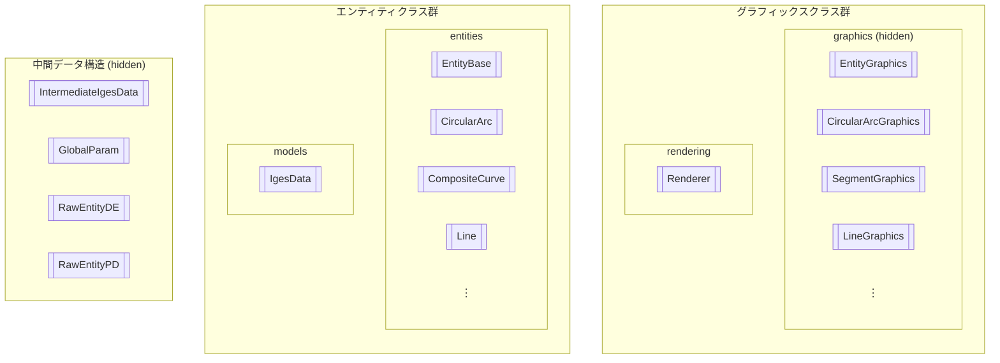

# Class Structure

## Table of Contents

- [Table of Contents](#table-of-contents)
- [Overview](#overview)
  - [1. Intermediate Data Structures](#1-intermediate-data-structures)
  - [2. Entity Classes](#2-entity-classes)
  - [3. Graphics Classes](#3-graphics-classes)
- [4. Other Non-Entity Classes](#4-other-non-entity-classes)
- [Intermediate Data Structures](#intermediate-data-structures)
  - [About Intermediate Products](#about-intermediate-products)

## Overview

The classes in the IGESio library mainly consist of the following three components:

### 1. Intermediate Data Structures

> See [Intermediate Data Structures](./intermediate_data_structure.md) for details.

These data structures are generated internally during IGES file input/output. They represent the structure described in the IGES file as is, using C++ structures. Because of their limited operability, **users typically do not directly manipulate them.**

It is possible to explicitly handle intermediate data structures by directly manipulating the `igesio::ReadIgesIntermediate` and `igesio::WriteIgesIntermediate` functions.

### 2. Entity Classes

> See [Entities](./entities/entities.md) for details.

This is a group of classes that represent each entity described in the IGES file. With the `igesio::entities::EntityBase` class as the base class, derived classes corresponding to each entity type are defined. Entity classes are mutually converted with intermediate data structures during IGES file input/output.

Entity classes are managed by data structures (models) that organize multiple entities. For example, data input/output from files uses the `igesio::ReadIges` and `igesio::WriteIges` functions, and the `igesio::models::IgesData` class is used as its return value/argument. Users can directly manipulate entity classes to generate, edit, and analyze IGES data.

See the Entities document above and [Examples](./examples.md) for usage instructions.

### 3. Graphics Classes

This is a group of classes that generate data structures for 3D graphics rendering based on the geometry information of entity classes. One or more graphics classes correspond to one entity class. Each graphics class is defined with the `igesio::graphics::EntityGraphics` class as the base class.

- Example:
    - `CircularArc` (entity) → `CircularArcGraphics`
    - `Line` (entity) → `SegmentGraphics` (line segment, half-line), `LineGraphics` (infinite line)

Since these graphics classes are generated and managed by the `igesio::graphics::Renderer` class, users typically do not directly manipulate them. The `Renderer` class is responsible for adding, deleting, and updating entities to be drawn, as well as camera operations and rendering processes. Users control 3D graphics rendering through instances of the `Renderer` class.

## 4. Other Non-Entity Classes

| Path | Class Name | Description |
| --- | --- | --- |
| `igesio/common/matrix.h` | `Matrix2d`, `Matrix23d`, `Matrix32d`, `Matrix3d`, `Matrix2Xd`, `Matrix3Xd`, `Vector2d`, `Vector3d` | Fixed-size and dynamically-sized matrix classes. See [here](./common/matrix.md) for details. |

## Intermediate Data Structures

### About Intermediate Products

When an IGES file is read, the following class instances are created internally first:

| Class Name | Intermediate Product | Description |
| --- | :-: | --- |
| `std::string` | No | String of the Start section of the IGES file |
| `models::GlobalParam` | No | Class that holds parameters of the Global section of the entire IGES file |
| `entities::RawEntityDE` | Yes | Class that holds each record of the Directory Entry section of the IGES file as is |
| `entities::RawEntityPD` | Yes | Class that holds each record of the Parameter Data section of the IGES file as is |

Next, the [entity classes](#ientity-inherited-classes) (classes inheriting `IEntity`) are generated using `GlobalParam` and the intermediate products. From the intermediate products,

> Actually, it is assumed that the `IgesData` class is created by specifying the path of the IGES file and reading it. Just in case, functions that return each intermediate product are included in the public part so that users can use the IGES file information almost as is (`ReadIgesIntermediate`, etc.). However, since the IGES file reading process in this library is basically hidden in the `IgesData` class, it is not assumed that users directly manipulate the intermediate products.
>
> The function that returns the `IgesData` class, which users are actually supposed to use, is `igesio::ReadIges`, and it is distinguished from the `igesio::ReadIgesIntermediate` function, which returns four types of data including the above intermediate products.