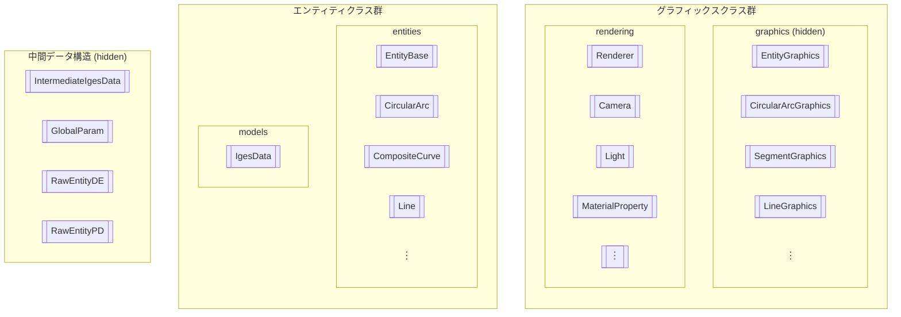

# クラス構造

## 目次

- [目次](#目次)
- [概要](#概要)
  - [1. 中間データ構造](#1-中間データ構造)
  - [2. エンティティクラス群](#2-エンティティクラス群)
  - [3. グラフィックスクラス群](#3-グラフィックスクラス群)
- [4. その他非エンティティクラス](#4-その他非エンティティクラス)
- [中間データ構造](#中間データ構造)
  - [中間生成物について](#中間生成物について)

## 概要

　IGESioライブラリのクラスは、主に以下の3つのコンポーネントで構成されています。

### 1. 中間データ構造

> 詳細は[中間データ構造](./intermediate_data_structure_ja.md)を参照してください。

　IGESファイルの入出力の際に内部生成されるデータ構造です。IGESファイルのに記述される構造を、そのままC++の構造体で表現しています。操作性は低いため、**ユーザーが直接操作することは通常ありません**。

　`igesio::ReadIgesIntermediate`、`igesio::WriteIgesIntermediate`関数を直接操作することで、明示的に中間データ構造を扱うことも可能です。

### 2. エンティティクラス群

> 詳細は[Entities](./entities/entities_ja.md)を参照してください。

　IGESファイルに記述される各エンティティを表現するクラス群です。`igesio::entities::EntityBase`クラスを基底クラスとして、各エンティティタイプに対応する派生クラスが定義されています。エンティティクラスは、IGESファイルの入出力の際に中間データ構造と相互変換されます。

　エンティティクラスは、複数のエンティティを取りまとめるデータ構造（models）によって管理されます。例えば、ファイルからのデータの入出力は`igesio::ReadIges`、`igesio::WriteIges`関数を利用し、その戻り値/引数として`igesio::models::IgesData`クラスが使用されます。ユーザーは、エンティティクラスを直接操作して、IGESデータを生成・編集・解析することができます。

　使用方法については、上記Entitiesドキュメントおよび[Examples](./examples_ja.md)を参照してください。

### 3. グラフィックスクラス群

　エンティティクラスのジオメトリ情報を基に、3Dグラフィックス描画用のデータ構造を生成するクラス群です。一つのエンティティクラスに対して、一つまたは複数のグラフィックスクラスが対応します。各グラフィックスクラスは`igesio::graphics::EntityGraphics`クラスを基底クラスとして定義されます。

- 例:
  - `CircularArc` (エンティティ) → `CircularArcGraphics`
  - `Line` (エンティティ) → `SegmentGraphics` (線分、半直線)、`LineGraphics` (無限直線)

　これらのグラフィックスクラスは`igesio::graphics::Renderer`クラスで生成・管理されるため、ユーザーは直接操作することは通常ありません。`Renderer`クラスは、描画するエンティティの追加・削除・更新や、カメラ操作、描画処理を担当します。ユーザーは`Renderer`クラスのインスタンスを通じて、3Dグラフィックス描画を制御します。

## 4. その他非エンティティクラス

| パス | クラス名 | 説明 |
| --- | --- | --- |
| `igesio/numerics/matrix.h` | `Matrix2d`, `Matrix23d`, `Matrix32d`, `Matrix3d`, `Matrix2Xd`, `Matrix3Xd`, `Vector2d`, `Vector3d` | 固定サイズおよび動的サイズの行列クラス 詳細は[こちら](./numerics/matrix_ja.md) |

## 中間データ構造

### 中間生成物について

　IGESファイルを読み込んだ場合、内部的に、以下のクラスインスタンスを最初に作成します。

| クラス名 | 中間生成物 | 説明 |
| --- | :-: | --- |
| `std::string` | No | IGESファイルのStartセクションの文字列 |
| `models::GlobalParam` | No | IGESファイル全体のGlobalセクションのパラメータを保持するクラス |
| `entities::RawEntityDE` | Yes | IGESファイルのDirectory Entryセクションの各レコードをそのまま保持するクラス |
| `entities::RawEntityPD` | Yes | IGESファイルのParameter Dataセクションの各レコードをそのまま保持するクラス |

　次に、`GlobalParam`および中間生成物を用いて、[各エンティティクラス](#ientity継承クラス)（`IEntity`を継承するクラス）を生成します。中間生成物から

> 実際には、`IgesData`クラスを作成する際に、IGESファイルのパスを指定して読み込むことを想定しています。念のため、ユーザーがIGESファイルの情報をほぼそのまま使用可能なように、各中間生成物を戻り値とする関数を公開部分に含めています（`ReadIgesIntermediate`等）。ただ、本ライブラリにおけるIGESファイルの読み込み処理は、基本的に`IgesData`クラスに隠蔽するため、ユーザーが直接中間生成物を操作することは想定していません。
>
> 実際にユーザーが使用することを想定している`IgesData`クラスを戻り値とする関数は`igesio::ReadIges`であり、上記の中間生成物を含む4種類のデータを返す`igesio::ReadIgesIntermediate`関数とは区別しています。
