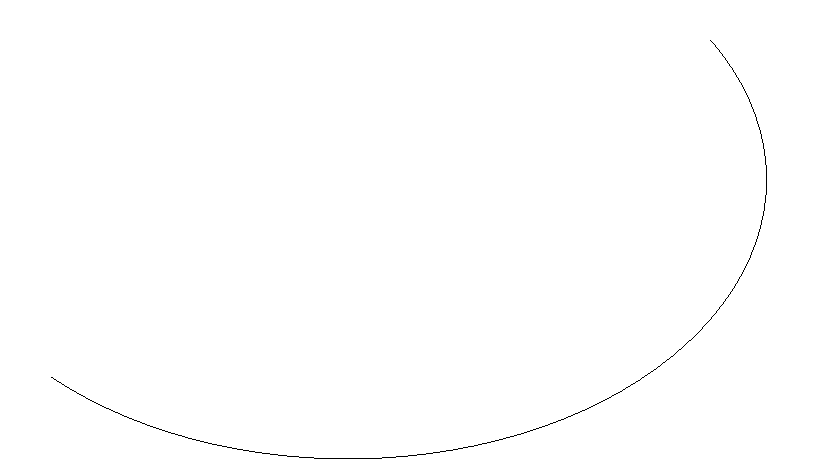
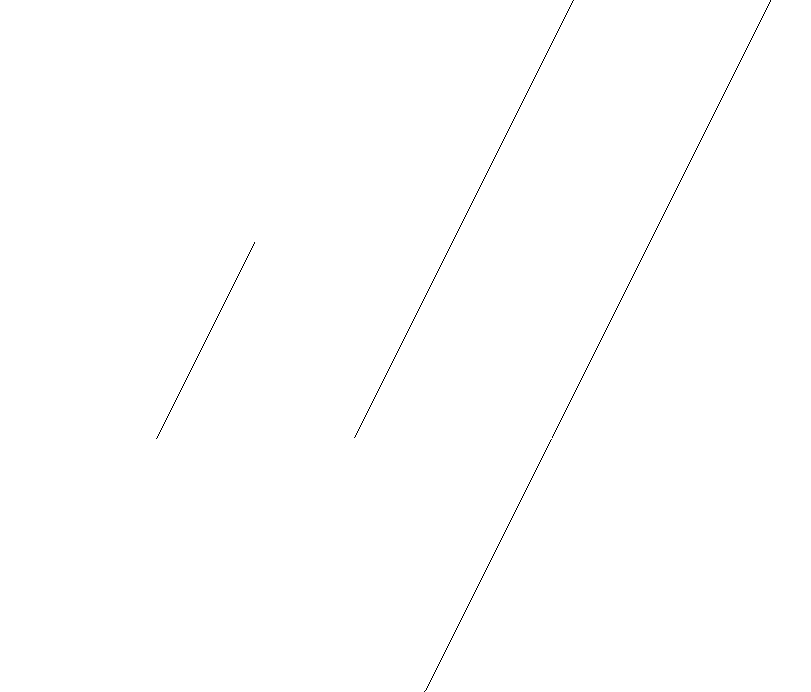
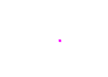
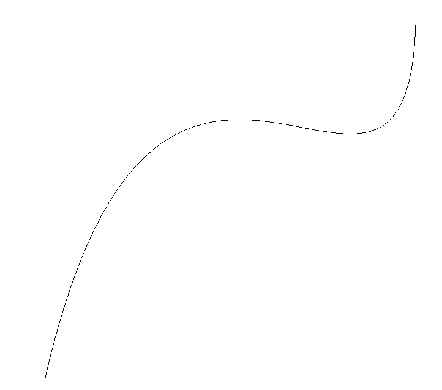

# Entities

This document covers the interfaces for specific entities and individual entity classes. For `IEntityIdentifier`, which all classes inherit, see [here](entity_base_class_architecture.md#ientityidentifier). Also, for `EntityBase`, which individual entity classes inherit, see [here](entity_base_class_architecture.md#entitybase).

## Table of Contents

- [Table of Contents](#table-of-contents)
- [Interfaces](#interfaces)
  - [`ICurve`](#icurve)
  - [`ICurve2D`](#icurve2d)
  - [`ICurve3D`](#icurve3d)
  - [`ISurface`](#isurface)
  - [`ITransformation`](#itransformation)
  - [`IColorDefinition`](#icolordefinition)
- [Annotations](#annotations)
- [Structures](#structures)
  - [`UnsupportedEntity`](#unsupportedentity)
  - [`NullEntity` (type 0)](#nullentity-type-0)
  - [`ColorDefinition` (type 314)](#colordefinition-type-314)
- [Curves](#curves)
  - [`CircularArc` (type 100)](#circulararc-type-100)
  - [`CompositeCurve` (type 102)](#compositecurve-type-102)
  - [`ConicArc` (type 104)](#conicarc-type-104)
  - [Copious Data (type 106)](#copious-data-type-106)
    - [`CopiousDataBase` (type 106)](#copiousdatabase-type-106)
    - [`CopiousData` (type 106, forms 1-3)](#copiousdata-type-106-forms-1-3)
    - [`LinearPath` (type 106, forms 11-13)](#linearpath-type-106-forms-11-13)
  - [`Line` (type 110)](#line-type-110)
  - [`ParametricSplineCurve` (type 112)](#parametricsplinecurve-type-112)
  - [`Point` (type 116)](#point-type-116)
  - [`RationalBSplineCurve` (type 126)](#rationalbsplinecurve-type-126)
- [Surfaces](#surfaces)
  - [`RuledSurface` (type 118)](#ruledsurface-type-118)
  - [`SurfaceOfRevolution` (type 120)](#surfaceofrevolution-type-120)
  - [`TabulatedCylinder` (type 122)](#tabulatedcylinder-type-122)
  - [`RationalBSplineSurface` (type 128)](#rationalbsplinesurface-type-128)
- [Transformations](#transformations)
  - [`TransformationMatrix` (type 124)](#transformationmatrix-type-124)

## Interfaces

Entities described in IGES files implement corresponding interfaces according to their type. These interfaces define the basic characteristics and operations of the entities. By implementing these interfaces, concrete entity classes can handle entities in a unified manner.

These interfaces are also used as pointer types to entities that an entity refers to for a specific function. For example, `CompositeCurve` refers to multiple curves, and the references to each entity are held as pointers of type `ICurve`.

### `ICurve`

> Defined at [i_curve.h](../../include/igesio/entities/interfaces/i_curve.h)

> Ancestor class:
> ```plaintext
> IEntityIdentifier <─── ICurve
> ```

### `ICurve2D`

> Defined at [i_curve.h](../../include/igesio/entities/interfaces/i_curve.h)

> Ancestor classes:
> ```plaintext
> IEntityIdentifier <─── ICurve <─── ICurve2D
> ```

### `ICurve3D`

> Defined at [i_curve.h](../../include/igesio/entities/interfaces/i_curve.h)

> Ancestor classes:
> ```plaintext
> IEntityIdentifier <─── ICurve <─── ICurve3D
> ```

### `ISurface`

> Defined at [i_surface.h](../../include/igesio/entities/interfaces/i_surface.h)

> Ancestor class:
> ```plaintext
> IEntityIdentifier <─── ISurface
> ```

### `ITransformation`

> Defined at [i_transformation.h](../../include/igesio/entities/i_transformation.h)

> Ancestor class:
> ```plaintext
> IEntityIdentifier <─── ITransformation
> ```

The `ITransformation` class is the interface for the Transformation Matrix (Type 124) entity. Only the `TransformationMatrix` class inherits this class, but it is used to hold references to Transformation Matrix entities within the `DETransformationMatrix` class. This interface is defined because a design using forward definitions of the `TransformationMatrix` class would violate the principle of abstraction.

### `IColorDefinition`

> Defined at [i_color_definition.h](../../include/igesio/entities/interfaces/i_color_definition.h)

> Ancestor class:
> ```plaintext
> IEntityIdentifier <─── IColorDefinition
> ```

## Annotations

This section describes the annotation entities in IGES files. Annotation entities are used to add information to the model, such as dimensions, notes, and symbols.

## Structures

This section describes the structure entities in IGES files. Structure entities are used to define the relationships and structures between entities, such as the arrangement and connectivity of entities within a model, external file references, the relationship between drawings and views, finite element modeling, and attribute tables.

In this library, an `UnsupportedEntity` class is also defined to represent unimplemented entity types. This class is used when a concrete entity class corresponding to a specific entity type does not exist.

### `UnsupportedEntity`

> Defined at [unsupported_entity.h](../../include/igesio/entities/structures/unsupported_entity.h)

> Ancestor class:
> ```plaintext
> IEntityIdentifier <── EntityBase <── UnsupportedEntity
> ```

The `UnsupportedEntity` class is used when a concrete entity class implementation corresponding to the specified entity type does not exist (or is not implemented). This class inherits `EntityBase` and holds entity identification information, but does not implement any specific entity functionality.

```cpp
namespace i_ent = igesio::entities;

auto entity = i_ent::CreateEntity(de, pd, {});

if (entity->IsSupported()) {
        // Supported entity
} else {
        // Unsupported entity
        auto unsupported_entity = std::dynamic_pointer_cast<i_ent::UnsupportedEntity>(entity);
        if (unsupported_entity) {
                std::cout << "Unsupported entity type: "
                                    << unsupported_entity->GetType() << std::endl;
        }

        // For example, even if EntityType is kCircularArc,
        // the following process will result in an error.
        // auto circular_arc = std::dynamic_pointer_cast<i_ent::CircularArc>(entity);
        // unsupported_entity->Radius();
}
```

### `NullEntity` (type 0)

> Defined at [null_entity.h](../../include/igesio/entities/structures/null_entity.h)

> Ancestor class:
> ```plaintext
> IEntityIdentifier <── EntityBase <── NullEntity
> ```

### `ColorDefinition` (type 314)

> Defined at [color_definition.h](../../include/igesio/entities/structures/color_definition.h)

> Ancestor class:
> ```plaintext
> IEntityIdentifier <─┬─────── EntityBase <─┬─ ColorDefinition
>                     └─ IColorDefinition <─┘
> ```

The `ColorDefinition` class is an entity class for defining the color of entities. It represents colors defined in IGES files and can be applied to other entities. The following code example creates a `ColorDefinition` entity with RGB values (30, 50, 100) and applies it to a `CircularArc` entity (see figure).

Note: While standard RGB values are specified in the range (0-255), the `ColorDefinition` class uses the range (0.0-100.0). For example, RGB (76, 127, 255) is specified as (30.0, 50.0, 100.0).

```cpp
auto circle = std::make_shared<igesio::entities::CircularArc>(
  igesio::Vector2d{0.0, 0.0}, 1.0);

auto blue_circle = std::make_shared<igesio::entities::CircularArc>(
  igesio::Vector2d{3.0, 0.0}, 1.0);

// Create a Color Definition entity (≈ #4C7FFF)
// and overwrite the color of the blue_circle entity.
auto color_def = std::make_shared<igesio::entities::ColorDefinition>(
  std::array<double, 3>{30.0, 50.0, 100.0}, "Bright Blue");
blue_circle->OverwriteColor(color_def);
```


**Figure: Example of a ColorDefinition entity.** Left: default color (black), right: #4C7FFF (bright blue).

## Curves

This section describes the curve entities in IGES files. Curve entities are used to represent curves in 2D or 3D space.

### `CircularArc` (type 100)

> Defined at [circular_arc.h](../../include/igesio/entities/curves/circular_arc.h)

> Ancestor class:
> ```plaintext
> IEntityIdentifier <─┬─────────── EntityBase <─┬─ CircularArc
>                     └─ ICurve  <── ICurve2D <─┘
> ```

The `CircularArc` class represents 2D circular arcs and circles. The following code example creates a circle with center $(-1.25, 0)$ and radius $1$, and a circular arc with center $(1.25, 0)$ and radius $1$ (see figure).

```cpp
// 1. circle: center (-1.25, 0), radius 1
auto circle = std::make_shared<igesio::entities::CircularArc>(
  igesio::Vector2d{-1.25, 0.0}, 1.0);

// 2. arc: center (1.25, 0), radius 1, start angle 4π/3, end angle 5π/2
double start_angle = 4.0 * igesio::kPi / 3.0;
double end_angle = 5.0 * igesio::kPi / 2.0;
auto arc_start = igesio::Vector2d{1.25 + cos(start_angle), sin(start_angle)};
auto arc_end   = igesio::Vector2d{1.25 + cos(end_angle),   sin(end_angle)};

auto arc = std::make_shared<igesio::entities::CircularArc>(
  igesio::Vector2d{1.25, 0.0}, arc_start, arc_end);
```


**Figure: Example of a CircularArc entity.**

### `CompositeCurve` (type 102)

> Defined at [composite_curve.h](../../include/igesio/entities/curves/composite_curve.h)

> Ancestor class:
> ```plaintext
> IEntityIdentifier <─┬─────────── EntityBase <─┬─ CompositeCurve
>                     └─ ICurve  <── ICurve3D <─┘
> ```

The `CompositeCurve` class is used to represent a single curve composed by joining multiple curve entities together. The following code example creates a `CompositeCurve` entity by connecting three curve entities (arc, line, arc), as shown in the figure.

```cpp
using igesio::Vector2d;
using igesio::Vector3d;

// 1. arc: center (0.5, -1), radius 1.5, start (-1, -1), end (2, -1) (CCW)
// -> CircularArc is defined clockwise, so use transformation matrix to flip and translate
auto comp_1_trans = std::make_shared<igesio::entities::TransformationMatrix>(
  igesio::AngleAxisd(igesio::kPi, Vector3d::UnitY()), Vector3d{0.5, -1.0, 0.0});
auto comp_1 = std::make_shared<igesio::entities::CircularArc>(
  Vector2d{0.0, 0.0}, Vector2d{-1.5, 0.0}, Vector2d{1.5, 0.0});
comp_1->OverwriteTransformationMatrix(comp_1_trans);

// 2. line: start (-1, -1), end (1, 1)
auto comp_2 = std::make_shared<igesio::entities::Line>(
  Vector3d{-1.0, -1.0, 0.0}, Vector3d{1.0, 1.0, 0.0});

// 3. arc: center (-0.5, 1), radius 1.5, start (1, 1), end (-2, 1) (CW)
auto comp_3 = std::make_shared<igesio::entities::CircularArc>(
  Vector2d{-0.5, 1.0}, Vector2d{1.0, 1.0}, Vector2d{-2.0, 1.0});

// Composite curve
// arc1 --> line --> arc2
auto comp_curve = std::make_shared<igesio::entities::CompositeCurve>();
comp_curve->AddCurve(comp_1);
comp_curve->AddCurve(comp_2);
comp_curve->AddCurve(comp_3);
```


**Figure: Example of a CompositeCurve entity** (the lower right arc is `comp_1`)

### `ConicArc` (type 104)

> Defined at [conic_arc.h](../../include/igesio/entities/curves/conic_arc.h)

> Ancestor class:
> ```plaintext
> IEntityIdentifier <─┬─────────── EntityBase <─┬─ ConicArc
>                     └─ ICurve  <── ICurve2D <─┘
> ```

The `ConicArc` class represents 2D conic curves (ellipse, parabola, hyperbola). The following code example creates an elliptical arc with center at $(0, 3)$, major axis $3$, and minor axis $2$ (see figure).

Currently, parabola and hyperbola are not implemented (the entity class is common, but internal processing is not supported).

```cpp
// 1. ellipse arc: center (0, 3), axis (x, y) = (3, 2),
//    start angle 7π/4, end angle 17π/6
auto ellipse_arc = std::make_shared<igesio::entities::ConicArc>(
  std::pair<double, double>{-3.0, 2.0},  // radii (rx, ry)
  7.0 * kPi / 4.0,    // start angle
  17.0 * kPi / 6.0);  // end angle

// Note: Since elliptical arc entities are defined with the origin
// as their center, use a transformation matrix entity to move the origin.
auto ellipse_trans = std::make_shared<igesio::entities::TransformationMatrix>(
  igesio::Matrix3d::Identity(), igesio::Vector3d{0.0, 3.0, 0.0});
ellipse_arc->OverwriteTransformationMatrix(ellipse_trans);
```



**Figure: Example of a ConicArc entity** (ellipse only)

### Copious Data (type 106)

#### `CopiousDataBase` (type 106)

> Defined at [copious_data_base.h](../../include/igesio/entities/curves/copious_data_base.h)

> Ancestor class:
> ```plaintext
> IEntityIdentifier <── EntityBase <── CopiousDataBase
> ```

This is the base class for all Copious Data related classes. It does not implement interfaces such as `ICurve`. An instance of this class is generated for form numbers not implemented in this library.

> Some Copious Data entities (Forms 20–40) are classified as [Annotation](#annotations) entities, not [Curve](#curves) and [Surface](#surfaces) Geometry entities.


**Figure: Example of Copious Data entities.** Left: Form 2 (point cloud), right: Form 12 (polyline). The right side is a polyline defined by shifting the same points as the left side to the right.

#### `CopiousData` (type 106, forms 1-3)

> Defined at [copious_data.h](../../include/igesio/entities/curves/copious_data.h)

> Ancestor class:
> ```plaintext
> IEntityIdentifier <── EntityBase <─┬────── CopiousDataBase <─┬─ CopiousData
>                                    └─ ICurve  <── ICurve3D <─┘
> ```

`CopiousData` is a class for representing point cloud data of forms 1–3 (2D coordinates, 3D coordinates, 6D coordinates). The following code example creates a point cloud consisting of five 3D coordinate points (see [CopiousDataBase figure](#copiousdatabase-type-106)).

```cpp
igesio::Matrix3Xd copious_coords(3, 5);
copious_coords << 3.0,  2.0, 2.0, 0.0, -1.0,
          0.0,  1.0, 2.0, 3.0,  2.0,
          1.0, -1.0, 0.0, 1.0,  0.0;
auto copious = std::make_shared<igesio::entities::CopiousData>(
    igesio::entities::CopiousDataType::kPoints3D, copious_coords);
```

#### `LinearPath` (type 106, forms 11-13)

> Defined at [linear_path.h](../../include/igesio/entities/curves/linear_path.h)

> Ancestor class:
> ```plaintext
> IEntityIdentifier <── EntityBase <─┬────── CopiousDataBase <─┬─ LinearPath
>                                    └─ ICurve  <── ICurve3D <─┘
> ```

`LinearPath` is a class for representing polyline data of forms 11–13 (2D coordinates, 3D coordinates, 6D coordinates). The following code example creates a polyline consisting of five 3D coordinate points (see [CopiousDataBase figure](#copiousdatabase-type-106)). The points used are the same as [CopiousData](#copiousdata-type-106-forms-1-3), but shifted $5$ units to the right.

```cpp
auto copious_trans = std::make_shared<igesio::entities::TransformationMatrix>(
    igesio::Matrix3d::Identity(), igesio::Vector3d{5.0, 0.0, 0.0});
auto linear_path = std::make_shared<igesio::entities::CopiousData>(
    igesio::entities::CopiousDataType::kPolyline3D, copious_coords);
linear_path->OverwriteTransformationMatrix(copious_trans);
```

### `Line` (type 110)

> Defined at [line.h](../../include/igesio/entities/curves/line.h)

> Ancestor class:
> ```plaintext
> IEntityIdentifier <─┬─────────── EntityBase <─┬─ Line
>                     └─ ICurve  <── ICurve3D <─┘
> ```

The `Line` class represents straight lines, rays, and line segments in 3D space. The following code example creates three types of Line entities (segment, ray, line), as shown in the figure.

```cpp
using igesio::Vector3d;

// 1. segment: start (0, -1, 0), end (1, 1, 0)
auto start = Vector3d{0.0, -1.0, 0.0};
auto end = Vector3d{1.0, 1.0, 0.0};
auto line_segment = std::make_shared<igesio::entities::Line>(
  start, end, igesio::entities::LineType::kSegment);

// 2. semi-infinite line: start (2, -1, 0), direction (1, 2, 0)
start = Vector3d{2.0, -1.0, 0.0};
end = start + Vector3d{1.0, 2.0, 0.0};
auto ray = std::make_shared<igesio::entities::Line>(
  start, end, igesio::entities::LineType::kRay);

// 3. infinite line: point (4, -1, 0), direction (1, 2, 0)
start = Vector3d{4.0, -1.0, 0.0};
end = start + Vector3d{1.0, 2.0, 0.0};
auto line = std::make_shared<igesio::entities::Line>(
  start, end, igesio::entities::LineType::kLine);
```



**Figure: Example of Line entities.** From left: segment, ray, line.

### `ParametricSplineCurve` (type 112)

> Defined at [parametric_spline_curve.h](../../include/igesio/entities/curves/parametric_spline_curve.h)

> Ancestor class:
> ```plaintext
> IEntityIdentifier <─┬─────────── EntityBase <─┬─ ParametricSplineCurve
>                     └─ ICurve  <── ICurve3D <─┘
> ```

The `ParametricSplineCurve` class is used to represent parametric spline curves in 3D space. In IGES 5.3, the curve is represented by a cubic polynomial divided into $N$ segments. The following equations show the parametric equation of the curve in the $i$-th segment ($T(i) \leq u \leq T(i + 1)$):

$$\begin{aligned}
  X(u) &= A_X(i) + s B_X(i) + s^2 C_X(i) + s^3 D_X(i) \\
  Y(u) &= A_Y(i) + s B_Y(i) + s^2 C_Y(i) + s^3 D_Y(i) \\
  Z(u) &= A_Z(i) + s B_Z(i) + s^2 C_Z(i) + s^3 D_Z(i)
\end{aligned}$$

where

$$\begin{aligned}
  T(i) &\leq u \leq T(i + 1), \quad i = 1, \ldots, N \\
  &s = u - T(i)
\end{aligned}$$

The following code example generates a cubic parametric spline curve divided into four segments (see figure). As shown below, use the `IGESParameterVector` structure to pass parameters at once and generate an instance. For detailed values of the parameters used in the code example, see the `CreateParametricSplineCurve` function in [examples/sample_curves.cpp](../../examples/sample_curves.cpp).

```cpp
auto param = igesio::IGESParameterVector{
  6,     // CTYPE: B-Spline
  3, 3,  // degree, NDIM (3D)
  4,     // number of segments
  0., .5, 1., 2., 2.25,  // Break Points T(1), ..., T(5)
   1.,     2.,   -5.,    1.,  // Ax(1) ~ Dx(1)
   0.,     2.,    3.,   -1.,  // Ay(1) ~ Dy(1)
   5.,     0.,    3.,   -2.,  // Az(1) ~ Dz(1)
   // ...
  -4.625, -2.25,  2.5,   8.,  // Ax(4) ~ Dx(4)
   8.0,    2.0,  -3.0,   0.,  // Ay(4) ~ Dy(4)
  11.5,    6.0,   0.0,   0.,  // Az(4) ~ Dz(4),
  -4.90625, 0.5, 17.,  48.,   // TPX0 ~ TPX3
   8.3125,  0.5, -6.,   0.,   // TPY0 ~ TPY3
  13.0,     6.0,  0.,   0.    // TPZ0 ~ TPZ3
};
auto spline_c = std::make_shared<i_ent::ParametricSplineCurve>(param);
```


**Figure: Example of a ParametricSplineCurve entity**

### `Point` (type 116)

> Defined at [point.h](../../include/igesio/entities/curves/point.h)

> Ancestor class:
> ```plaintext
> IEntityIdentifier <── EntityBase <── Point
> ```

The `Point` class is used to represent a point in 3D space. It allows associating the point's coordinates with a drawing shape (Subfigure Definition entity (Type 308)). The following code example creates a point entity located at coordinates $(1.0, 2.0, 3.0)$ and changes its color to magenta (see figure).

> Note: Currently, the Subfigure Definition entity is not implemented.

```cpp
auto point = std::make_shared<i_ent::Point>(Vector3d{1.0, 2.0, 3.0});
point->OverwriteColor(i_ent::ColorNumber::kMagenta);
```



**Figure: Example of a Point entity**

### `RationalBSplineCurve` (type 126)

> Defined at [rational_b_spline_curve.h](../../include/igesio/entities/curves/rational_b_spline_curve.h)

> Ancestor class:
> ```plaintext
> IEntityIdentifier <─┬─────────── EntityBase <─┬─ RationalBSplineCurve
>                     └─ ICurve  <── ICurve3D <─┘
> ```

The `RationalBSplineCurve` class represents rational B-spline curves in 3D space. The following code example creates a non-periodic, open NURBS curve of degree 3 with four control points (see figure). You can use the `IGESParameterVector` structure to pass all parameters at once when creating an instance.

**Note:** Make sure to distinguish between `int` and `double` types when passing parameters to `IGESParameterVector`. For example, the seventh parameter (the first knot value; `0.0`) must be passed as `0.0` (double), not `0` (int), otherwise an error will occur.

```cpp
auto param = igesio::IGESParameterVector{
  3,  // degree
  3,  // number of control points - 1
  false, false, false, false,  // non-periodic open NURBS curve
  0.0, 0.0, 0.0, 0.0, 1.0, 1.0, 1.0, 1.0,  // knot vector
  1.0, 1.0, 1.0, 1.0,  // weights
  -4.0, -4.0,  0.0,    // control point P(0)
  -1.5,  7.0,  3.5,    // control point P(1)
   4.0, -3.0,  1.0,    // control point P(2)
   4.0,  4.0,  0.0,    // control point P(3)
  0.0, 1.0,            // parameter range V(0), V(1)
  0.0, 0.0, 1.0        // normal vector of the defining plane
};
auto nurbs_c = std::make_shared<igesio::entities::RationalBSplineCurve>(param);
```



**Figure: Example of a RationalBSplineCurve entity**

## Surfaces

This section describes the surface entities in IGES files. Surface entities are used to represent surfaces in 3D space.

### `RuledSurface` (type 118)

> Defined at [ruled_surface.h](../../include/igesio/entities/surfaces/ruled_surface.h)

> Ancestor class:
> ```plaintext
> IEntityIdentifier <─┬─ EntityBase <─┬─ RuledSurface
>                     └─ ISurface <───┘
> ```

The `RuledSurface` class is used to represent a ruled surface, which is generated using a straight line (ruling) connecting two curve entities, $C_1(t)$ and $C_2(s)$. Each point on the surface is described by the following parametric equation:

$$S(u, v) = (1 - v) C_1(t) + v C_2(s)$$

Where $u,v \in [0, 1]$ are the surface parameters. $t, s$ are the parameters of the respective curves $C_1, C_2$, and are determined by $u$ and `DIRFLG` (`RuledSurface::IsReversed()`).

$$\begin{aligned}
  t &= t_{\text{min}} + u (t_{\text{max}} - t_{\text{min}}) \\
  s &= \begin{cases}
        s_{\text{min}} + u (s_{\text{max}} - s_{\text{min}}) & \text{if DIRFLG = false} \\
        s_{\text{max}} - u (s_{\text{max}} - s_{\text{min}}) & \text{if DIRFLG = true}
      \end{cases}
\end{aligned}$$

The following code example generates a ruled surface composed of a line connecting $(-5, 0, 0) \to (5, 0, 0)$ and a 3rd degree [RationalBSplineCurve](#rationalbsplinecurve-type-126) with four control points (see figure).

```cpp
// curve1: Line
auto curve1 = std::make_shared<i_ent::Line>(
    Vector3d{-5., 0., 0.}, Vector3d{5., 0., 0.});

// curve2: Rational B-Spline Curve
auto param = igesio::IGESParameterVector{
    3,  // number of control points - 1
    3,  // degree
    false, false, false, false,  // non-periodic open NURBS curve
    0.0, 0.0, 0.0, 0.0, 1.0, 1.0, 1.0, 1.0,  // knot vector
    1.0, 1.0, 1.0, 1.0,  // weights
    -5.0, 0.0, -6.0,     // control point P(0)
    -3.0, 4.0, -6.0,     // control point P(1)
     3.0, 4.0, -6.0,     // control point P(2)
     5.0, 0.0, -6.0,     // control point P(3)
    0.0, 1.0,            // parameter range V(0), V(1)
    0.0, 0.0, 1.0        // normal vector of the defining plane
};
auto curve2 = std::make_shared<i_ent::RationalBSplineCurve>(param);

// Ruled surface
auto ruled_surf = std::make_shared<i_ent::RuledSurface>(curve1, curve2);
ruled_surf->OverwriteColor(i_ent::ColorNumber::kGreen);
```


**Figure: Example of a RuledSurface entity**

### `SurfaceOfRevolution` (type 120)

> Defined at [surface_of_revolution.h](../../include/igesio/entities/surfaces/surface_of_revolution.h)

> Ancestor class:
> ```plaintext
> IEntityIdentifier <─┬─ EntityBase <─┬─ SurfaceOfRevolution
>                     └─ ISurface <───┘
> ```

The `SurfaceOfRevolution` class is used to represent a surface of revolution in 3D space. It generates a surface by rotating a [curve entity](#curves) $C(t)$ around an axis defined by a [Line](#line-type-110). Each point on the surface is described by the following parametric equation:

$$S(u, v) = S(t, \theta) = R_\text{axis}(\theta) (C(t) P_\text{axis}) + P_\text{axis}$$

Where $R_\text{axis}(\theta)$ is the rotation matrix that rotates by $\theta$ around the rotation axis, and $P_\text{axis}$ is an arbitrary point on the rotation axis. The parameter $u$ corresponds to the parameter of the curve $C(t)$, and $v$ corresponds to the rotation angle $\theta$.

The following code example creates a surface of revolution by rotating a [RationalBSplineCurve](#rationalbsplinecurve-type-126) around a line connecting the points $(1, 1, 1)$ and $(1, 2, 3)$, from $\theta = 0$ to $\pi$ [rad] (see figure).

```cpp
using igesio::Vector3d;
namespace i_ent = igesio::entities;

// Axis line
auto axis_line = std::make_shared<i_ent::Line>(
  Vector3d{1., 1., 1.}, Vector3d{1., 2., 3.});

// Generatrix curve (Rational B-Spline Curve)
auto param = igesio::IGESParameterVector{
  3,  // number of control points - 1
  3,  // degree
  false, false, false, false,  // non-periodic open NURBS curve
  0.0, 0.0, 0.0, 0.0, 1.0, 1.0, 1.0, 1.0,  // knot vector
  1.0, 1.0, 1.0, 1.0,  // weights
  1.0, -4.0,  0.0,    // control point P(0)
  1.0, -5.0,  1.5,    // control point P(1)
  1.0, -3.0,  2.0,    // control point P(2)
  1.0,  0.0,  4.0,    // control point P(3)
  0.0, 1.0,            // parameter range V(0), V(1)
  0.0, 0.0, 1.0        // normal vector of the defining plane
};
auto generatrix = std::make_shared<i_ent::RationalBSplineCurve>(param);

// Surface of revolution
auto surf_rev = std::make_shared<i_ent::SurfaceOfRevolution>(
  axis_line, generatrix, 0.0, kPi);
surf_rev->OverwriteColor(i_ent::ColorNumber::kYellow);
```


**Figure: Example of a SurfaceOfRevolution entity**

### `TabulatedCylinder` (type 122)

> Defined at [tabulated_cylinder.h](../../include/igesio/entities/surfaces/tabulated_cylinder.h)

> Ancestor class:
> ```plaintext
> IEntityIdentifier <─┬─ EntityBase <─┬─ TabulatedCylinder
>                     └─ ISurface <───┘
> ```

The `TabulatedCylinder` class is used to represent a ruled surface in 3D space. It generates a surface by sweeping a [curve entity](#curves) $C(t)$ along a given location $L$ (or a direction vector $D$). Each point on the surface is described by the following parametric equation:

$$S(u, v) = C(t) + v(L - C(0)) = C(t) + vD$$

Where $D$ is the direction vector, and $C(0)$ is the start point of the curve $C(t)$. Also, $t = t_{\text{start}} + u(t_{\text{end}} - t_{\text{start}})$ and $u,v \in [0, 1]$. In IGES 5.3, the extrusion start position $L$ is specified as a parameter. In this library, it is also possible to directly specify the extrusion direction vector $D$, as shown in the code example below.

The following code example generates a tabulated cylinder by sweeping a [RationalBSplineCurve](#rationalbsplinecurve-type-126) along the direction vector $D = 3 * [1, -1, 0]^\top$ (see figure).

```cpp
// Directrix curve
auto param = igesio::IGESParameterVector{
  3,  // number of control points - 1
  2,  // degree
  false, false, false, false,   // non-periodic open NURBS curve
  0., 0., 0., 0.5, 1., 1., 1.,  // knot vector
  1., 1., 1., 1.,               // weights
  0.0, -4.0, -4.0,              // control points P(0)
  0.0,  0.2, -1.1,              // control points P(1)
  0.0, -1.0,  4.5,              // control points P(2)
  0.0,  4.0,  4.0,              // control points P(3)
  0.0, 1.0,                     // parameter range V(0), V(1)
  1., 0., 0.                    // normal vector of the defining plane
};
auto directrix = std::make_shared<i_ent::RationalBSplineCurve>(param);

// Axis direction
Vector3d axis_dir{1., -1., 0.};
double axis_length = 3.0;

// Tabulated cylinder
// When specifying the extrusion direction vector D = axis_length * axis_dir
// -> When specifying the extrusion position L, give directrix and Vector3d type location as arguments.
auto tab_cyl = std::make_shared<i_ent::TabulatedCylinder>(
    directrix, axis_dir, axis_length);
tab_cyl->OverwriteColor(i_ent::ColorNumber::kCyan);
```


**Figure: Example of a TabulatedCylinder entity**

### `RationalBSplineSurface` (type 128)

> Defined at [rational_b_spline_surface.h](../../include/igesio/entities/surfaces/rational_b_spline_surface.h)

> Ancestor class:
> ```plaintext
> IEntityIdentifier <─┬─ EntityBase <─┬─ RationalBSplineSurface
>                     └─ ISurface <───┘
> ```

The `RationalBSplineSurface` class represents rational B-spline surfaces in 3D space. The following code example creates a non-periodic, open NURBS surface of degree 3 with 6x6 control points (see figure). As shown below, use the `IGESParameterVector` structure to pass parameters at once and generate an instance. For detailed values of the parameters used in the code example, see the `CreateRationalBSplineSurface` function in [examples/sample_surfaces.cpp](../../examples/sample_surfaces.cpp).

Note that when passing parameters to `IGESParameterVector`, be sure to clearly distinguish between `int` and `double`. For example, if the eighth parameter (the first U knot vector value; `0.0`) is passed as `0` (int), an error will occur.

```cpp
// Freeform surface
auto param = igesio::IGESParameterVector{
  5, 5,  // K1, K2 (Number of control points - 1 in U and V)
  3, 3,  // M1, M2 (Degree in U and V)
  false, false, true, false, false,         // PROP1-5
  0., 0., 0., 0., 1., 2., 3., 3., 3., 3.,   // Knot vector in U
  0., 0., 0., 0., 1., 2., 3., 3., 3., 3.,   // Knot vector in V
  1., 1., 1., 1., 1., 1., 1., 1., 1., 1., 1., 1.,   // Weights W(0,0) to W(1,5)
  1., 1., 1., 1., 1., 1., 1., 1., 1., 1., 1., 1.,   // Weights W(2,0) to W(3,5)
  1., 1., 1., 1., 1., 1., 1., 1., 1., 1., 1., 1.,   // Weights W(4,0) to W(5,5)
  // Control points (36 points, each with x, y, z)
  -25., -25., -10.,  // Control point (0,0)
  -25., -15., -5.,   // Control point (0,1)
  // ...
  25., 25., -10.,    // Control point (5,5)
  0., 3., 0., 3.     // Parameter range in U and V
};
auto nurbs_freeform = std::make_shared<igesio::entities::RationalBSplineSurface>(param);
nurbs_freeform->OverwriteColor(igesio::entities::ColorNumber::kCyan);
```


**Figure: Example of a RationalBSplineSurface entity**

## Transformations

This section describes the transformation matrix entities in IGES files. Transformation matrices are used to transform coordinate systems and change the position, orientation, and scale of entities.

> According to the IGES 5.3 standard, Transformation Matrix (Type 124) is defined as a type of Curve and Surface Geometry entity, that is, [Curves](#curves) and [Surfaces](#surfaces).

### `TransformationMatrix` (type 124)

> Defined at [transformation_matrix.h](../../include/igesio/entities/transformations/transformation_matrix.h)

> Ancestor class:
> ```plaintext
> IEntityIdentifier <─┬────── EntityBase <─┬─ TransformationMatrix
>                     └─ ITransformation <─┘
> ```

The `TransformationMatrix` class defines transformations of entities in 3D space. With this class, operations such as translation and rotation can be expressed as a single matrix. In IGES 5.3, the transformation matrix is defined by a rotation matrix $R \in \mathbb{R}^{3\times 3} \; (|R| = 1)$ and a translation vector $P \in \mathbb{R}^3$ as follows:

$$T = \begin{bmatrix} R & P \\ 0 & 1 \end{bmatrix} \in \mathbb{R}^{4\times 4}$$

Here, in IGES 5.3, since the rotation matrix $R$ has the constraint $|R| = 1$, it is not possible to express transformations such as scaling and shearing using the transformation matrix entity.

An instance of the `TransformationMatrix` class can be passed to the `OverwriteTransformationMatrix` method of another entity to apply the transformation to that entity. In the following example, a transformation matrix with the identity matrix as the rotation matrix and $(1.0, 2.0, 3.0)$ as the translation vector is created and applied to the `Line` entity to translate the line segment.

```cpp
// Define a line segment from (0,0,0) to (1,1,1)
auto segment = std::make_shared<igesio::entities::Line>(
  igesio::Vector3d{0.0, 0.0, 0.0}, igesio::Vector3d{1.0, 1.0, 1.0},
  igesio::entities::LineType::kSegment);

// Define a transformation matrix: no rotation, translation vector = (1,2,3)
auto transform = std::make_shared<igesio::entities::TransformationMatrix>(
  igesio::Matrix3d::Identity(), igesio::Vector3d{1.0, 2.0, 3.0});

// Apply the transformation matrix to the line segment:
// now the line segment is from (1,2,3) to (2,3,4)
segment->OverwriteTransformationMatrix(transform);
```

