# Entities

　本ドキュメントでは、具体的なエンティティのインターフェースと、個別のエンティティクラスを扱います。すべてのクラスが継承する`IEntityIdentifier`については、[こちら](entity_base_class_architecture_ja.md#ientityidentifier)を参照してください。また、個別のエンティティクラスが継承する`EntityBase`については、[こちら](entity_base_class_architecture_ja.md#entitybase)を参照してください。

## 目次

- [目次](#目次)
- [Interfaces](#interfaces)
  - [`ICurve`](#icurve)
  - [`ICurve2D`](#icurve2d)
  - [`ICurve3D`](#icurve3d)
  - [`ISurface`](#isurface)
  - [`ITransformation`](#itransformation)
  - [`IColorDefinition`](#icolordefinition)
- [Annotations](#annotations)
- [Structures](#structures)
  - [`UnsupportedEntity`](#unsupportedentity)
  - [`NullEntity` (type 0)](#nullentity-type-0)
  - [`ColorDefinition` (type 314)](#colordefinition-type-314)
- [Curves](#curves)
  - [`CircularArc` (type 100)](#circulararc-type-100)
  - [`CompositeCurve` (type 102)](#compositecurve-type-102)
  - [`ConicArc` (type 104)](#conicarc-type-104)
  - [Copious Data (type 106)](#copious-data-type-106)
    - [`CopiousDataBase` (type 106)](#copiousdatabase-type-106)
    - [`CopiousData` (type 106, forms 1-3)](#copiousdata-type-106-forms-1-3)
    - [`LinearPath` (type 106, forms 11-13)](#linearpath-type-106-forms-11-13)
  - [`Line` (type 110)](#line-type-110)
  - [`ParametricSplineCurve` (type 112)](#parametricsplinecurve-type-112)
  - [`Point` (type 116)](#point-type-116)
  - [`RationalBSplineCurve` (type 126)](#rationalbsplinecurve-type-126)
- [Surfaces](#surfaces)
  - [`RuledSurface` (type 118)](#ruledsurface-type-118)
  - [`SurfaceOfRevolution` (type 120)](#surfaceofrevolution-type-120)
  - [`TabulatedCylinder` (type 122)](#tabulatedcylinder-type-122)
  - [`RationalBSplineSurface` (type 128)](#rationalbsplinesurface-type-128)
- [Transformations](#transformations)
  - [`TransformationMatrix` (type 124)](#transformationmatrix-type-124)

## Interfaces

　IGESファイルに記述されるエンティティは、その種類に応じて対応するインターフェースを実装します。これらのインターフェースは、エンティティの基本的な特性や操作を定義し、具体的なエンティティクラスがこれらのインターフェースを実装することで、統一的な方法でエンティティを扱うことができます。

　また、これらのインターフェースは、エンティティが特定の機能を目的として参照するエンティティへのポインタの型としても使用されます。例えば`CompositeCurve`は複数の曲線を参照しますが、各エンティティへの参照は`ICurve`型のポインタとして保持されます。

### `ICurve`

> Defined at [i_curve.h](../../include/igesio/entities/interfaces/i_curve.h)

> Ancestor class:
> ```plaintext
> IEntityIdentifier <─── ICurve
> ```

### `ICurve2D`

> Defined at [i_curve.h](../../include/igesio/entities/interfaces/i_curve.h)

> Ancestor classes:
> ```plaintext
> IEntityIdentifier <─── ICurve <─── ICurve2D
> ```

### `ICurve3D`

> Defined at [i_curve.h](../../include/igesio/entities/interfaces/i_curve.h)

> Ancestor classes:
> ```plaintext
> IEntityIdentifier <─── ICurve <─── ICurve3D
> ```

### `ISurface`

> Defined at [i_surface.h](../../include/igesio/entities/interfaces/i_surface.h)

> Ancestor class:
> ```plaintext
> IEntityIdentifier <─── ISurface
> ```

### `ITransformation`

> Defined at [i_transformation.h](../../include/igesio/entities/i_transformation.h)

> Ancestor class:
> ```plaintext
> IEntityIdentifier <─── ITransformation
> ```

　`ITransformation`クラスは、Transformation Matrix (Type 124) エンティティのインターフェースです。このクラスを継承するのは`TransformationMatrix`クラスのみですが、`DETransformationMatrix`クラス内においてTransformation Matrixエンティティへの参照を保持するために使用されます。`TransformationMatrix`クラスの前方定義を用いる設計では、抽象化の原則に反するため、このようなインターフェースを定義しています。

### `IColorDefinition`

> Defined at [i_color_definition.h](../../include/igesio/entities/interfaces/i_color_definition.h)

> Ancestor class:
> ```plaintext
> IEntityIdentifier <─── IColorDefinition
> ```

## Annotations

　本節では、IGESファイルにおける注釈エンティティについて解説します。注釈エンティティは、寸法、注記、記号など、モデルに追加情報を提供するために使用されます。

## Structures

　本節では、IGESファイルにおける構造エンティティについて解説します。構造エンティティは、モデル内のエンティティの配置、接続性、外部ファイル参照、図面とビューの関係、有限要素モデリング、属性テーブルなど、エンティティ間の関係性や構造を定義するために使用されます。

　また、本ライブラリでは、未実装のエンティティタイプを表現するための`UnsupportedEntity`クラスも定義しています。このクラスは、特定のエンティティタイプに対応する具体的なエンティティクラスが存在しない場合に使用されます。

### `UnsupportedEntity`

> Defined at [unsupported_entity.h](../../include/igesio/entities/structures/unsupported_entity.h)

> Ancestor class:
> ```plaintext
> IEntityIdentifier <── EntityBase <── UnsupportedEntity
> ```

　`UnsupportedEntity`クラスは、指定されたエンティティタイプに対応する具体的なエンティティクラスの実装が、存在しない（または未実装の）場合に使用されるクラスです。このクラスは`EntityBase`を継承し、エンティティの識別情報を保持しますが、具体的なエンティティのための機能は実装されません。

```cpp
namespace i_ent = igesio::entities;

auto entity = i_ent::CreateEntity(de, pd, {});

if (entity->IsSupported()) {
    // Supported entity
} else {
    // Unsupported entity
    auto unsupported_entity = std::dynamic_pointer_cast<i_ent::UnsupportedEntity>(entity);
    if (unsupported_entity) {
        std::cout << "Unsupported entity type: "
                  << unsupported_entity->GetType() << std::endl;
    }

    // 例えばEntityTypeがkCircularArcであった場合でも、
    // 以下のような処理はエラーになります。
    // auto circular_arc = std::dynamic_pointer_cast<i_ent::CircularArc>(entity);
    // unsupported_entity->Radius();
}
```

### `NullEntity` (type 0)

> Defined at [null_entity.h](../../include/igesio/entities/structures/null_entity.h)

> Ancestor class:
> ```plaintext
> IEntityIdentifier <── EntityBase <── NullEntity
> ```

### `ColorDefinition` (type 314)

> Defined at [color_definition.h](../../include/igesio/entities/structures/color_definition.h)

> Ancestor class:
> ```plaintext
> IEntityIdentifier <─┬─────── EntityBase <─┬─ ColorDefinition
>                     └─ IColorDefinition <─┘
> ```

　`ColorDefinition`クラスは、エンティティの色を定義するためのエンティティクラスです。IGESファイル内で定義された色を表現し、他のエンティティに適用することができます。以下のコード例は、RGB値 (30, 50, 100) を持つColorDefinitionエンティティを生成し、`CircularArc`エンティティに適用しています（図参照）。

　注意点として、通常のRGB値は (0-255) の範囲で指定されますが、`ColorDefinition`クラスでは (0.0-100.0) の範囲で指定します。例えば、RGB値 (76, 127, 255) は (30.0, 50.0, 100.0) として指定します。

```cpp
auto circle = std::make_shared<igesio::entities::CircularArc>(
        igesio::Vector2d{0.0, 0.0}, 1.0);

auto blue_circle = std::make_shared<igesio::entities::CircularArc>(
        igesio::Vector2d{3.0, 0.0}, 1.0);

// Create a Color Definition entity (≈ #4C7FFF)
// and overwrite the color of the blue_circle entity.
auto color_def = std::make_shared<igesio::entities::ColorDefinition>(
        std::array<double, 3>{30.0, 50.0, 100.0}, "Bright Blue");
blue_circle->OverwriteColor(color_def);
```

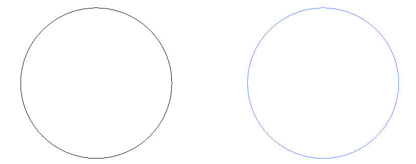

**図: ColorDefinitionエンティティの例**. 左はデフォルト色(黒)、右は#4C7FFF (明るい青).

## Curves

　本節では、IGESファイルに記述される曲線エンティティについて解説します。曲線エンティティは、2次元または3次元空間内の曲線を表現するために使用されます。

### `CircularArc` (type 100)

> Defined at [circular_arc.h](../../include/igesio/entities/curves/circular_arc.h)

> Ancestor class:
> ```plaintext
> IEntityIdentifier <─┬─────────── EntityBase <─┬─ CircularArc
>                     └─ ICurve  <── ICurve2D <─┘
> ```

　`CircularArc`は2次元円弧・円を表現するためのクラスです。以下のコード例は $(-1.25, 0)$ を中心とする半径 $1$ の円と、$(1.25, 0)$ を中心とする半径 $1$ の円弧を生成します（図参照）。

```cpp
// 1. circle: center (-1.25, 0), radius 1
auto circle = std::make_shared<igesio::entities::CircularArc>(
        igesio::Vector2d{-1.25, 0.0}, 1.0);

// 2. arc: center (1.25, 0), radius 1, start angle 4π/3, end angle 5π/2
double start_angle = 4.0 * igesio::kPi / 3.0;
double end_angle = 5.0 * igesio::kPi / 2.0;
auto arc_start = igesio::Vector2d{1.25 + cos(start_angle), sin(start_angle)};
auto arc_end   = igesio::Vector2d{1.25 + cos(end_angle),   sin(end_angle)};

auto arc = std::make_shared<igesio::entities::CircularArc>(
        igesio::Vector2d{1.25, 0.0}, arc_start, arc_end);
```

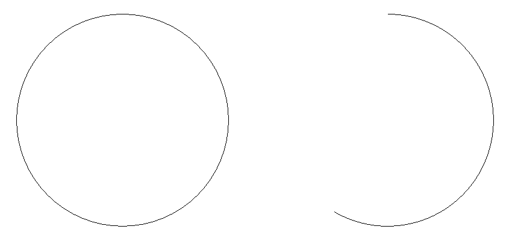

**図: CircularArcエンティティの例**

### `CompositeCurve` (type 102)

> Defined at [composite_curve.h](../../include/igesio/entities/curves/composite_curve.h)

> Ancestor class:
> ```plaintext
> IEntityIdentifier <─┬─────────── EntityBase <─┬─ CompositeCurve
>                     └─ ICurve  <── ICurve3D <─┘
> ```

　`CompositeCurve`は複数の曲線エンティティを連結して一つの曲線として表現するためのクラスです。以下のコード例は、3つの曲線エンティティ（円弧、直線、円弧）を連結したCompositeCurveエンティティを生成します（図参照）。

```cpp
using igesio::Vector2d;
using igesio::Vector3d;

// 1. arc: center (0.5, -1), radius 1.5, start (-1, -1), end (2, -1) (CCW)
// -> CircularArc is defined clockwise, so use transformation matrix to flip and translate
auto comp_1_trans = std::make_shared<igesio::entities::TransformationMatrix>(
        igesio::AngleAxisd(igesio::kPi, Vector3d::UnitY()), Vector3d{0.5, -1.0, 0.0});
auto comp_1 = std::make_shared<igesio::entities::CircularArc>(
        Vector2d{0.0, 0.0}, Vector2d{-1.5, 0.0}, Vector2d{1.5, 0.0});
comp_1->OverwriteTransformationMatrix(comp_1_trans);

// 2. line: start (-1, -1), end (1, 1)
auto comp_2 = std::make_shared<igesio::entities::Line>(
        Vector3d{-1.0, -1.0, 0.0}, Vector3d{1.0, 1.0, 0.0});

// 3. arc: center (-0.5, 1), radius 1.5, start (1, 1), end (-2, 1) (CW)
auto comp_3 = std::make_shared<igesio::entities::CircularArc>(
        Vector2d{-0.5, 1.0}, Vector2d{1.0, 1.0}, Vector2d{-2.0, 1.0});

// Composite curve
// arc1 --> line --> arc2
auto comp_curve = std::make_shared<igesio::entities::CompositeCurve>();
comp_curve->AddCurve(comp_1);
comp_curve->AddCurve(comp_2);
comp_curve->AddCurve(comp_3);
```


**図: CompositeCurveエンティティの例**（右下の円弧が`comp_1`）

### `ConicArc` (type 104)

> Defined at [conic_arc.h](../../include/igesio/entities/curves/conic_arc.h)

> Ancestor class:
> ```plaintext
> IEntityIdentifier <─┬─────────── EntityBase <─┬─ ConicArc
>                     └─ ICurve  <── ICurve2D <─┘
> ```

　`ConicArc`は2次元の円錐曲線（楕円、放物線、双曲線）を表現するためのクラスです。以下のコード例は、中心が $(0, 3)$、長軸・短軸がそれぞれ $3$、$2$ の楕円弧を生成します（図参照）。

　現在、放物線・双曲線は未実装です（エンティティクラスは共通ですが、内部処理が未対応です）。

```cpp
// 1. ellipse arc: center (0, 3), axis (x, y) = (3, 2),
//    start angle 7π/4, end angle 17π/6
auto ellipse_arc = std::make_shared<igesio::entities::ConicArc>(
        std::pair<double, double>{-3.0, 2.0},  // radii (rx, ry)
        7.0 * kPi / 4.0,    // start angle
        17.0 * kPi / 6.0);  // end angle

// Note: Since elliptical arc entities are defined with the origin
// as their center, use a transformation matrix entity to move the origin.
auto ellipse_trans = std::make_shared<igesio::entities::TransformationMatrix>(
        igesio::Matrix3d::Identity(), igesio::Vector3d{0.0, 3.0, 0.0});
ellipse_arc->OverwriteTransformationMatrix(ellipse_trans);
```

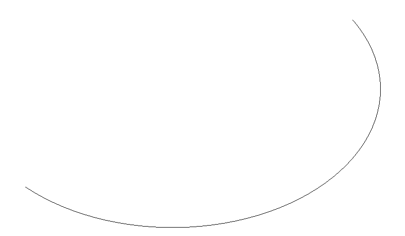

**図: ConicArcエンティティの例** (楕円のみ)

### Copious Data (type 106)

#### `CopiousDataBase` (type 106)

> Defined at [copious_data_base.h](../../include/igesio/entities/curves/copious_data_base.h)

> Ancestor class:
> ```plaintext
> IEntityIdentifier <── EntityBase <── CopiousDataBase
> ```

　すべてのCopious Data関連クラスの基底クラスです。`ICurve`等のインターフェースは実装していません。本ライブラリで未実装のフォーム番号に対しては、このクラスのインスタンスが生成されます。

> 一部のCopious Dataエンティティ（Form 20～40）は、[Curve](#curves) and [Surface](#surfaces) Geometryエンティティではなく、[Annotation](#annotation)エンティティに分類されます。

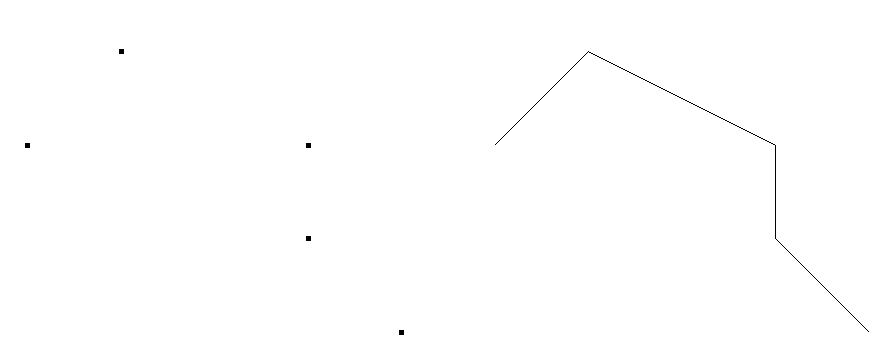

**図: Copious Dataエンティティの例**. 左はフォーム2（点群）、右はフォーム12（折れ線）であり、右側は左側と同じ順序で定義された点を右方向にシフトしたもの.

#### `CopiousData` (type 106, forms 1-3)

> Defined at [copious_data.h](../../include/igesio/entities/curves/copious_data.h)

> Ancestor class:
> ```plaintext
> IEntityIdentifier <── EntityBase <─┬────── CopiousDataBase <─┬─ CopiousData
>                                    └─ ICurve  <── ICurve3D <─┘
> ```

　`CopiousData`は、フォーム1～3 (座標2つ組、座標3つ組、座標6つ組) の点群データを表現するためのクラスです。以下のコード例は、5つの3次元座標点からなる点群を生成します（[CopiousDataBaseの図参照](#copiousdatabase-type-106)）。

```cpp
igesio::Matrix3Xd copious_coords(3, 5);
copious_coords << 3.0,  2.0, 2.0, 0.0, -1.0,
                  0.0,  1.0, 2.0, 3.0,  2.0,
                  1.0, -1.0, 0.0, 1.0,  0.0;
auto copious = std::make_shared<igesio::entities::CopiousData>(
        igesio::entities::CopiousDataType::kPoints3D, copious_coords);
```

#### `LinearPath` (type 106, forms 11-13)

> Defined at [linear_path.h](../../include/igesio/entities/curves/linear_path.h)

> Ancestor class:
> ```plaintext
> IEntityIdentifier <── EntityBase <─┬────── CopiousDataBase <─┬─ LinearPath
>                                    └─ ICurve  <── ICurve3D <─┘
> ```

　`LinearPath`は、フォーム11～13 (座標2つ組、座標3つ組、座標6つ組) の折れ線データを表現するためのクラスです。以下のコード例は、5つの3次元座標点からなる折れ線を生成します（[CopiousDataBaseの図参照](#copiousdatabase-type-106)）。与える点群は[CopiousData](#copiousdata-type-106-forms-1-3)と同じですが、右方向に $5$ だけシフトしています。

```cpp
auto copious_trans = std::make_shared<igesio::entities::TransformationMatrix>(
        igesio::Matrix3d::Identity(), igesio::Vector3d{5.0, 0.0, 0.0});
auto linear_path = std::make_shared<igesio::entities::CopiousData>(
        igesio::entities::CopiousDataType::kPolyline3D, copious_coords);
linear_path->OverwriteTransformationMatrix(copious_trans);
```

### `Line` (type 110)

> Defined at [line.h](../../include/igesio/entities/curves/line.h)

> Ancestor class:
> ```plaintext
> IEntityIdentifier <─┬─────────── EntityBase <─┬─ Line
>                     └─ ICurve  <── ICurve3D <─┘
> ```

　`Line`は、3次元空間内の直線、半直線、線分を表現するためのクラスです。以下のコード例は、3種類のLineエンティティ（線分、半直線、直線）を生成します（図参照）。

```cpp
using igesio::Vector3d;

// 1. segment: start (0, -1, 0), end (1, 1, 0)
auto start = Vector3d{0.0, -1.0, 0.0};
auto end = Vector3d{1.0, 1.0, 0.0};
auto line_segment = std::make_shared<igesio::entities::Line>(
        start, end, igesio::entities::LineType::kSegment);

// 2. semi-infinite line: start (2, -1, 0), direction (1, 2, 0)
start = Vector3d{2.0, -1.0, 0.0};
end = start + Vector3d{1.0, 2.0, 0.0};
auto ray = std::make_shared<igesio::entities::Line>(
        start, end, igesio::entities::LineType::kRay);

// 3. infinite line: point (4, -1, 0), direction (1, 2, 0)
start = Vector3d{4.0, -1.0, 0.0};
end = start + Vector3d{1.0, 2.0, 0.0};
auto line = std::make_shared<igesio::entities::Line>(
        start, end, igesio::entities::LineType::kLine);
```

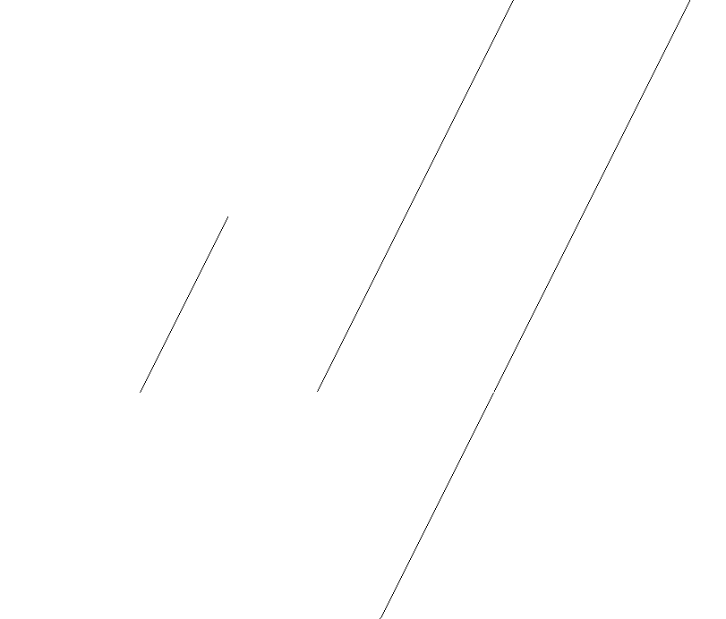

**図: Lineエンティティの例**. 左から線分、半直線、直線.

### `ParametricSplineCurve` (type 112)

> Defined at [parametric_spline_curve.h](../../include/igesio/entities/curves/parametric_spline_curve.h)

> Ancestor class:
> ```plaintext
> IEntityIdentifier <─┬─────────── EntityBase <─┬─ ParametricSplineCurve
>                     └─ ICurve  <── ICurve3D <─┘
> ```

　`ParametricSplineCurve`は、3次元空間内のパラメトリックスプライン曲線を表現するためのクラスです。IGES 5.3では、$N$ 個の区間に分割された3次の多項式で曲線を表現します。以下の数式は、$i$ 番目の区間 ($T(i) \leq u \leq T(i + 1)$) における曲線のパラメトリック方程式を示しています。

$$\begin{aligned}
    X(u) &= A_X(i) + s B_X(i) + s^2 C_X(i) + s^3 D_X(i) \\
    Y(u) &= A_Y(i) + s B_Y(i) + s^2 C_Y(i) + s^3 D_Y(i) \\
    Z(u) &= A_Z(i) + s B_Z(i) + s^2 C_Z(i) + s^3 D_Z(i)
\end{aligned}$$

where

$$\begin{aligned}
    T(i) &\leq u \leq T(i + 1), \quad i = 1, \ldots, N \\
    &s = u - T(i)
\end{aligned}$$

　以下のコード例は、4つの区間に分割された3次のパラメトリックスプライン曲線を生成します（図参照）。以下に示すように、`IGESParameterVector`構造体を用いてパラメータをまとめて渡し、インスタンスを生成します。コード例で使用したパラメータの詳細な値については、[examples/sample_curves.cpp](../../examples/sample_curves.cpp)の`CreateParametricSplineCurve`関数を参照してください。

```cpp
auto param = igesio::IGESParameterVector{
    6,     // CTYPE: B-Spline
    3, 3,  // degree, NDIM (3D)
    4,     // number of segments
    0., .5, 1., 2., 2.25,  // Break Points T(1), ..., T(5)
     1.,     2.,   -5.,    1.,  // Ax(1) ~ Dx(1)
     0.,     2.,    3.,   -1.,  // Ay(1) ~ Dy(1)
     5.,     0.,    3.,   -2.,  // Az(1) ~ Dz(1)
     // ...
    -4.625, -2.25,  2.5,   8.,  // Ax(4) ~ Dx(4)
     8.0,    2.0,  -3.0,   0.,  // Ay(4) ~ Dy(4)
    11.5,    6.0,   0.0,   0.,  // Az(4) ~ Dz(4),
    -4.90625, 0.5, 17.,  48.,   // TPX0 ~ TPX3
     8.3125,  0.5, -6.,   0.,   // TPY0 ~ TPY3
    13.0,     6.0,  0.,   0.    // TPZ0 ~ TPZ3
};
auto spline_c = std::make_shared<i_ent::ParametricSplineCurve>(param);
```

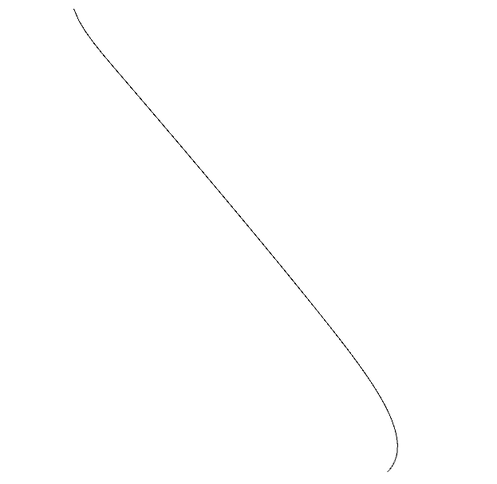

**図: ParametricSplineCurveエンティティの例**

### `Point` (type 116)

> Defined at [point.h](../../include/igesio/entities/curves/point.h)

> Ancestor class:
> ```plaintext
> IEntityIdentifier <── EntityBase <── Point
> ```

　`Point`は、3次元空間内の点を表現するためのクラスです。点の座標値と、その点の描画形状（Subfigure Definitionエンティティ (Type 308)）を関連付けることができます。以下のコード例は、座標 $(1.0, 2.0, 3.0)$ に位置する点エンティティを生成し、その色をマゼンタに変更しています（図参照）。

> Note: 現在、Subfigure Definitionエンティティは未実装です。

```cpp
auto point = std::make_shared<i_ent::Point>(Vector3d{1.0, 2.0, 3.0});
point->OverwriteColor(i_ent::ColorNumber::kMagenta);
```

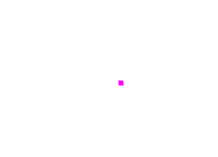

**図: Pointエンティティの例**

### `RationalBSplineCurve` (type 126)

> Defined at [rational_b_spline_curve.h](../../include/igesio/entities/curves/rational_b_spline_curve.h)

> Ancestor class:
> ```plaintext
> IEntityIdentifier <─┬─────────── EntityBase <─┬─ RationalBSplineCurve
>                     └─ ICurve  <── ICurve3D <─┘
> ```

　`RationalBSplineCurve`は、3次元空間内の有理Bスプライン曲線を表現するためのクラスです。以下のコード例は、4つの制御点、3次の非周期的開放NURBS曲線を生成します（図参照）。以下に示すように、`IGESParameterVector`構造体を用いてパラメータをまとめて渡し、インスタンスを生成します。

　この際の注意点として、`IGESParameterVector`には、intとdoubleを明確に区別して渡してください。例えば以下の7つ目のパラメータ (1つ目のノットベクトル値; `0.0`) を、`0` (int) として渡すと、エラーが発生します。

```cpp
auto param = igesio::IGESParameterVector{
    3,  // number of control points - 1
    3,  // degree
    false, false, false, false,  // non-periodic open NURBS curve
    0.0, 0.0, 0.0, 0.0, 1.0, 1.0, 1.0, 1.0,  // knot vector
    1.0, 1.0, 1.0, 1.0,  // weights
    -4.0, -4.0,  0.0,    // control point P(0)
    -1.5,  7.0,  3.5,    // control point P(1)
     4.0, -3.0,  1.0,    // control point P(2)
     4.0,  4.0,  0.0,    // control point P(3)
    0.0, 1.0,            // parameter range V(0), V(1)
    0.0, 0.0, 1.0        // normal vector of the defining plane
};
auto nurbs_c = std::make_shared<igesio::entities::RationalBSplineCurve>(param);
```

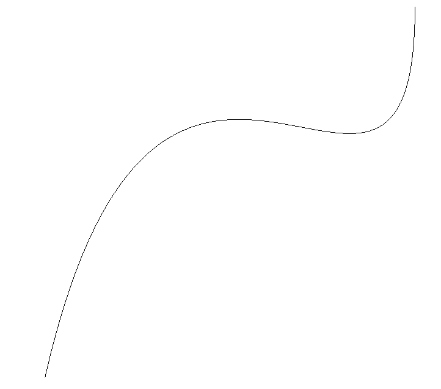

**図: RationalBSplineCurveエンティティの例**

## Surfaces

　本節では、IGESファイルに記述される曲面エンティティについて解説します。曲面エンティティは、3次元空間内の曲面を表現するために使用されます。

### `RuledSurface` (type 118)

> Defined at [ruled_surface.h](../../include/igesio/entities/surfaces/ruled_surface.h)

> Ancestor class:
> ```plaintext
> IEntityIdentifier <─┬─ EntityBase <─┬─ RuledSurface
>                     └─ ISurface <───┘
> ```

　`RuledSurface`は、2つの曲線エンティティ $C_1(t), C_2(s)$ を結ぶ直線（支線）を用いて生成される曲面を表現するためのクラスです。曲面の各点は、以下のパラメトリック方程式で表現されます。

$$S(u, v) = (1 - v) C_1(t) + v C_2(s)$$

ここで、$u,v \in [0, 1]$ は曲面のパラメータです。$t, s$ はそれぞれの曲線 $C_1, C_2$ のパラメータであり、$u$ および`DIRFLG`（`RuledSurface::IsReversed()`）により決定されます。

$$\begin{aligned}
  t &= t_{\text{min}} + u (t_{\text{max}} - t_{\text{min}}) \\
  s &= \begin{cases}
        s_{\text{min}} + u (s_{\text{max}} - s_{\text{min}}) & \text{if DIRFLG = false} \\
        s_{\text{max}} - u (s_{\text{max}} - s_{\text{min}}) & \text{if DIRFLG = true}
      \end{cases}
\end{aligned}$$

　以下のコード例は、$(-5, 0, 0) \to (5, 0, 0)$ を結ぶ直線と、4つの制御点、3次の[RationalBSplineCurve](#rationalbsplinecurve-type-126)を結ぶ支線で構成されるルールド面を生成します（図参照）。

```cpp
// curve1: Line
auto curve1 = std::make_shared<i_ent::Line>(
    Vector3d{-5., 0., 0.}, Vector3d{5., 0., 0.});

// curve2: Rational B-Spline Curve
auto param = igesio::IGESParameterVector{
    3,  // number of control points - 1
    3,  // degree
    false, false, false, false,  // non-periodic open NURBS curve
    0.0, 0.0, 0.0, 0.0, 1.0, 1.0, 1.0, 1.0,  // knot vector
    1.0, 1.0, 1.0, 1.0,  // weights
    -5.0, 0.0, -6.0,     // control point P(0)
    -3.0, 4.0, -6.0,     // control point P(1)
     3.0, 4.0, -6.0,     // control point P(2)
     5.0, 0.0, -6.0,     // control point P(3)
    0.0, 1.0,            // parameter range V(0), V(1)
    0.0, 0.0, 1.0        // normal vector of the defining plane
};
auto curve2 = std::make_shared<i_ent::RationalBSplineCurve>(param);

// Ruled surface
auto ruled_surf = std::make_shared<i_ent::RuledSurface>(curve1, curve2);
ruled_surf->OverwriteColor(i_ent::ColorNumber::kGreen);
```

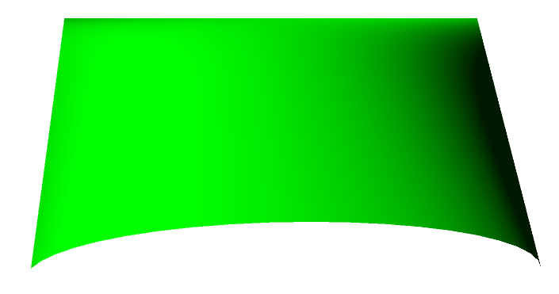

**図: RuledSurfaceエンティティの例**

### `SurfaceOfRevolution` (type 120)

> Defined at [surface_of_revolution.h](../../include/igesio/entities/surfaces/surface_of_revolution.h)

> Ancestor class:
> ```plaintext
> IEntityIdentifier <─┬─ EntityBase <─┬─ SurfaceOfRevolution
>                     └─ ISurface <───┘
> ```

　`SurfaceOfRevolution`は、3次元空間内の回転曲面を表現するためのクラスです。[Line](#line-type-110)を軸として、[曲線エンティティ](#curves) $C(t)$ を回転させることで曲面を生成します。曲面の各点は、以下のパラメトリック方程式で表現されます。

$$S(u, v) = S(t, \theta) = R_\text{axis}(\theta) (C(t) P_\text{axis}) + P_\text{axis}$$

ここで、$R_\text{axis}(\theta)$ は回転軸周りに $\theta$ だけ回転する回転行列、$P_\text{axis}$ は回転軸上の任意の点です。パラメータ $u$ は曲線 $C(t)$ のパラメータ、$v$ は回転角 $\theta$ に対応します。

　以下のコード例は、$(1, 1, 1) \to (1, 2, 3)$ を結ぶ直線を回転軸とし、[RationalBSplineCurve](#rationalbsplinecurve-type-126)を $\theta = 0$ から $\pi$ [rad] の範囲で回転させた回転曲面を生成します（図参照）。

```cpp
using igesio::Vector3d;
namespace i_ent = igesio::entities;

// Axis line
auto axis_line = std::make_shared<i_ent::Line>(
    Vector3d{1., 1., 1.}, Vector3d{1., 2., 3.});

// Generatrix curve (Rational B-Spline Curve)
auto param = igesio::IGESParameterVector{
    3,  // number of control points - 1
    3,  // degree
    false, false, false, false,  // non-periodic open NURBS curve
    0.0, 0.0, 0.0, 0.0, 1.0, 1.0, 1.0, 1.0,  // knot vector
    1.0, 1.0, 1.0, 1.0,  // weights
    1.0, -4.0,  0.0,    // control point P(0)
    1.0, -5.0,  1.5,    // control point P(1)
    1.0, -3.0,  2.0,    // control point P(2)
    1.0,  0.0,  4.0,    // control point P(3)
    0.0, 1.0,            // parameter range V(0), V(1)
    0.0, 0.0, 1.0        // normal vector of the defining plane
};
auto generatrix = std::make_shared<i_ent::RationalBSplineCurve>(param);

// Surface of revolution
auto surf_rev = std::make_shared<i_ent::SurfaceOfRevolution>(
    axis_line, generatrix, 0.0, kPi);
surf_rev->OverwriteColor(i_ent::ColorNumber::kYellow);
```

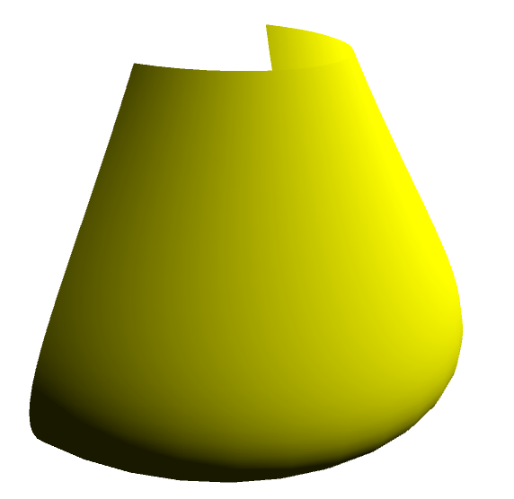

**図: SurfaceOfRevolutionエンティティの例**

### `TabulatedCylinder` (type 122)

> Defined at [tabulated_cylinder.h](../../include/igesio/entities/surfaces/tabulated_cylinder.h)

> Ancestor class:
> ```plaintext
> IEntityIdentifier <─┬─ EntityBase <─┬─ TabulatedCylinder
>                     └─ ISurface <───┘
> ```

　`TabulatedCylinder`は、3次元空間内の平行曲面を表現するためのクラスです。[曲線エンティティ](#curves) $C(t)$ を準線とし、指定された位置 $L$（または方向ベクトル $D$）に沿って曲線を押し出すことで曲面を生成します。曲面の各点は、以下のパラメトリック方程式で表現されます。

$$S(u, v) = C(t) + v(L - C(0)) = C(t) + vD$$

ここで、$D$ は方向ベクトルであり、$C(0)$ は曲線 $C(t)$ の始点です。また、$t = t_{\text{start}} + u(t_{\text{end}} - t_{\text{start}})$、$u,v \in [0, 1]$ です。IGES 5.3では、押し出し開始位置 $L$ をパラメータとして指定します。本ライブラリでは、以下のコード例に示すように、押し出し方向ベクトル $D$ を直接指定することも可能です。

　以下のコード例は、[RationalBSplineCurve](#rationalbsplinecurve-type-126)を準線とし、方向ベクトル $D = 3 * [1, -1, 0]^\top$ に沿って押しだした平行曲面を生成します（図参照）。

```cpp
// Directrix curve
auto param = igesio::IGESParameterVector{
    3,  // number of control points - 1
    2,  // degree
    false, false, false, false,   // non-periodic open NURBS curve
    0., 0., 0., 0.5, 1., 1., 1.,  // knot vector
    1., 1., 1., 1.,               // weights
    0.0, -4.0, -4.0,              // control points P(0)
    0.0,  0.2, -1.1,              // control points P(1)
    0.0, -1.0,  4.5,              // control points P(2)
    0.0,  4.0,  4.0,              // control points P(3)
    0.0, 1.0,                     // parameter range V(0), V(1)
    1., 0., 0.                    // normal vector of the defining plane
};
auto directrix = std::make_shared<i_ent::RationalBSplineCurve>(param);

// Axis direction
Vector3d axis_dir{1., -1., 0.};
double axis_length = 3.0;

// Tabulated cylinder
// 押し出し方向ベクトル D = axis_length * axis_dirを指定する場合
// -> 押し出し位置Lを指定する場合は、directrixとVector3d型のlocationの2つを引数に与える
auto tab_cyl = std::make_shared<i_ent::TabulatedCylinder>(
        directrix, axis_dir, axis_length);
tab_cyl->OverwriteColor(i_ent::ColorNumber::kCyan);
```

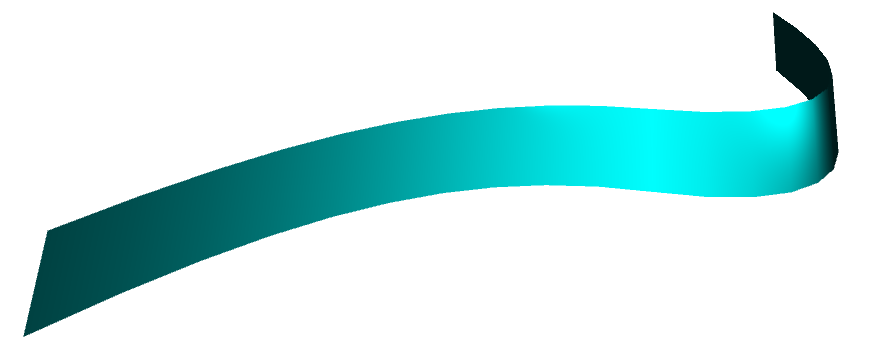

**図: TabulatedCylinderエンティティの例**

### `RationalBSplineSurface` (type 128)

> Defined at [rational_b_spline_surface.h](../../include/igesio/entities/surfaces/rational_b_spline_surface.h)

> Ancestor class:
> ```plaintext
> IEntityIdentifier <─┬─ EntityBase <─┬─ RationalBSplineSurface
>                     └─ ISurface <───┘
> ```

　`RationalBSplineSurface`は、3次元空間内の有理Bスプライン曲面を表現するためのクラスです。以下のコード例は、6x6個の制御点、3次の非周期的開放NURBS曲面を生成します（図参照）。以下に示すように、`IGESParameterVector`構造体を用いてパラメータをまとめて渡し、インスタンスを生成します。コード例で使用したパラメータの詳細な値については、[examples/sample_surfaces.cpp](../../examples/sample_surfaces.cpp)の`CreateRationalBSplineSurface`関数を参照してください。

　この際の注意点として、`IGESParameterVector`には、intとdoubleを明確に区別して渡してください。例えば以下の8つ目のパラメータ (1つ目のUノットベクトル値; `0.0`) を、`0` (int) として渡すと、エラーが発生します。

```cpp
// Freeform surface
auto param = igesio::IGESParameterVector{
    5, 5,  // K1, K2 (Number of control points - 1 in U and V)
    3, 3,  // M1, M2 (Degree in U and V)
    false, false, true, false, false,         // PROP1-5
    0., 0., 0., 0., 1., 2., 3., 3., 3., 3.,   // Knot vector in U
    0., 0., 0., 0., 1., 2., 3., 3., 3., 3.,   // Knot vector in V
    1., 1., 1., 1., 1., 1., 1., 1., 1., 1., 1., 1.,   // Weights W(0,0) to W(1,5)
    1., 1., 1., 1., 1., 1., 1., 1., 1., 1., 1., 1.,   // Weights W(2,0) to W(3,5)
    1., 1., 1., 1., 1., 1., 1., 1., 1., 1., 1., 1.,   // Weights W(4,0) to W(5,5)
    // Control points (36 points, each with x, y, z)
    -25., -25., -10.,  // Control point (0,0)
    -25., -15., -5.,   // Control point (0,1)
    // ...
    25., 25., -10.,    // Control point (5,5)
    0., 3., 0., 3.     // Parameter range in U and V
};
auto nurbs_freeform = std::make_shared<igesio::entities::RationalBSplineSurface>(param);
nurbs_freeform->OverwriteColor(igesio::entities::ColorNumber::kCyan);
```

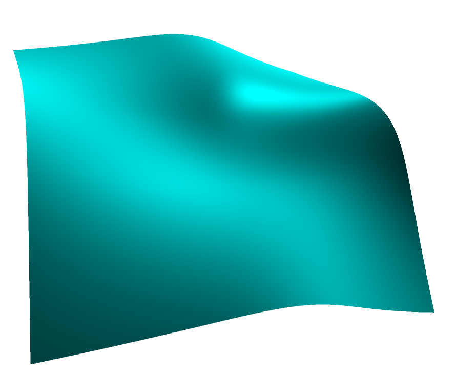

**図: RationalBSplineSurfaceエンティティの例**

## Transformations

　本節では、IGESファイルに記述される変換行列エンティティについて解説します。変換行列は、座標系の変換やエンティティの位置、向き、スケールを変更するために使用されます。

> IGES 5.3 の規格においては、Transformation Matrix (Type 124) はCurve and Surface Geometry entity、すなわち[Curves](#curves)や[Surfaces](#surfaces)などの一種として定義されています。

### `TransformationMatrix` (type 124)

> Defined at [transformation_matrix.h](../../include/igesio/entities/transformations/transformation_matrix.h)

> Ancestor class:
> ```plaintext
> IEntityIdentifier <─┬────── EntityBase <─┬─ TransformationMatrix
>                     └─ ITransformation <─┘
> ```

　`TransformationMatrix`は、3次元空間におけるエンティティの変換を定義するクラスです。このクラスを用いることで、平行移動、回転といった操作を、単一の行列として表現できます。IGES 5.3では、変換行列は回転行列 $R \in \mathbb{R}^{3\times 3} \; (|R| = 1)$ と平行移動ベクトル $P \in \mathbb{R}^3$ によって以下のように定義されます。

$$T = \begin{bmatrix} R & P \\ 0 & 1 \end{bmatrix} \in \mathbb{R}^{4\times 4}$$

ここで、IGES 5.3においては、回転行列 $R$ に $|R| = 1$ という制約が存在するため、変換行列エンティティを使用してスケーリングやせん断といった変換を表現することはできません。

　`TransformationMatrix`クラスのインスタンスは、他のエンティティの`OverwriteTransformationMatrix`メソッドに渡すことで、そのエンティティに変換を適用できます。以下の例では、単位行列を回転行列、$(1.0, 2.0, 3.0)$ を平行移動ベクトルとする変換行列を作成し、`Line`エンティティに適用することで、線分を平行移動させています。

```cpp
// (0,0,0) から (1,1,1) までの線分を定義
auto segment = std::make_shared<igesio::entities::Line>(
        igesio::Vector3d{0.0, 0.0, 0.0}, igesio::Vector3d{1.0, 1.0, 1.0},
        igesio::entities::LineType::kSegment);

// 変換行列を定義: 回転なし、平行移動ベクトル = (1,2,3)
auto transform = std::make_shared<igesio::entities::TransformationMatrix>(
        igesio::Matrix3d::Identity(), igesio::Vector3d{1.0, 2.0, 3.0});

// 変換行列を線分に適用: segmentは (1,2,3) から (2,3,4) を結ぶ線分となる
segment->OverwriteTransformationMatrix(transform);
```
