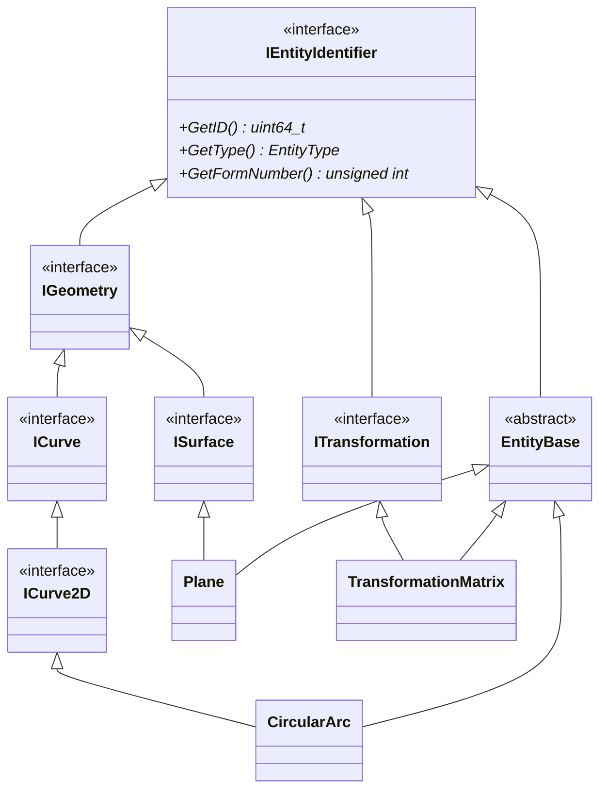

# Entity Base Class Architecture: Design and Implementation

## Table of Contents

- [Table of Contents](#table-of-contents)
- [Overview](#overview)
  - [Design Policy](#design-policy)
  - [Class Diagram](#class-diagram)
- [`IEntityIdentifier`](#ientityidentifier)
- [Specific Entity Interfaces](#specific-entity-interfaces)
- [Directory Entry Parameter Classes](#directory-entry-parameter-classes)
- [`EntityBase`](#entitybase)
  - [Member Functions (`EntityBase`)](#member-functions-entitybase)
    - [Directory Entry Section Related Member Functions (`EntityBase`)](#directory-entry-section-related-member-functions-entitybase)
      - [Functions Returning Enumerations or Primitive Types](#functions-returning-enumerations-or-primitive-types)
      - [Functions Requiring the Creation of Individual Classes](#functions-requiring-the-creation-of-individual-classes)
      - [Functions Without Meaning in `EntityBase` Inherited Classes](#functions-without-meaning-in-entitybase-inherited-classes)
    - [Parameter Data Section Related Member Functions (`EntityBase`)](#parameter-data-section-related-member-functions-entitybase)
    - [Other Minor Member Functions (`EntityBase`)](#other-minor-member-functions-entitybase)
- [Specific Entity Classes](#specific-entity-classes)

## Overview

### Design Policy

This library defines an abstract class called `IEntityIdentifier` to represent each entity in an IGES file, and implements concrete entity classes that inherit from it. In IGES, the functionality of an entity is determined by its entity type and form number. These pieces of information can be obtained from each entity via the `GetType` and `GetFormNumber` member functions, which are defined in the `IEntityIdentifier` class.

Additionally, in CAD data, entities can have parent-child relationships. In IGES files, entities are uniquely managed using DE pointers<sup>*</sup>, and parent elements express relationships by referencing the DE pointers of child elements. However, since DE pointers depend on the line number where the entity is described in the IGES file, they cannot be directly used in programs where entities may be added or deleted.

Therefore, this library assigns a unique `uint64_t` ID to each entity instance upon creation, allowing entities to be uniquely identified. The assigned value can be obtained via the `GetID` member function. Member functions such as `std::shared_ptr<const EntityBase> GetEntity` and `std::vector<uint64_t> GetChildIDs` are also defined to retrieve parent-child relationship information. These functions use the ID (of type `uint64_t`) to specify or indicate concrete entities, rather than using DE pointers.

> * **DE Pointer**: In IGES files, entity data is stored in the Directory Entry (DE) section and the Parameter Data (PD) section. Each line in an IGES file has a sequence number, and entities are uniquely identified within the file using the sequence number of the DE section data record. A pointer referencing this sequence number is called a DE pointer. DE pointers are used to express parent-child relationships, including both physical and logical relationships.

### Class Diagram

The following diagram shows the inheritance relationships of entity-related classes. In reality, there are over 100 concrete entity classes, but here we only show the `CircularArc` class representing a circular arc, the `Plane` class representing a plane, the `TransformationMatrix` class representing a transformation matrix, and their base classes.



The roles of the entities shown in the above class diagram are organized below. Basically, entities are held by `EntityBase` pointers (such as `std::shared_ptr<EntityBase>`), but dedicated types are used for specific references. This is a design for the principle of interface segregation and the principle of dependency inversion.

Interfaces other than `IEntityIdentifier` and `EntityBase` (`ICurve`, `ISurface`, `ITransformation`, etc.) are defined for holding references for specific functions only. For example, in DE field 7 (Transformation Matrix) of `EntityBase`, `std::weak_ptr<const ITransformation>` is used to hold a reference to the Transformation Matrix (Type 124). (Therefore, although it is not an inheritance relationship, `EntityBase` depends on `ITransformation`).

| Class Name | Role |
|---|---|
| `IEntityIdentifier` | Defines the identification information (ID, type, form number) that all entities have in common |
| `ICurve`<br>`ISurface`<br>`ITransformation`<br>Other | Interfaces for specific functions of entities<br>(Used to hold references specialized for specific roles) |
| `EntityBase` | Base class that implements the functions that all entities have in common |
| `CircularArc`<br>`Plane`<br>`TransformationMatrix`<br>Other | Concrete implementation classes of IGES entities |

## `IEntityIdentifier`

> Defined at [i_entity_identifier.h](../../include/igesio/entities/i_entity_identifier.h)

> Ancestor class: None

The `IEntityIdentifier` class is an interface for identifying each entity in an IGES file. This class defines the identification information that all entities have in common, and all concrete/abstract entity classes inherit and implement this class.

The `IEntityIdentifier` class defines only the following three pure virtual functions. All implementations are done in the `EntityBase` class.

- [x] `uint64_t GetID() const;` (10th/20th DE fields)
  - Gets a unique identifier for the entity in the program.
- [x] `EntityType GetType() const;` (1st/11th DE fields)
  - Gets the entity type.
- [x] `unsigned int GetFormNumber() const;` (15th DE field)
  - Gets the form number of the entity.

**Member Function to Check if Supported by This Library**

This library has many unimplemented entity classes. Also, there may be user-defined entity types in the loaded IGES file. Such entities are treated as instances of the [`UnsupportedEntity`](entities.md#unsupportedentity) class. The following member function is for checking whether the class is `UnsupportedEntity`.

- [x] `bool IsSupported() const;`
  - Returns `true` except for instances of `UnsupportedEntity`.

## Specific Entity Interfaces

See [entities/interfaces](entities.md#interfaces) for interface classes.

## Directory Entry Parameter Classes

In this library, each field in the Directory Entry (DE) section is classified into the following three types. Among these, `DEFieldWrapper` inheritance classes are defined as classes that represent the fields in (2). These classes are held as member variables of the `EntityBase` class and represent the information in the Directory Entry section of each entity.

1. Fields that can be represented as enumerations or primitive type values
   - Example) Entity Type (1st/11th fields), Status Number (9th field), Entity Label (18th field), etc.
2. Fields that may have pointers
   - Example) Structure (3rd field), Transformation Matrix (7th field), Color (13th field), etc.
3. Fields that have no meaning in `EntityBase` inherited classes
   - Example) Parameter Data (2nd field), Parameter Line Count (14th field), Reserved (16th/17th fields), etc.

See [Implementation of Directory Entry Section](de_field.md) for details.

## `EntityBase`

> Defined at [entity_base.h](../../include/igesio/entities/entity_base.h)

> Ancestor class:
> ```plaintext
> IEntityIdentifier <─── EntityBase
> ```

The `EntityBase` class is an abstract base class for representing each entity in an IGES file. This class defines the functions that all entities have in common, and concrete entity classes inherit and implement this class.

### Member Functions (`EntityBase`)

This section shows the member functions implemented/to be implemented in the `EntityBase` class. `[ ]` (or □) described before the member function indicates an unimplemented member function. `[x]` (or ☑) indicates an implemented member function.

#### Directory Entry Section Related Member Functions (`EntityBase`)

All entity classes must have member functions for getting and manipulating information defined in the Directory Entry (DE) section. In connection with this, we also define the following member function to get the currently set parameters as a [`RawEntityDE`](de_field.md#rawentityde) object.

- `RawEntityDE GetRawEntityDE() const;`
  - Generates a `RawEntityDE` object internally and gets the information of the DE section of the current entity.

The following only describes the `Value GetXxx() const` member function for getting data, but unless otherwise specified, a `bool SetXxx(const Value& value)` member function for setting the value is also required. The return value of the setter shall be `true` if the value can be set for that entity, and `false` otherwise.

##### Functions Returning Enumerations or Primitive Types

The following member functions return enumeration or primitive type values (that is, they do not have pointers to other entities).

Derived from the `IEntityIdentifier` class:

| field | Function Name | Return Value |
|---|---|---|
| 10th/20th | `GetID()` | `uint64_t` |
| 1st/11th | `GetType()` | `EntityType` |
| 15th | `GetFormNumber()` | `unsigned int` |

Newly defined in the `EntityBase` class:

| field | Function Name | Arguments/Return Value |
|---|---|---|
| 9th | `GetBlankStatus()` <br> `SetBlankStatus(...)` | `bool` <br> true: visible (status 00),<br> false: invisible (status 01) |
| ^ | `GetSubordinateEntitySwitch()` <br> `SetSubordinateEntitySwitch(...)` | `SubordinateEntitySwitch` |
| ^ | `GetEntityUseFlag()` <br> `SetEntityUseFlag(...)` | `EntityUseFlag` |
| ^ | `GetHierarchyType()` <br> `SetHierarchyType(...)` | `HierarchyType` |
| ^ | `GetEntityStatus()` <br> `SetEntityStatus(...)` | `EntityStatus` |
| 12th | `GetLineWeightNumber()` <br> `SetLineWeightNumber(...)` | `double` |
| 18th | `GetEntityLabel()` <br> `SetEntityLabel(...)` | `std::string` |
| 19th | `GetEntitySubscript()` <br> `SetEntitySubscript(...)` | `int` |

##### Functions Requiring the Creation of Individual Classes

The following member functions have corresponding DE fields that have pointers. These member functions are implemented as functions that take individual classes that store pointers as return values/arguments. The following seven fields are

- `GetXxx()` member function that returns a const reference
  - Example: `const DEColor& GetColor() const;`
- `ResetXxx()` member function that returns to the default state (state with invalid value set)
  - Example: `void ResetColor();`
- `OverwriteXxx(...)` member function that changes the pointer or value
  - Example: `bool OverwriteColor(const std::shared_ptr<const IColor>& color);`
  - Example: `bool OverwriteColor(const ColorNumber& color);` (enumeration version)

have. These member functions have different implementations depending on the type of field, as shown in the table below.

| field | type | Function Name |
|---|---|---|
| 3rd | (a) | `GetStructure()` <br> `ResetStructure()` <br> `OverwriteStructure(...)` |
| 4th | (b) | `GetLineFontPattern()` <br> `ResetLineFontPattern()` <br> `OverwriteLineFontPattern(...)` |
| 5th | (c) | `GetLevel()` <br> `ResetLevel()` <br> `OverwriteLevel(...)` |
| 6th | (c) | `GetView()` <br> `ResetView()` <br> `OverwriteView(...)` |
| 7th | (a) | `GetTransformationMatrix()` <br> `ResetTransformationMatrix()` <br> `OverwriteTransformationMatrix(...)` |
| 8th | (a) | `GetLabelDisplayAssociativity()` <br> `ResetLabelDisplayAssociativity()` <br> `OverwriteLabelDisplayAssociativity(...)` |
| 13th | (b) | `GetColor()` <br> `ResetColor()` <br> `OverwriteColor(...)` |

> **Value of "type" column**:
>
> (a): Fields that have an invalid value or a pointer to a single type of entity
> - The `OverwriteXxx` function only satisfies the overload that overwrites with a pointer
>
> (b): Fields that have a default value, an invalid value, or a pointer to a single type of entity
> - The `OverwriteXxx` function has both an overload that overwrites with a pointer and an overload that overwrites with an enumeration value
>
> (c): Fields that have a positive value, an invalid value, or a pointer to a single type of entity
> - The `OverwriteXxx` function has both an overload that overwrites with a pointer and an overload that overwrites with an `int` value

##### Functions Without Meaning in `EntityBase` Inherited Classes

Parameter Data (2nd field), Parameter Line Count (14th field), and Reserved (16th/17th fields) only have meaning on the IGES file. Therefore, member functions corresponding to these fields are not defined in the `EntityBase` class.

> Note: Intermediate product classes such as the `RawEntityDE` class define member variables that hold these fields.

#### Parameter Data Section Related Member Functions (`EntityBase`)

The Parameter Data (PD) section is a section that defines the parameters of an entity. The `EntityBase` class defines the following PD section related member functions that all entities have in common.

| Function | Description |
|---|---|
| `GetParameters()` | Gets all parameters of the entity, including additional pointers, as an `IGESParameterVector`. |

Also, in the Parameter Data section of the IGES file, entities may refer to other entities. We define member functions for getting and setting this reference relationship.

**Getting Child Elements (Physically Dependent Entities)**

- [x] `std::vector<uint64_t> GetChildIDs() const;`
  - Get the ID list of entities that are physically subordinate to this entity
- [x] `std::shared_ptr<const EntityBase> GetChildEntity(const uint64_t id) const;`
  - Get a pointer to a physically subordinate entity with the specified ID

**Getting Physically/Logically Dependent Entities**

- [ ] `std::vector<uint64_t> GetDependantIDs(const SubordinateEntitySwitch dependency) const;`
  - Get the ID list of dependent entities based on the specified dependency type
- [ ] `std::shared_ptr<const EntityBase> GetDependant(const uint64_t id) const;`
  - Get a pointer to a dependent entity with the specified ID

> **Note**: According to Section 2.2.4.4.9.2 of IGES 5.3, both physical and logical dependencies only occur through references in the Parameter Data section. Therefore, the member functions for getting dependent elements and the member functions for getting referenced elements are clearly distinguished.

**Getting/Setting Referenced Entities**

These are member functions for getting and setting all entities (or their IDs) that the entity refers to, including elements referenced in the Directory Entry section. The `EntityBase` inherited class internally holds a pointer to each entity it refers to (`std::shared_ptr<const EntityBase>`). After creating an instance, you need to set the pointer of the entity to be referenced.

- [x] `std::vector<uint64_t> GetReferencedEntityIDs() const;`
  - Get the ID list of all entities referenced by this entity
- [x] `bool AreAllReferencesSet() const;`
  - Check if pointers to all entities referenced by the entity have been set
- [x] `std::vector<uint64_t> GetUnresolvedReferences() const;`
  - Get the ID list of entities whose pointers are not set
- [x] `bool SetUnresolvedReference(const std::shared_ptr<EntityBase>& entity);`
  - Set an unset pointer (does not overwrite a set pointer)

> We do not define member functions such as `OverwritePointer` that overwrite pointers with IDs. Overwriting an already set pointer may impair the integrity of the entity. It is assumed that this operation is performed by using individual reference rewriting members (such as `SetView`) or by directly manipulating member variables.

#### Other Minor Member Functions (`EntityBase`)

**Member Functions for Validating Parameters**

These are member functions for validating whether the parameters corresponding to the DE & PD sections set in the entity object are correct. We define the following two member functions.

- [x] `ValidationResult Validate() const;`
  - This is a member function that validates whether the parameters of the current entity are correct. If an error occurs, the error is stored in `ValidationResult` and returned.
- [x] `bool IsValid() const;`
  - This is a member function that validates whether the parameters of the current entity are correct.

**Member Functions for Distinguishing Entities**

- [ ] `EntityClass GetEntityClass() const;`
  - This is a member function for getting the class of the entity (See Section 3.1 of IGES 5.3). Setter is not required.
- [ ] `EntitySubClass GetEntitySubClass() const;`
  - [ ] This is a member function for getting the subclass of the entity defined in this library. Setter is not required.

**Matrix Operations**

These are member functions that perform coordinate transformation when a transformation matrix is multiplied from the left. The former returns a new entity, and the latter transforms the current entity.

- [ ] `std::shared_ptr<EntityBase> Transformed(const TransformationMatrix& matrix) const;`
- [ ] `void Transform(const TransformationMatrix& matrix);`

> It is still undecided how to propagate the transformation matrix from the parent to the child elements. There are methods such as adding a reference to the transformation matrix to the parent, or applying the transformation to the coordinates of the parent and all child elements. In addition, it is necessary to consider what to do if the parent cannot have a reference to the transformation matrix or if the child is 2D.
>  - Member function that multiplies the matrix from the right (non-const member function that changes the coordinates of the instance itself)
>  - Operator overload with a matrix (const member function that creates a copy with changed coordinate values). Regarding this, the child element is `std::shared_ptr<const EntityBase>`, but it is necessary to consider what to do.
>     - Option 1: Copy the child element and change the coordinate values: In this case, there is a problem that there is no one who has ownership other than those who have a pointer to `const EntityBase`.
>     - Option 2: Limit this operation to those who do not have physical child elements: In this case, it is necessary to implement a member function in `EntityBase` to confirm this.
>     - As far as I can tell from reading Section 3.2.2, the parent's transformation matrix does not seem to be applied except for the relationships shown in Table 4, so should we proceed with the implementation based on that premise?

**Entity Creation and Copying**

This is a member function that returns a new entity that is a copy of itself. The ID of the returned entity shall be newly assigned, and it is undecided whether to make the entity referenced by the returned entity different (copy it) (we plan to use `PointerContainer` that refers to the same entity without copying).

- [ ] `std::shared_ptr<EntityBase> Clone() const;`

**Comparison**

This is a member function that compares entities. The comparison criteria are defined as necessary, such as the entity ID and type. Simple operator overloads are not defined, and it is defined as a member function that can specify a tolerance.

- [ ] `bool IsEqual(const EntityBase& other, double tolerance = 1e-6) const;`

**Serialization Related**

- [ ] `IGESParameterVector GetParameters() const;`
  - This is a member function that gets the parameters of the entity as a vector. It returns all fields of the PD section except for the first field (entity type number).
- [ ] `std::string ToString() const;`
  - For debugging/display support

## Specific Entity Classes

Individual classes that represent specific entities are implemented by inheriting the `EntityBase` class and other interfaces as necessary. See the links below for details.

| Type | Description |
|---|---|
| [Structure](entities.md#structure) | Class that represents the structure of the IGES file<br>+ Class that represents unimplemented entities (`UnsupportedEntity`) |
| [Curves](entities.md#curves) | Class that represents curves |
| [Surfaces](entities.md#surfaces) | Class that represents curved surfaces |
| [Transformations](entities.md#transformations) | Class that represents transformation matrices<br>(`TransformationMatrix` class) |
