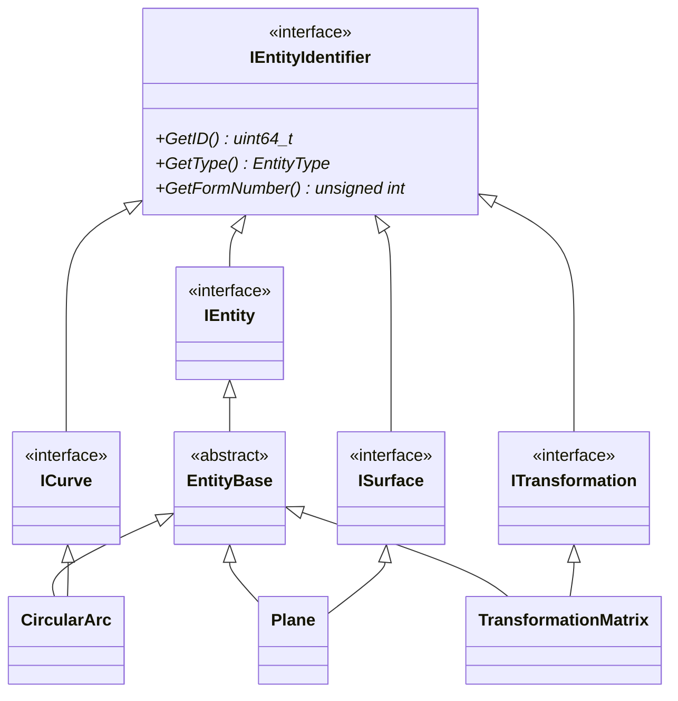

# Entity Base Class Architecture: Design and Implementation

## 目次

- [目次](#目次)
- [概要](#概要)
  - [Class Diagram](#class-diagram)
- [`IEntityIdentifier`](#ientityidentifier)
- [`IEntity`](#ientity)
  - [メンバ関数 (`IEntity`)](#メンバ関数-ientity)
    - [抽象基底クラスが備えるべきメンバ関数 (`IEntity`)](#抽象基底クラスが備えるべきメンバ関数-ientity)
    - [Directory Entry セクション関係のメンバ関数 (`IEntity`)](#directory-entry-セクション関係のメンバ関数-ientity)
    - [Parameter Dataセクションでの参照に関連したメンバ関数 (`IEntity`)](#parameter-dataセクションでの参照に関連したメンバ関数-ientity)
    - [構造検証用のメンバ関数 (`IEntity`)](#構造検証用のメンバ関数-ientity)
    - [その他細かいメンバ関数 (`IEntity`)](#その他細かいメンバ関数-ientity)
- [`EntityBase`](#entitybase)

## 概要

### Class Diagram

　以下に、現時点でのデータ構造（の案）のクラス図を示します。実際には100を越える具体的なエンティティクラスが存在しますが、ここでは、円弧を表す`CircularArc`クラス、平面を表す`Plane`クラス、変換行列を表す`TransformationMatrix`クラスと、そらの基底クラスのみを示しています。

　上記のクラス図で示したエンティティの役割を以下に整理します。基本的にエンティティの保持は`IEntity`のポインタ（`std::shared_ptr<IEntity>`等）で行いますが、特定の参照では専用の型を使用します。

　`IEntityIdentifier`および`IEntity`を除くインターフェース（`ICurve`、`ISurface`、`ITransformation`等）は、特定の機能のみを対象とした参照の保持のために定義されています。

　例えば、`IEntity`のDEフィールド7（Transformation Matrix）では、`std::shared_ptr<const ITransformation>`を使用してTransformation Matrix（Type 124）への参照を保持します。

| クラス名 | 役割 |
| --- | --- |
| `IEntityIdentifier` | 全てのエンティティが共通して持つ識別情報（ID、タイプ、フォーム番号）を定義 |
| `IEntity` | 複数種類のエンティティを一つのポインタで統一的に扱うための抽象基底クラス（型消去の役割） |
| `ICurve` `ISurface` `ITransformation` その他 | エンティティの特定の機能のみを対象としたインターフェース （特定の役割に特化した参照の保持に使用） |
| `EntityBase` | 全てのエンティティが共通して持つ機能を実装するCRTP基底クラス |
| `CircularArc` `Plane` `TransformationMatrix` その他 | IGESエンティティの具体的な実装クラス |

## `IEntityIdentifier`

　`IEntityIdentifier`クラスは、IGESファイルの各エンティティを識別するためのインターフェースです。このクラスは、全てのエンティティが共通して持つ識別情報を定義し、全ての具体的/抽象的なエンティティクラスはこのクラスを継承して実装されます。

　`IEntityIdentifier`クラスには、以下３つの純粋仮想関数のみが定義されています。いずれも実装は`EntityBase`クラスで行われます。

| メンバ関数 | 説明 |
| --- | --- |
| `GetID()` | プログラム上における、エンティティの一意な識別子 (`uint64_t`型) を取得します。 |
| `GetType()` | エンティティタイプ (`EntityType`型) を取得します。 |
| `GetFormNumber()` | エンティティのフォーム番号 (`unsigned int`型) を取得します。 |

## `IEntity`

　`IEntity`クラスは、IGESファイルの各エンティティを表現するための抽象基底クラスです。このクラスは、全てのエンティティが共通して持つ機能を定義し、具体的なエンティティクラスはこのクラスを継承して実装されます。

　本ライブラリでは、`IEntity`クラスを継承した[`EntityBase`クラス](#entitybase)も定義されており、全エンティティがこのクラスも継承します。`EntityBase`クラスは、CRTP (Curiously Recurring Template Pattern) を使用して、全エンティティで共通する処理の実装を提供します。

　`EntityBase`クラスはCRTPを使用するテンプレートクラスであるため、型が異なるエンティティ間での統一的な扱いが困難になります。そこで`IEntity`クラスが型消去の役割を果たし、一つのポインタで全てのエンティティを統一的に扱えるようにします。

### メンバ関数 (`IEntity`)

　本セクションでは、`IEntity`クラスに実装される/実装予定のメンバ関数を示します。メンバ関数の前に記述された`[ ]` (または□)は、未実装のメンバ関数を示します。`[x]` (または☑)は、実装済みのメンバ関数を示します。

#### 抽象基底クラスが備えるべきメンバ関数 (`IEntity`)

**デストラクタ**

- [x] `virtual ~IEntity() = default;`

#### Directory Entry セクション関係のメンバ関数 (`IEntity`)

　全てのエンティティのクラスは、Directory Entry (DE) セクションで定義される情報を取得・操作するためのメンバ関数を持つ必要があります。

　以下には、データを取得するための`Value GetXxx() const`メンバ関数のみを記述していますが、特に明示されていない限り、値を設定するための`bool SetXxx(const Value& value)`メンバ関数も必要です。セッターの戻り値は、値がそのエンティティに設定可能な場合は`true`、そうでない場合は`false`を返すものとします。

**列挙体やプリミティブ型を返すもの**

　以下に示すメンバ関数は、列挙体やプリミティブ型の値を返すもの（すなわち、他のエンティティへのポインタを持たないもの）です。

- [x] `uint64_t GetID() const;` (substitute for 10th/20th fields) (セッターは不要)
- [x] `EntityType GetType() const;` (1st/11th fields) (セッターは不要)
- [x] `unsigned int GetFormNumber() const;` (15th field)
- [x] Status Number (9th field)
  - [x] `bool GetBlankStatus() const;` (true: visible (status 00), false: invisible (status 01))
  - [x] `SubordinateEntitySwitch GetSubordinateEntitySwitch() const;` (セッター不要)
  - [x] `EntityUseFlag GetEntityUseFlag() const;` (セッター不要)
  - [x] `HierarchyType GetHierarchyType() const;` (セッター不要)
- [ ] `double GetLineWeight() const;` (12th field)
- [x] `std::string GetEntityLabel() const;` (18th field)
- [x] `int GetEntitySubscript() const;` (19th field)

**個別のクラスを作成する必要のあるもの**

　以下に示すメンバ関数は、対応するDEフィールドがポインタを持つものです。これらのメンバ関数は、ポインタなどを格納する個別クラスを戻り値/引数とする関数として実装されます。

- フィールドが無効値 (0) か単一種類のエンティティへのポインタ (負値) を持つもの
  - [ ] `DEStructure GetStructure() const;` (3rd field)
  - [ ] `DETransformationMatrix GetTransformationMatrix() const;` (7th field)
  - [ ] `DELabelDisplayAssociativity GetLabelDisplayAssociativity() const;` (8th field)
- フィールドが規定値 (正値) か無効値 (0)、または単一種類のエンティティへのポインタ (負値) を持つもの
  - [ ] `DELineFontPattern GetLineFontPattern() const;` (4th field)
  - [ ] `DEColor GetColor() const;` (13th field)
- フィールドが正値か無効値 (0)、または単一種類のエンティティへのポインタ (負値) を持つもの
  - [ ] `DELevel GetLevel() const;` (5th field)
- フィールドが無効値 (0) か複数種類のエンティティへのポインタ (負値) を持つもの
  - [ ] `DEView GetView() const;` (6th field)

> 抽象化の原則を考えると、抽象クラス (`IEntity`) が具体的なクラス (例えば`TransformationMatrix`) を戻り値とするメンバ関数を持つことは好ましくありません。したがって、例えば変換行列であれば、`const Matrix3d`と`const Vector3d`、および参照先のID (`const uint64_t`) を持つ`DETransformationMatrix`クラスを定義し、これを戻り値とするメンバ関数を定義する方が適切かと思います。この方向での実装を進めます。
>
> `IEntity`を継承していない、例えば`ITransformation`クラスを定義して、`TransformationMatrix`クラスが`EntityBase`と`ITransformation`を継承する形にすると、上手く行くケースもあるかもしれません。仕様書を軽く確認した限りでは、DEで参照するTransformation Matrixは、自身のデータ (回転行列と平行移動ベクトル) と、他のTransformation Matrixへの参照を持てば良いようです。ですので、idと`std::shared_ptr<const ITransformation>`、および`Matrix3d`と`Vector3d`を持つ`ITransformation`クラスを定義し、`TransformationMatrix`クラスがこれを継承する形にすると良いかもしれません。このように、`IEntity`を継承しないクラスが定義可能な構造であれば、抽象化の原則に従いつつ、ポインタを持つことができるかと思います。この場合、`GetID`、`GetType`、`GetFormNumber`メンバ関数のみを持つ`IEntityIdentifier`クラスを定義し、`IEntity`クラスと`ITransformation`クラスがこれを継承する形にすると良いかもしれません。

`IEntity`**クラスのインスタンス上で意味を持たないもの**

　Parameter Data (2nd field)、Parameter Line Count (14th field)、Reserved (16th/17th fields) は、いずれもIGESファイル上でのみ意味を持ちます。したがって、これらのフィールドに対応するメンバ関数は、`IEntity`クラスには定義しません。

> Note: `RawEntityDE`クラスなどの中間生成物クラスでは、これらのフィールドを保持するメンバ変数を定義しています。

#### Parameter Dataセクションでの参照に関連したメンバ関数 (`IEntity`)

　IGESファイルのParameter Dataセクションでは、エンティティが他のエンティティを参照することがあります。この参照関係を取得・設定するためのメンバ関数を定義します。

**子要素（物理的に従属するエンティティ）の取得**

- [x] `std::vector<uint64_t> GetChildIDs() const;`
  - このエンティティの子要素となるエンティティのIDリストを取得
- [x] `std::shared_ptr<const IEntity> GetChild(const uint64_t id) const;`
  - 指定されたIDの子エンティティのポインタを取得

**物理的・論理的に従属するエンティティの取得**

- [ ] `std::vector<uint64_t> GetDependantIDs(const SubordinateEntitySwitch dependency) const;`
  - 指定された従属関係タイプに基づいて、従属エンティティのIDリストを取得
- [ ] `std::shared_ptr<const IEntity> GetDependant(const uint64_t id) const;`
  - 指定されたIDの従属エンティティのポインタを取得

> **Note**: IGES 5.3のSection 2.2.4.4.9.2によると、物理的・論理的どちらの従属関係も、Parameter Dataセクションでの参照によってのみ発生します。そのため、従属している要素を取得するメンバ関数と、参照している要素を取得するメンバ関数は明確に区別しています。

**参照するエンティティの取得・設定**

　Directory Entryセクションで参照する要素も含め、エンティティが参照する全てのエンティティ（またはそのID）を取得・設定するためのメンバ関数です。`IEntity`継承クラスは参照する各エンティティへのポインタ（`std::shared_ptr<const IEntity>`）を内部的に保持します。インスタンス作成後に、参照するエンティティのポインタを設定する必要があります。

- [x] `std::vector<uint64_t> GetPointerIDs() const;`
  - このエンティティが参照する全てのエンティティのIDリストを取得
- [x] `bool AreAllPointersSet() const;`
  - エンティティが参照する全てのエンティティのポインタが設定済みかを確認
- [x] `std::vector<uint64_t> GetUnsetPointerIDs() const;`
  - ポインタが未設定のエンティティのIDリストを取得
- [x] `bool SetPointer(const std::shared_ptr<IEntity>& entity);`
  - 未設定のポインタを設定（設定済みのポインタは上書きしない）

> `OverwritePointer`のような、IDでポインタを上書きするメンバ関数は定義しません。既に設定済みのポインタを上書きすることは、エンティティの整合性を損なう可能性があるためです。その操作は、個別の参照書換えメンバを使用したり（`SetView`など）、メンバ変数を直接操作することで行うことを想定しています。

#### 構造検証用のメンバ関数 (`IEntity`)

~~各エンティティを定義する個別のヘッダーファイルに`bool Validate(const SpecificEntity& entity)`のような関数を宣言する。これをメンバ関数としても呼べるようにする（単純に内部でその関数を呼ぶ）。~~

　各エンティティのコンストラクタでは、正しいパラメータが格納されているかもわからない、`std::vector<std::string>`を引数として、エンティティの個別のパラメータへとパースすることになります。したがって、コンストラクタの実装を（実際は内部で呼び出すprivateメンバ関数を）ベースに考える必要があります。

　いずれにせよ入力は`std::vector<std::string>`ですから、コンストラクタは`std::vector<std::string>`を引数にとるものと、`IGESParameterVector`を引数にとるものの2つを定義します。後者については、`EntityBase`で定義を行います（`IGESParameterVector`を`std::vector<std::string>`に変換するメンバ関数を定義します）。

　加えて、現在のパラメータを`IGESParameterVector`に[変換するメンバ関数](#シリアライズ準備)も定義します。`Validate`メンバ関数および`Validate`関数では内部で`Vectorize`メンバ関数を呼び出し、新しいオブジェクトを作成してエラーが発生しないかを確認する形で実装します。エラーが発生すれば全てそれをキャッチし、必要であれば`std::string`に変換して返します。

- [x] `bool Validate() const;`
  - 現在のエンティティのパラメータが正しいかを検証するメンバ関数です。
- [ ] `std::string GetValidationError() const;`
  - 1つでもエラーが発生した時点で、そのエラーの内容を文字列として返すメンバ関数です。エラーが発生しなければ空文字列を返します。

#### その他細かいメンバ関数 (`IEntity`)

**エンティティを区別するためのメンバ関数**

- [ ] `EntityClass GetEntityClass() const;`
  - エンティティのクラス (See Section 3.1 of IGES 5.3) を取得するためのメンバ関数です。セッターは不要です。
- [ ] `EntitySubClass GetEntitySubClass() const;`
  - [ ] 本ライブラリで定義する、エンティティのサブクラスを取得するためのメンバ関数です。セッターは不要です。

**行列演算**

　変換行列を左から掛けた場合の座標変換を行うメンバ関数です。前者は新しいエンティティを返し、後者は現在のエンティティを変換します。

- [ ] `std::shared_ptr<IEntity> Transformed(const TransformationMatrix& matrix) const;`
- [ ] `void Transform(const TransformationMatrix& matrix);`

> 親から子要素に変換行列を伝播させる機能をどうするかはまだ未定です。親に変換行列の参照を追加する方法、親とすべての子要素の座標に変換をかける方法などがあります。加えて、親が変換行列の参照を持てない場合や、子が2Dの場合はどうするかも考慮する必要があります。
>  - 行列を右から掛けるメンバ関数（インスタンス自身の座標を変更する非constメンバ関数）
>  - 行列との演算子オーバーロード（座標値を変更したコピーを作成するconstメンバ関数）。こちらについて、子要素は`std::shared_ptr<const IEntity>`となりますが、どうするかを考える必要があります。
>     - 案1: 子要素もコピーして座標値を変更：この場合、`const IEntity`のポインタを持つもの以外に所有権を持つものがいなくなるという問題が生じる可能性があります
>     - 案2: この演算を物理的な子要素を持たないものに限定：この場合、それを確認するためのメンバ関数を`IEntity`に実装する必要があります。
>     - Section 3.2.2を読む限り、Table 4に示される関係以外は、親の変換行列が適用されることはないように思えるため、それを前提とした方向性で実装を進める？

**エンティティの作成とコピー**

　自身をコピーした、新しいエンティティを返すメンバ関数です。戻り値のエンティティのIDは新たに割り当てられるものとし、戻り値のエンティティが参照するエンティティを別のものにするか（コピーするか）は未定です（コピーせず、同じエンティティを参照する`PointerContainer`を使用するようにする予定です）。

- [ ] `std::shared_ptr<IEntity> Clone() const;`

**比較**

　エンティティの比較を行うメンバ関数です。比較の基準は、エンティティのIDやタイプなど、必要に応じて定義します。単純な演算子オーバーロードは定義せず、トレランスを指定可能なメンバ関数として定義します。

- [ ] `bool IsEqual(const IEntity& other, double tolerance = 1e-6) const;`

**シリアライズ関連**

- [ ] `IGESParameterVector GetParameters() const;`
  - エンティティのパラメータをベクトルとして取得するメンバ関数です。PDセクションの、1つ目のフィールド (エンティティタイプ番号) を除いて返します。
- [ ] `std::string ToString() const;`
  - デバッグ/表示サポート用

## `EntityBase`

　`igesio::entities::EntityBase`クラスは、`IEntity`クラスをCRTP (Curiously Recurring Template Pattern) を使用して実装した抽象基底クラスです。このクラスは、全てのエンティティが共通して持つ機能を提供し、具体的なエンティティクラスはこのクラスを継承して実装されます。
