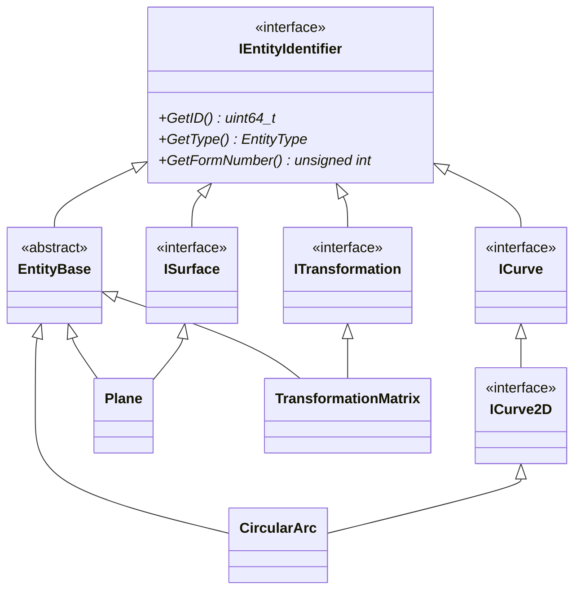

# Entity Base Class Architecture: Design and Implementation

## 目次

- [目次](#目次)
- [概要](#概要)
  - [Class Diagram](#class-diagram)
- [`IEntityIdentifier`](#ientityidentifier)
- [Specific Entity Interfaces](#specific-entity-interfaces)
- [Directory Entry Parameter Classes](#directory-entry-parameter-classes)
- [`EntityBase`](#entitybase)
  - [メンバ関数 (`EntityBase`)](#メンバ関数-entitybase)
    - [Directory Entry セクション関係のメンバ関数 (`EntityBase`)](#directory-entry-セクション関係のメンバ関数-entitybase)
      - [列挙体やプリミティブ型を返すもの](#列挙体やプリミティブ型を返すもの)
      - [個別のクラスを作成する必要のあるもの](#個別のクラスを作成する必要のあるもの)
      - [`EntityBase`継承クラスにおいて意味を持たないもの](#entitybase継承クラスにおいて意味を持たないもの)
    - [Parameter Dataセクションに関連したメンバ関数 (`EntityBase`)](#parameter-dataセクションに関連したメンバ関数-entitybase)
    - [その他細かいメンバ関数 (`EntityBase`)](#その他細かいメンバ関数-entitybase)
- [Specific Entity Classes](#specific-entity-classes)

## 概要

### Class Diagram

　以下の図に、エンティティ関連クラスの継承関係を示します。実際には100を越える具体的なエンティティクラスが存在しますが、ここでは、円弧を表す`CircularArc`クラス、平面を表す`Plane`クラス、変換行列を表す`TransformationMatrix`クラスと、それらの基底クラスのみを示しています。



　上記のクラス図で示したエンティティの役割を以下に整理します。基本的にエンティティの保持は`EntityBase`のポインタ（`std::shared_ptr<EntityBase>`等）で行いますが、特定の参照では専用の型を使用します。これは、インターフェース分離の原則、および依存性逆転の原則のための設計です。

　`IEntityIdentifier`および`EntityBase`を除くインターフェース（`ICurve`、`ISurface`、`ITransformation`等）は、特定の機能のみを対象とした参照の保持のために定義されています。例えば、`EntityBase`のDEフィールド7（Transformation Matrix）では、`std::weak_ptr<const ITransformation>`を使用してTransformation Matrix（Type 124）への参照を保持します。（したがって、継承関係ではありませんが、`EntityBase`は`ITransformation`に依存します）。

| クラス名 | 役割 |
| --- | --- |
| `IEntityIdentifier` | 全てのエンティティが共通して持つ識別情報（ID、タイプ、フォーム番号）を定義 |
| `ICurve`<br>`ISurface`<br>`ITransformation`<br>その他 | エンティティの特定の機能のみを対象としたインターフェース<br>（特定の役割に特化した参照の保持に使用） |
| `EntityBase` | 全てのエンティティが共通して持つ機能を実装する基底クラス |
| `CircularArc`<br>`Plane`<br>`TransformationMatrix`<br>その他 | IGESエンティティの具体的な実装クラス |

## `IEntityIdentifier`

> Defined at [i_entity_identifier.h](../../include/igesio/entities/i_entity_identifier.h)

> Ancestor class: None

　`IEntityIdentifier`クラスは、IGESファイルの各エンティティを識別するためのインターフェースです。このクラスは、全てのエンティティが共通して持つ識別情報を定義し、全ての具体的/抽象的なエンティティクラスはこのクラスを継承して実装されます。

　`IEntityIdentifier`クラスには、以下３つの純粋仮想関数のみが定義されています。いずれも実装は`EntityBase`クラスで行われます。

- [x] `uint64_t GetID() const;` (10th/20th DE fields)
  - プログラム上における、エンティティの一意な識別子を取得します。
- [x] `EntityType GetType() const;` (1st/11th DE fields)
  - エンティティタイプを取得します。
- [x] `unsigned int GetFormNumber() const;` (15th DE field)
  - エンティティのフォーム番号を取得します。

**本ライブラリでサポートされているかを確認するメンバ関数**

　本ライブラリには、未実装のエンティティクラスが多数存在します。また、読み込んだIGESファイルにユーザー定義のエンティティタイプが存在する可能性もあります。そのようなエンティティは、[`UnsupportedEntity`](entities_ja.md#unsupportedentity)クラスのインスタンスとして扱われます。以下のメンバ関数は、そのクラスが`UnsupportedEntity`ではないかを確認するためのものです。

- [x] `bool IsSupported() const;`
  - `UnsupportedEntity`のインスタンスを除き、常に`true`を返します。

## Specific Entity Interfaces

　インターフェースクラスについては、[entities/interfaces](entities_ja.md#interfaces)を参照してください。

## Directory Entry Parameter Classes

　本ライブラリでは、Directory Entry (DE) セクションの各フィールドを、以下の3種類に分類しています。このうち、(2)のフィールドを表現するクラスとして、`DEFieldWrapper`継承クラスを定義しています。これらのクラスは、`EntityBase`クラスのメンバ変数として保持され、各エンティティのDirectory Entryセクションの情報を表現します。

1. 列挙体やプリミティブ型の値として表現可能なフィールド
   - 例) Entity Type (1st/11th fields)、Status Number (9th field)、Entity Label (18th field) など
2. ポインタを持つ可能性のあるフィールド
   - 例) Structure (3rd field)、Transformation Matrix (7th field)、Color (13th field) など
3. `EntityBase`継承クラスにおいて意味を持たないフィールド
   - 例) Parameter Data (2nd field)、Parameter Line Count (14th field)、Reserved (16th/17th fields) など

　詳細については、[Directory Entryセクションの実装](de_field_ja.md)を参照してください。

## `EntityBase`

> Defined at [entity_base.h](../../include/igesio/entities/entity_base.h)

> Ancestor class:
> ```plaintext
> IEntityIdentifier <─── EntityBase
> ```

　`EntityBase`クラスは、IGESファイルの各エンティティを表現するための抽象基底クラスです。このクラスは、全てのエンティティが共通して持つ機能を定義し、具体的なエンティティクラスはこのクラスを継承して実装されます。

### メンバ関数 (`EntityBase`)

　本セクションでは、`EntityBase`クラスに実装される/実装予定のメンバ関数を示します。メンバ関数の前に記述された`[ ]` (または□)は、未実装のメンバ関数を示します。`[x]` (または☑)は、実装済みのメンバ関数を示します。

#### Directory Entry セクション関係のメンバ関数 (`EntityBase`)

　全てのエンティティのクラスは、Directory Entry (DE) セクションで定義される情報を取得・操作するためのメンバ関数を持つ必要があります。関連して、現在設定されているパラメータを[`RawEntityDE`](de_field_ja.md#rawentityde)オブジェクトとして取得する以下のメンバ関数も定義します。

- `RawEntityDE GetRawEntityDE() const;`
  - 内部で`RawEntityDE`オブジェクトを生成し、現在のエンティティのDEセクションの情報を取得します。

　以下には、データを取得するための`Value GetXxx() const`メンバ関数のみを記述していますが、特に明示されていない限り、値を設定するための`bool SetXxx(const Value& value)`メンバ関数も必要です。セッターの戻り値は、値がそのエンティティに設定可能な場合は`true`、そうでない場合は`false`を返すものとします。

##### 列挙体やプリミティブ型を返すもの

　以下に示すメンバ関数は、列挙体やプリミティブ型の値を返すもの（すなわち、他のエンティティへのポインタを持たないもの）です。

`IEntityIdentifier`クラス由来：

| field | 関数名 | 戻り値 |
| --- | --- | --- |
| 10th/20th | `GetID()` | `uint64_t` |
| 1st/11th | `GetType()` | `EntityType` |
| 15th | `GetFormNumber()` | `unsigned int` |

`EntityBase`クラスで新たに定義されるもの：

| field | 関数名 | 引数/戻り値 |
| --- | --- | --- |
| 9th | `GetBlankStatus()` <br> `SetBlankStatus(...)` |`bool` <br> true: visible (status 00),<br> false: invisible (status 01) |
| ^ | `GetSubordinateEntitySwitch()` <br> `SetSubordinateEntitySwitch(...)` | `SubordinateEntitySwitch` |
| ^ | `GetEntityUseFlag()` <br> `SetEntityUseFlag(...)` | `EntityUseFlag` |
| ^ | `GetHierarchyType()` <br> `SetHierarchyType(...)` | `HierarchyType` |
| ^ | `GetEntityStatus()` <br> `SetEntityStatus(...)` | `EntityStatus` |
| 12th | `GetLineWeightNumber()` <br> `SetLineWeightNumber(...)` | `double` |
| 18th | `GetEntityLabel()` <br> `SetEntityLabel(...)` | `std::string` |
| 19th | `GetEntitySubscript()` <br> `SetEntitySubscript(...)` | `int` |

##### 個別のクラスを作成する必要のあるもの

　以下に示すメンバ関数は、対応するDEフィールドがポインタを持つものです。これらのメンバ関数は、ポインタなどを格納する個別クラスを戻り値/引数とする関数として実装されます。以下の7つのフィールドは、

- const参照をを返す`GetXxx()`メンバ関数
  - 例: `const DEColor& GetColor() const;`
- デフォルト状態（無効値が設定された状態）に戻す`ResetXxx()`メンバ関数
  - 例: `void ResetColor();`
- ポインタや値を変更する`OverwriteXxx(...)`メンバ関数
  - 例: `bool OverwriteColor(const std::shared_ptr<const IColor>& color);`
  - 例: `bool OverwriteColor(const ColorNumber& color);` (列挙体バージョン)

を持ちます。これらのメンバ関数は、以下の表に示すように、フィールドの種類に応じて異なる実装を持ちます。

| field | type | 関数名 |
| --- | --- | --- |
| 3rd | (a) | `GetStructure()` <br> `ResetStructure()` <br> `OverwriteStructure(...)` |
| 4th | (b) | `GetLineFontPattern()` <br> `ResetLineFontPattern()` <br> `OverwriteLineFontPattern(...)` |
| 5th | (c) | `GetLevel()` <br> `ResetLevel()` <br> `OverwriteLevel(...)` |
| 6th | (c) | `GetView()` <br> `ResetView()` <br> `OverwriteView(...)` |
| 7th | (a) | `GetTransformationMatrix()` <br> `ResetTransformationMatrix()` <br> `OverwriteTransformationMatrix(...)` |
| 8th | (a) | `GetLabelDisplayAssociativity()` <br> `ResetLabelDisplayAssociativity()` <br> `OverwriteLabelDisplayAssociativity(...)` |
| 13th | (b) | `GetColor()` <br> `ResetColor()` <br> `OverwriteColor(...)` |

> **「type」列の値**：
>
> (a): フィールドが無効値か、単一種類のエンティティへのポインタを持つもの
> - `OverwriteXxx`関数は、ポインタで上書きするオーバーロードのみを満ちます
>
> (b): フィールドが規定値か無効値、または単一種類のエンティティへのポインタを持つもの
> - `OverwriteXxx`関数は、ポインタで上書きするオーバーロードと、列挙体値で上書きするオーバーロードの両方を持ちます
>
> (c): フィールドが正値か無効値、または単一種類のエンティティへのポインタを持つもの
> - `OverwriteXxx`関数は、ポインタで上書きするオーバーロードと、`int`値で上書きするオーバーロードの両方を持ちます

##### `EntityBase`継承クラスにおいて意味を持たないもの

　Parameter Data (2nd field)、Parameter Line Count (14th field)、Reserved (16th/17th fields) は、いずれもIGESファイル上でのみ意味を持ちます。したがって、これらのフィールドに対応するメンバ関数は、`EntityBase`クラスには定義しません。

> Note: `RawEntityDE`クラスなどの中間生成物クラスでは、これらのフィールドを保持するメンバ変数を定義しています。

#### Parameter Dataセクションに関連したメンバ関数 (`EntityBase`)

　Parameter Data (PD) セクションは、エンティティのパラメータを定義するセクションです。`EntityBase`クラスでは、すべてのエンティティが共通して持つ、PDセクション関連の以下のメンバ関数を定義します。

| 関数 | 説明 |
| --- | --- |
| `GetParameters()` | 追加ポインタも含め、エンティティのすべてのパラメータを `IGESParameterVector` として取得します。 |

　また、IGESファイルのParameter Dataセクションでは、エンティティが他のエンティティを参照することがあります。この参照関係を取得・設定するためのメンバ関数を定義します。

**子要素（物理的に従属するエンティティ）の取得**

- [x] `std::vector<uint64_t> GetChildIDs() const;`
  - このエンティティに物理的に従属するエンティティのIDリストを取得
- [x] `std::shared_ptr<const EntityBase> GetChildEntity(const uint64_t id) const;`
  - 指定されたIDの物理的に従属するエンティティのポインタを取得

**物理的・論理的に従属するエンティティの取得**

- [ ] `std::vector<uint64_t> GetDependantIDs(const SubordinateEntitySwitch dependency) const;`
  - 指定された従属関係タイプに基づいて、従属エンティティのIDリストを取得
- [ ] `std::shared_ptr<const EntityBase> GetDependant(const uint64_t id) const;`
  - 指定されたIDの従属エンティティのポインタを取得

> **Note**: IGES 5.3のSection 2.2.4.4.9.2によると、物理的・論理的どちらの従属関係も、Parameter Dataセクションでの参照によってのみ発生します。そのため、従属している要素を取得するメンバ関数と、参照している要素を取得するメンバ関数は明確に区別しています。

**参照するエンティティの取得・設定**

　Directory Entryセクションで参照する要素も含め、エンティティが参照する全てのエンティティ（またはそのID）を取得・設定するためのメンバ関数です。`EntityBase`継承クラスは参照する各エンティティへのポインタ（`std::shared_ptr<const EntityBase>`）を内部的に保持します。インスタンス作成後に、参照するエンティティのポインタを設定する必要があります。

- [x] `std::vector<uint64_t> GetReferencedEntityIDs() const;`
  - このエンティティが参照する全てのエンティティのIDリストを取得
- [x] `bool AreAllReferencesSet() const;`
  - エンティティが参照する全てのエンティティのポインタが設定済みかを確認
- [x] `std::vector<uint64_t> GetUnresolvedReferences() const;`
  - ポインタが未設定のエンティティのIDリストを取得
- [x] `bool SetUnresolvedReference(const std::shared_ptr<EntityBase>& entity);`
  - 未設定のポインタを設定（設定済みのポインタは上書きしない）

> `OverwritePointer`のような、IDでポインタを上書きするメンバ関数は定義しません。既に設定済みのポインタを上書きすることは、エンティティの整合性を損なう可能性があるためです。その操作は、個別の参照書換えメンバを使用したり（`SetView`など）、メンバ変数を直接操作することで行うことを想定しています。

#### その他細かいメンバ関数 (`EntityBase`)

**パラメータを検証するためのメンバ関数**

　そのエンティティオブジェクトに設定されている、DE＆PDセクションに該当するパラメータが正しいかを検証するためのメンバ関数です。以下の2つのメンバ関数を定義します。

- [x] `ValidationResult Validate() const;`
  - 現在のエンティティのパラメータが正しいかを検証するメンバ関数です。エラーが発生した場合は、そのエラーを`ValidationResult`内に格納して返します。
- [x] `bool IsValid() const;`
  - 現在のエンティティのパラメータが正しいかを検証するメンバ関数です。

**エンティティを区別するためのメンバ関数**

- [ ] `EntityClass GetEntityClass() const;`
  - エンティティのクラス (See Section 3.1 of IGES 5.3) を取得するためのメンバ関数です。セッターは不要です。
- [ ] `EntitySubClass GetEntitySubClass() const;`
  - [ ] 本ライブラリで定義する、エンティティのサブクラスを取得するためのメンバ関数です。セッターは不要です。

**行列演算**

　変換行列を左から掛けた場合の座標変換を行うメンバ関数です。前者は新しいエンティティを返し、後者は現在のエンティティを変換します。

- [ ] `std::shared_ptr<EntityBase> Transformed(const TransformationMatrix& matrix) const;`
- [ ] `void Transform(const TransformationMatrix& matrix);`

> 親から子要素に変換行列を伝播させる機能をどうするかはまだ未定です。親に変換行列の参照を追加する方法、親とすべての子要素の座標に変換をかける方法などがあります。加えて、親が変換行列の参照を持てない場合や、子が2Dの場合はどうするかも考慮する必要があります。
>  - 行列を右から掛けるメンバ関数（インスタンス自身の座標を変更する非constメンバ関数）
>  - 行列との演算子オーバーロード（座標値を変更したコピーを作成するconstメンバ関数）。こちらについて、子要素は`std::shared_ptr<const EntityBase>`となりますが、どうするかを考える必要があります。
>     - 案1: 子要素もコピーして座標値を変更：この場合、`const EntityBase`のポインタを持つもの以外に所有権を持つものがいなくなるという問題が生じる可能性があります
>     - 案2: この演算を物理的な子要素を持たないものに限定：この場合、それを確認するためのメンバ関数を`EntityBase`に実装する必要があります。
>     - Section 3.2.2を読む限り、Table 4に示される関係以外は、親の変換行列が適用されることはないように思えるため、それを前提とした方向性で実装を進める？

**エンティティの作成とコピー**

　自身をコピーした、新しいエンティティを返すメンバ関数です。戻り値のエンティティのIDは新たに割り当てられるものとし、戻り値のエンティティが参照するエンティティを別のものにするか（コピーするか）は未定です（コピーせず、同じエンティティを参照する`PointerContainer`を使用するようにする予定です）。

- [ ] `std::shared_ptr<EntityBase> Clone() const;`

**比較**

　エンティティの比較を行うメンバ関数です。比較の基準は、エンティティのIDやタイプなど、必要に応じて定義します。単純な演算子オーバーロードは定義せず、トレランスを指定可能なメンバ関数として定義します。

- [ ] `bool IsEqual(const EntityBase& other, double tolerance = 1e-6) const;`

**シリアライズ関連**

- [ ] `IGESParameterVector GetParameters() const;`
  - エンティティのパラメータをベクトルとして取得するメンバ関数です。PDセクションの、1つ目のフィールド (エンティティタイプ番号) を除いて返します。
- [ ] `std::string ToString() const;`
  - デバッグ/表示サポート用

## Specific Entity Classes

　特定のエンティティを表現する個別のクラスは、`EntityBase`クラスと、必要に応じて他のインターフェースを継承して実装されます。詳細については、以下のリンクを参照してください。

| 種別 | 説明 |
| --- | --- |
| [Structure](entities_ja.md#structure) | IGESファイルの構造を表現するクラス<br>＋未実装のエンティティを表現するクラス（`UnsupportedEntity`） |
| [Curves](entities_ja.md#curves) | 曲線を表現するクラス |
| [Surfaces](entities_ja.md#surfaces) | 曲面を表現するクラス |
| [Transformations](entities_ja.md#transformations) | 変換行列を表現するクラス<br>(`TransformationMatrix`クラス) |
