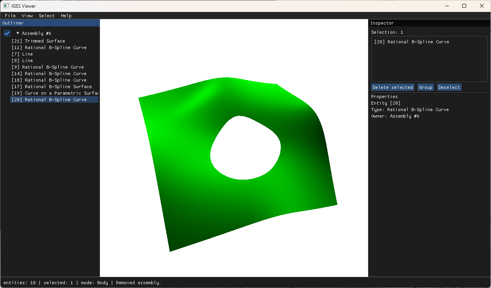
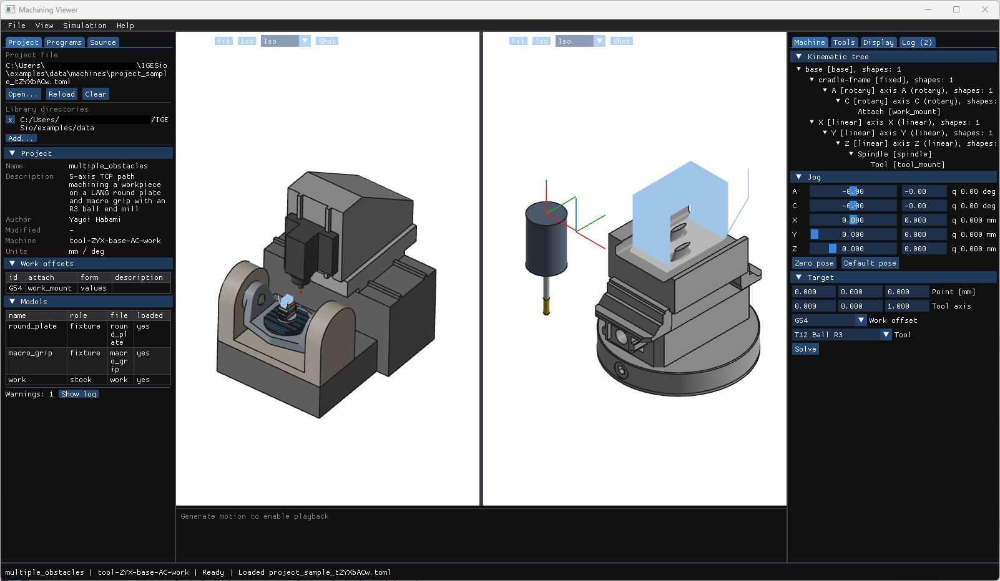
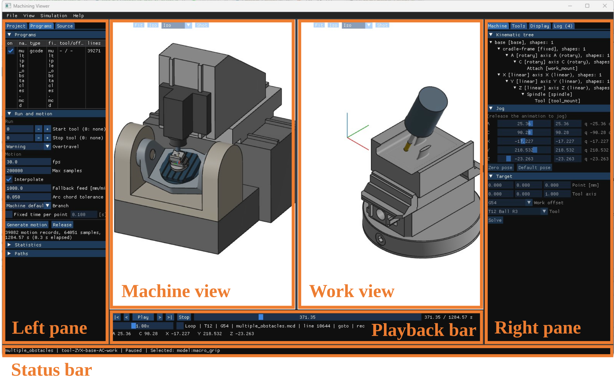
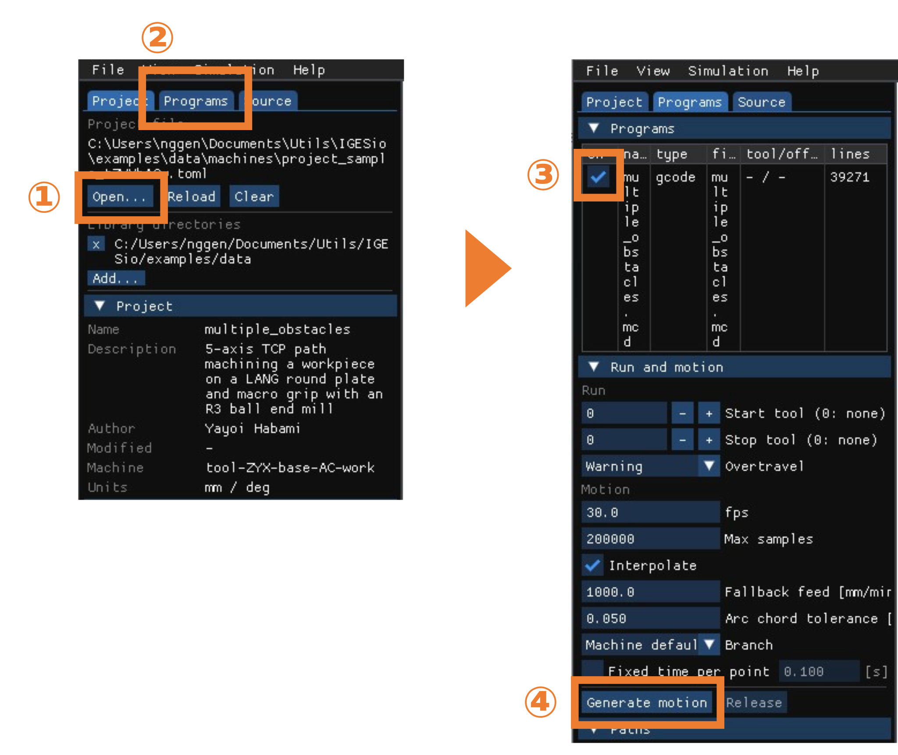
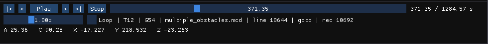

# Examples

This section provides an overview of the sample code included in the `examples` directory. For detailed explanations of each sample code, please refer to the comments within each source code file.

## Table of Contents

- [Table of Contents](#table-of-contents)
- [GUI Applications](#gui-applications)
  - [iges\_viewer.cpp](#iges_viewercpp)
    - [Window Layout](#window-layout)
    - [Loading IGES Files](#loading-iges-files)
    - [Viewer Controls](#viewer-controls)
    - [Assembly Operations and Structural Editing](#assembly-operations-and-structural-editing)
    - [Animation Playback](#animation-playback)
  - [machining\_viewer.cpp](#machining_viewercpp)
    - [Building and Starting](#building-and-starting)
    - [Window Layout](#window-layout-1)
    - [Viewer Controls](#viewer-controls-1)
    - [Basic Usage](#basic-usage)
- [CUI Applications](#cui-applications)
  - [iges\_data\_from\_scratch.cpp](#iges_data_from_scratchcpp)
  - [iges\_data\_io.cpp](#iges_data_iocpp)
  - [intermediate\_data\_io.cpp](#intermediate_data_iocpp)
  - [sample\_curves.cpp](#sample_curvescpp)
  - [sample\_surfaces.cpp](#sample_surfacescpp)

## GUI Applications

### iges_viewer.cpp

This is a sample code for the graphics module provided by this library. It loads IGES files and displays them in a GUI window. You can select which entity types to display, and use mouse controls to rotate, zoom, and pan the view.



**Figure: Screenshot of Iges Viewer**

#### Window Layout

The window consists of a menu bar at the top, an Outliner (assembly tree) on the left, an Inspector (selection summary and properties) on the right, a status bar at the bottom, and a viewport in the center. Each panel is anchored to an edge of the viewport.

- Menu bar: File (load, screenshot, exit), View (projection mode, reset camera, fit view, standard views, display mode, background color, antialiasing, transparency, per-type filters), Select (selection granularity, removal policy, deselect all), and Help.
- Outliner: displays the model's assembly tree and entities hierarchically. Entities are nested according to their reference structure. Click a row to select it, and right-click a node to open a context menu.
- Inspector: shows a summary of the current selection and lets you view and edit the properties (name, visibility, lock, and so on) of the focused assembly node.
- Status bar: shows the result of the most recent edit and the current selection granularity, among others.

Nothing is displayed immediately after startup. Load an IGES file from the "File" menu.

#### Loading IGES Files

Select "File" → "Load IGES..." from the menu bar to open a popup for entering a file path. Enter the file path as an absolute path and load it. If a file path is passed as a command-line argument, it is loaded automatically at startup.

If the file loads successfully, the corresponding entities are displayed in the viewport and added to the tree in the Outliner. Unsupported entities or invalid data are skipped, and error messages are printed to the console.

> Some IGES files may not display entities. This can happen if the entities are not supported by the library, or if the displayable entities are in a dependent state<sup>*</sup>.
>
> <sup>*</sup>A dependent state means, for example, "a curve on a surface"—the entity depends on another entity. In such cases, the dependent entity must also be supported and displayed. If the dependency is not supported, the dependent entity cannot be shown.

#### Viewer Controls

- Camera controls:
    - Middle drag: Rotate the view.
    - Ctrl + Middle drag: Pan (move the view).
    - Mouse wheel (or Shift + Middle drag): Zoom in/out.
    - "Fit View" in the View menu, or the F key, adjusts the camera so the whole model fits in the view.
    - "Reset Camera" in the View menu resets the camera to its initial position.
    - "Standard Views" in the View menu switches to a preset view: front, back, top, bottom, right, left, or isometric.
- Entity selection:
    - Left click: Select the entity under the cursor (highlighted).
    - Ctrl + Left click: Toggle selection (multi-select).
    - Click on empty space, or the Esc key: Clear all selections.
    - Left drag (L→R): Select entities fully inside the rectangle (window selection).
    - Left drag (R→L): Select entities intersecting the rectangle (crossing selection).
    - Ctrl + Left drag: Add box-selected entities to the current selection.
- Selection granularity: Switch between "Body" and "Assembly" in the Select menu. With "Assembly", clicking an entity selects the members of its owning assembly at once.
- Projection mode: Choose between two modes in the View menu:
    - Perspective: Shows objects with depth (default).
    - Orthographic: Parallel projection, commonly used in CAD.
- Display mode: Use "Display Mode" in the View menu to switch the combination of surface and surface-edge rendering. Non-subordinate curve entities are always drawn in every mode.
    - Shaded: Draws both surfaces and surface edges.
    - Wireframe: Draws surface edges only (no surface fill).
    - No Edge: Draws surfaces only (no surface edges).
- Background color: Use "Background" in the View menu to change the viewport background color.
- Screenshot: Use "Screenshot" in the File menu to save the current view as a PNG image. The file is named in the format "screenshot YYYY-MM-DD HHMMSS.png" and saved to the execution directory.
- Entity type visibility: Use "Filters" in the View menu to toggle visibility by entity type.

#### Assembly Operations and Structural Editing

The Outliner on the left displays a tree rooted at the model's root assembly. Expanding an assembly node lets you follow its child assemblies and owned entities. Clicking a node or entity row selects it and highlights it in the viewport. The checkbox at the head of an assembly node row toggles the visibility of its subtree.

Entities are displayed hierarchically according to their reference structure.

- Directly under an assembly, only the entities that are not referenced by any other entity in the same assembly are listed (in ascending ID order).
- Expanding an entity row shows the entities it references as child levels. References include those in the PD section (such as the constituent curves of a composite curve) as well as those in DE fields, such as transformation matrices and color definitions. Child levels are collapsed by default.
- An entity referenced by multiple entities, such as a transformation matrix, appears under each of its referrers.
- Clicking the arrow only expands or collapses the child level; clicking the row body selects the entity (Ctrl toggles).

Structural editing is available from the context menu opened by right-clicking a node in the Outliner, from the buttons in the Inspector, or from keyboard shortcuts.

- Context menu (right-click a node):
    - New child: Create a new child assembly directly under the node.
    - Group selection here: Group the selected entities into a new child assembly directly under the node.
    - Clear: Remove all entities and all child assemblies of the node.
    - Remove: Delete the node (child assembly).
- Inspector (selection summary): "Delete selected" (delete the selection), "Group" (group the selection into a new assembly), and "Deselect" (clear the selection).
- Removal policy: Use "Removal policy" in the Select menu to choose how an entity that is still referenced by others is handled on deletion.
    - Reject: Reject deletion if a reference remains (default).
    - Cascade: Also cascade-delete the referrers and physically dependent children.
    - Orphan: Delete while leaving references unresolved.
- Keyboard shortcuts:
    - Del: Delete the selected entities.
    - Ctrl + G: Group the selected entities into a new assembly.
    - Esc: Clear all selections.
    - F: Adjust the camera so the whole model fits in the view.

> Currently, all entities are owned directly by the root assembly at load time (no child assemblies are generated automatically). As a result, the "Assembly" selection granularity effectively selects everything. This is a forward-compatible implementation that becomes meaningful once child assemblies are generated automatically (with typed support for grouping entities).

#### Animation Playback

When built with the animation extension (`IGESIO_ENABLE_ANIMATION_EXTENSION`), an "Animation" menu is added to the menu bar. It plays keyframe animations that switch the poses of the loaded models (the child assemblies directly under the root).

Keyframes switch stepwise without interpolation: each key's value is held until the time of the next key, and the last key is held until the end of the animation. A clip holds three kinds of keys. Transform keys (rotation + translation) switch the pose of a target assembly, visibility keys show or hide a target assembly, and event keys form named integer sequences with no target; they do not act on the scene but let the caller query the value at the current time. The animation feature itself is provided as a GUI-independent library (`AnimationClip`/`AnimationPlayer` in `igesio/extensions/animation.h`); this panel is a practical example of it.

- Open the panel via "Animation" → "Animation Panel".
- "Build & Bind Demo Clip" builds a demo keyframe sequence for each target child assembly and makes it ready to play. The demo is a single rigid motion from the base pose to the end pose (total translation + total rotation), configurable with:
    - Motion: movement amount (Move span, a ratio of the largest world bounding box size), movement axis (Move axis), total rotation angle (Rotation), rotation axis (Rotation axis), rotation center (Rotation center: each assembly's BBox center / the whole model's BBox center / the world origin), whether to alternate the direction per child assembly (Alternate direction), whether to append the return leg (Ping-pong), and whether to hide each target after its outbound travel (Hide after travel). The last option adds visibility keys: the target is hidden at its arrival time and shown again when the return leg (Ping-pong) or the hold ends.
    - Smoothness: the number of subdivisions (Steps). The motion is split into this many keys. 1 moves in a single jump; higher values look continuous (about 60 per second of travel is already smooth at 60 fps).
    - Timing: the delay before the first key (Start delay), the one-way travel time (Travel), the per-assembly start offset (Stagger), and how long the final pose is held (Hold).
    - Targets: whether to animate only the selected assemblies (Selected assemblies only). The targets are the child assemblies directly under the root that own the selected elements.
    - The end of the settings shows the size of the clip to be generated (target count, keys per track, and total duration).
- Playback controls:
    - Play/Pause/Stop: Start, pause, and stop playback (stopping restores the original poses).
    - Time slider: Seek to an arbitrary time (can be dragged during playback).
    - Speed slider: Change the playback speed (0.1x to 4.0x).
    - Loop: Toggle looped playback.
    - Release: Detach the animation and restore the original poses and visibility.
    - Stage: The current value of the demo clip's `"stage"` event track (0 = idle, 1 = outbound, 2 = return, 3 = hold; the first target's timing is used as the representative).
    - Time change: Where the time last moved from and to, and whether that movement was monotone (forward only). This is the result of the player's `TakeTimeChange`, called every frame after `Advance`.
- After binding, the settings can still be changed under "Demo settings" and applied with Rebuild (playback continues from the beginning if it was playing).
- The bottom of the panel lists the tracks: transform and visibility tracks show the target assembly name, key count, and key time range; event tracks show the name and key count.
- Camera controls (rotate, pan, zoom) work as usual during playback.

### machining_viewer.cpp

This is a sample application for the machines extension (`igesio/extensions/machines.h`). It loads a machining project (a machine definition, tools, work offsets, models, and NC/CL programs), shows the machine and the workpiece in two views, generates the machine motion from the program, and plays it as an animation.

It is a test application that integrates the extensions of this project: stl/obj (STL/OBJ input and output), inspection (entity duplication, etc.), animation (keyframe animation), and machines (machine definitions, kinematics, and scene building).



**Figure: Screenshot of Machining Viewer (right after loading the sample project)**

#### Building and Starting

The executable `machining_viewer` is built when both `IGESIO_BUILD_GUI` and `IGESIO_ENABLE_MACHINES_EXTENSION` are enabled. The machines extension also enables the STL, OBJ, inspection, and animation extensions.

```bash
machining_viewer [-h|--help] [PROJECT=<path>] [LIB=<dir>]... [MSAA=<samples>]
```

- `PROJECT`: the machining project (TOML) to load at startup.
- `LIB`: a directory to search for the `library` keys of the project (machine definitions and tool libraries). It can be repeated. The directory of the project file itself is always searched first, so paths relative to the project file need no `LIB`. The `examples/data` directory of the source tree is always added last, so the sample project finds its machine definition without this argument.
- `MSAA`: the number of samples for multisample antialiasing (0 disables it; default 4).

The sample project is started as follows. The sample is a 5-axis TCP path (about 39,000 blocks) that machines a workpiece mounted on a LANG round plate and macro grip with an R3 ball end mill, on a tool-side XYZ / table-side AC machine.

```bash
machining_viewer PROJECT=<source tree>/examples/data/machines/project_sample_tZYXbACw.toml
```

#### Window Layout

The window consists of a menu bar, a left panel (Project, Programs, and Source tabs), two views in the center with a playback bar below them, a right panel (Machine, Tools, Display, and Log tabs), and a status bar.

- **Machine view**: the whole machine in machine coordinates. The table and the head move as the axes move.
- **Work view**: the display fixed to the work mount (the table). The machine is not shown, and the tool moves relative to the workpiece.
- **Playback bar**: the settings and display for animation playback. It also shows the current tool, work offset, program line, NC axis values, and so on.
- **Status bar**: the project name, the machine name, the state (No project / Ready / Bound / Playing), and the most recent message.

Both views share one scene, so an element selected in one view is highlighted in the other as well. Each view has Fit, Iso, a standard-view selector, and a screenshot button overlaid in its top-left corner.



> - Dragging the bar between the two views changes their width ratio, and "Layout" in the View menu switches between both views, the machine view only, and the work view only.
> - "Panels" in the View menu hides the left and right panels.

**Table: Panels and tabs of Machining Viewer**

| Panel | Tab | Contents |
|:---:|:---|:---|
| Left | Project | Loading a project and showing information about the loaded project |
| Left | Programs | The list of loaded programs and the control of motion generation |
| Left | Source | The source code of the loaded programs |
| Right | Machine | The kinematic tree of the machine, jogging, and inverse kinematics |
| Right | Tools | The list of loaded tools and the selection of the tool to use, etc. |
| Right | Display | Display settings |
| Right | Log | The log of warnings and information |

#### Viewer Controls

- Camera controls:
    - Middle drag: Rotate the view.
    - Ctrl + Middle drag: Pan (move the view).
    - Mouse wheel (or Shift + Middle drag): Zoom in/out.
    - F key, or Fit in the top-left of the view: Adjust the camera so the visible elements fit in the view.
    - "Standard View" in the View menu, or the selector in the top-left of the view: Top, Bottom, Front, Back, Right, Left, or Iso.
    - "Projection" in the View menu: Switch between perspective and orthographic projection per view.
- Selection:
    - Left click: Select the assembly (machine part, model, or tool) under the cursor.
    - Ctrl + Left click: Toggle selection (multi-select).
    - Click on empty space, or the Esc key: Clear all selections.
- Playback (available after generating motion):
    - Space: Play / Pause.
    - Left / Right: Previous / Next record.
    - Home / End: Go to the start / the end.
    - Ctrl+G: Generate motion.
- Screenshot: "Screenshot" in the File menu, the button in the top-left of the view, or the button in the Display tab saves the view as a PNG image. A popup asks for the file name.

#### Basic Usage

**Loading a project**
Click "Open Project..." (Ctrl+O; ① in the figure below) and enter the path of a machining project. Alternatively, "Reload Project" (F5) reloads the same file. Loading builds the machining setup and the scene, and warnings from loading (files not found, unresolved tools, and so on) are shown in the Log tab of the right panel.

**Generating motion**
Open the Programs tab (② in the figure below), make sure that valid programs are loaded (③ in the figure below), and click "Generate motion" (Ctrl+G; ④ in the figure below). The tool path is converted to axis values with inverse kinematics and sampled on a time axis, and an animation is created from the result. The Programs tab shows the statistics of the generated path.



**Figure: Motion generation flow (loading a project → generating motion)**

- The playback bar plays, pauses, and stops the animation, seeks with the time slider, and changes the speed and looping. The "<" and ">" buttons move to the previous and next record.
- While playing, the current record is highlighted in both views, the Source tab follows the current line, and the playback bar shows the current state.
- Clicking a path range in the Programs tab or a line in the Source tab moves to that position.



**Figure: Playback bar**

## CUI Applications

### iges_data_from_scratch.cpp

This sample code demonstrates how to create entities and IGES data programmatically. It creates basic curve entities and structure entities, performs simple operations on them, and then writes them to an IGES file.

The following output is generated:

```
Composite Curve:
    Parameter ranges:
        Curve1 range: [0, 1.5708],
        Curve2 range: [4.71239, 9.42478],
        Curve3 range: [3.14159, 6.28319],
        CompositeCurve range: [0, 9.42478]
    The 2nd curve ID (from TryGet): 2
Arc Parameters
    Normal at t=1.5: ((0.0707372), (0.997495), (0))
    Tangent at t=1.5: ((-0.997495), (0.0707372), (0))
    Dot product: 0

TransformationMatrix parameters: [6.12303e-17, 0.0, 1.0, 0.0, 0.0, 1.0, 0.0, 0.0, -1.0, 0.0, 0.0, 1.0]

Total entities added: 8
iges_data is ready: true
Writing IGES file to: "path\\to\\IGESio\\build\\debug_ex_win\\examples\\from_scratch.iges"
Write success: true
```

### iges_data_io.cpp

This sample code demonstrates how to read data from an IGES file and use it programmatically. It displays the types and counts of entities read from the IGES file.

You can specify the path to the IGES file as a command-line argument. If no path is specified, `examples/data/input.igs` is used by default.  Specify `--help` or `-h` to display usage instructions.

```
> iges_data_io.exe "path\to\iges\file.igs"
```

Executing without arguments produces output similar to the following:

```
Reading IGES file from: path/to/IGESio/examples\data\input.igs

Table 1. Entity types and counts (102 entities):
Entity Type                    Type#  Supported  Count
--------------------------------------------------------
Color Definition               314    Yes        1
Surface of Revolution          120    No         1
Line                           110    Yes        28
Transformation Matrix          124    Yes        4
Rational B-Spline Curve        126    Yes        30
Circular Arc                   100    Yes        4
Rational B-Spline Surface      128    No         6
Composite Curve                102    Yes        14
Curve on a Parametric Surface  142    No         7
Trimmed Surface                144    No         7
```

### intermediate_data_io.cpp

This sample code demonstrates how to perform input/output of [intermediate data structures](./intermediate_data_structure.md) from/to an IGES file. In normal usage, you do not need to directly manipulate the intermediate data structure because `igesio::ReadIges` and `igesio::WriteIges` internally convert it.

The results are generally similar to those of [iges_data_io.cpp](#iges_data_iocpp).

### sample_curves.cpp

This sample code creates curve entities implemented in this library and writes them to an IGES file. Refer to this code as an example of how to create each curve entity in [entities](./entities/entities.md). Also, the figures in that document are generated by displaying the IGES files created by this sample code in [IGES Viewer](#gui-applications).

Typically, there is no command-line output, and an IGES file named `sample_curves.igs` is generated.

### sample_surfaces.cpp

This sample code creates surface entities implemented in this library and writes them to an IGES file. Refer to this code as an example of how to create each surface entity in [entities](./entities/entities.md). Also, the figures in that document are generated by displaying the IGES files created by this sample code in [IGES Viewer](#gui-applications).

Typically, there is no command-line output, and an IGES file named `sample_surfaces.igs` is generated.


