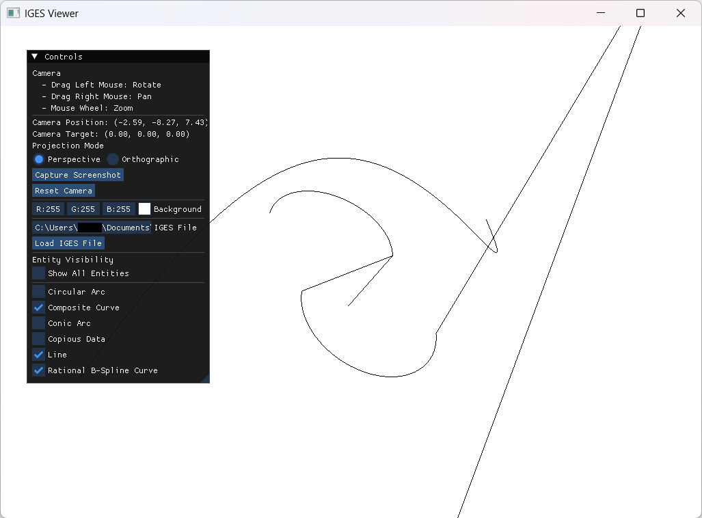

# Examples

This section provides an overview of the sample code included in the `examples` directory. For detailed explanations of each sample code, please refer to the comments within each source code file.

## Table of Contents

- [Table of Contents](#table-of-contents)
- [GUI Applications](#gui-applications)
  - [curves\_viewer.cpp](#curves_viewercpp)
    - [Loading IGES Files](#loading-iges-files)
    - [Viewer Controls](#viewer-controls)
- [CUI Applications](#cui-applications)
  - [iges\_data\_from\_scratch.cpp](#iges_data_from_scratchcpp)
  - [iges\_data\_io.cpp](#iges_data_iocpp)
  - [intermediate\_data\_io.cpp](#intermediate_data_iocpp)
  - [sample\_curves.cpp](#sample_curvescpp)

## GUI Applications

### curves_viewer.cpp

This is a sample code for the graphics module provided by this library. It loads IGES files and displays them in a GUI window. You can select which entity types to display, and use mouse controls to rotate, zoom, and pan the view.



**Figure: Screenshot of Curves Viewer**

When you start the program, a window like the one above appears. By default, nothing is displayed until you load an IGES file using the "Controls" panel on the left. The Controls panel can be moved and resized.

#### Loading IGES Files

Enter the file path in the "IGES File" field of the control panel and click the "Load IGES File" button. Please specify the file path as an absolute path. In the screenshot above, `examples/data/sample_curves.igs` is used as an example.

If the file loads successfully, curve entities are automatically added and displayed in the viewer. Unsupported entities or invalid data are skipped, and error messages are printed to the console.

> Some IGES files may not display entities. This can happen if the entities are not supported by the library, or if the displayable entities are in a dependent state<sup>*</sup>.
>
> <sup>*</sup>A dependent state means, for example, "a curve on a surface"—the entity depends on another entity. In such cases, the dependent entity must also be supported and displayed. If the dependency is not supported, the dependent entity cannot be shown.

#### Viewer Controls

- Camera controls:
    - Left drag: Rotate the view.
    - Right drag: Pan (move the view).
    - Mouse wheel: Zoom in/out.
    - "Reset Camera" button resets the camera to its initial position.
- Projection mode: Choose between two modes:
    - Perspective: Shows objects with depth (default).
    - Orthographic: Parallel projection, commonly used in CAD.
- Screenshot:
  - Click the "Capture Screenshot" button to save the current view as a PNG image.
  - The file is named in the format "screenshot YYYY-MM-DD HH-MM-SS.png" and saved to the execution directory.
- Background color: Change the background color using the color picker.
- Entity display controls:
    - "Show All Entities" checkbox toggles visibility of all entities.
    - Individual checkboxes allow toggling visibility by entity type.

## CUI Applications

### iges_data_from_scratch.cpp

This sample code demonstrates how to create entities and IGES data programmatically. It creates basic curve entities and structure entities, performs simple operations on them, and then writes them to an IGES file.

The following output is generated:

```
Composite Curve:
    Parameter ranges:
        Curve1 range: [0, 1.5708],
        Curve2 range: [4.71239, 9.42478],
        Curve3 range: [3.14159, 6.28319],
        CompositeCurve range: [0, 9.42478]
    The 2nd curve ID (from TryGet): 2
Arc Parameters
    Normal at t=1.5: ((0.0707372), (0.997495), (0))
    Tangent at t=1.5: ((-0.997495), (0.0707372), (0))
    Dot product: 0

TransformationMatrix parameters: [6.12303e-17, 0.0, 1.0, 0.0, 0.0, 1.0, 0.0, 0.0, -1.0, 0.0, 0.0, 1.0]

Total entities added: 8
iges_data is ready: true
Writing IGES file to: "path\\to\\IGESio\\build\\debug_ex_win\\examples\\from_scratch.iges"
Write success: true
```

### iges_data_io.cpp

This sample code demonstrates how to read data from an IGES file and use it programmatically. It displays the types and counts of entities read from the IGES file.

You can specify the path to the IGES file as a command-line argument. If no path is specified, `examples/data/input.igs` is used by default.  Specify `--help` or `-h` to display usage instructions.

```
> iges_data_io.exe "path\to\iges\file.igs"
```

Executing without arguments produces output similar to the following:

```
Reading IGES file from: path/to/IGESio/examples\data\input.igs

Table 1. Entity types and counts (102 entities):
Entity Type                    Type#  Supported  Count
--------------------------------------------------------
Color Definition               314    Yes        1
Surface of Revolution          120    No         1
Line                           110    Yes        28
Transformation Matrix          124    Yes        4
Rational B-Spline Curve        126    Yes        30
Circular Arc                   100    Yes        4
Rational B-Spline Surface      128    No         6
Composite Curve                102    Yes        14
Curve on a Parametric Surface  142    No         7
Trimmed Surface                144    No         7
```

### intermediate_data_io.cpp

This sample code demonstrates how to perform input/output of [intermediate data structures](./intermediate_data_structure.md) from/to an IGES file. In normal usage, you do not need to directly manipulate the intermediate data structure because `igesio::ReadIges` and `igesio::WriteIges` internally convert it.

The results are generally similar to those of [iges_data_io.cpp](#iges_data_iocpp).

### sample_curves.cpp

This sample code creates curve entities implemented in this library and writes them to an IGES file. Refer to this code as an example of how to create each curve entity in [entities](./entities/entities.md). Also, the figures in that document are generated by displaying the IGES files created by this sample code in [Curves Viewer](#gui-applications).

Typically, there is no command-line output, and an IGES file named `sample_curves.igs` is generated.
