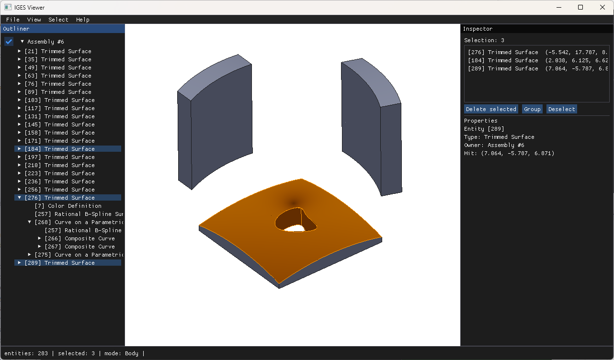

# Examples

　本項では、`examples`ディレクトリに含まれるサンプルコードの概要を説明します。各サンプルコードの詳細な説明は、各ソースコード内のコメントを参照してください。

## 目次

- [目次](#目次)
- [GUIアプリケーション](#guiアプリケーション)
  - [iges\_viewer.cpp](#iges_viewercpp)
    - [画面構成](#画面構成)
    - [IGESファイルの読み込み](#igesファイルの読み込み)
    - [ビューアの操作](#ビューアの操作)
    - [アセンブリの操作と構造編集](#アセンブリの操作と構造編集)
- [CUIアプリケーション](#cuiアプリケーション)
  - [iges\_data\_from\_scratch.cpp](#iges_data_from_scratchcpp)
  - [iges\_data\_io.cpp](#iges_data_iocpp)
  - [intermediate\_data\_io.cpp](#intermediate_data_iocpp)
  - [sample\_curves.cpp](#sample_curvescpp)
  - [sample\_surfaces.cpp](#sample_surfacescpp)

## GUIアプリケーション

### iges_viewer.cpp

　本ライブラリで提供するグラフィックスモジュールのサンプルコードです。IGESファイルを読み込み、GUI上で表示します。表示するエンティティのタイプを選択したり、マウス操作で回転・拡大縮小・平行移動が可能です。



**図. IGES Viewerのスクリーンショット**

#### 画面構成

　ウィンドウは、上部のメニューバー、左側のOutliner（アセンブリツリー）、右側のInspector（選択サマリとプロパティ）、下部のステータスバー、中央のビューポートで構成されます。各パネルはビューポートの端に固定されます。

- メニューバー: File（読み込み・スクリーンショット・終了）、View（投影モード・カメラリセット・フィットビュー・標準ビュー・表示モード・背景色・アンチエイリアス・透過・タイプ別フィルタ）、Select（選択粒度・削除ポリシー・全選択解除）、Help。
- Outliner: モデルのアセンブリツリーとエンティティを階層表示します。エンティティは参照構造に従って入れ子に表示されます。行をクリックして選択でき、ノードを右クリックするとコンテキストメニューを開けます。
- Inspector: 現在の選択内容のサマリと、フォーカス中のアセンブリノードのプロパティ（名前・可視性・ロックなど）を表示・編集します。
- ステータスバー: 直近の編集操作の結果や、現在の選択粒度などを表示します。

　起動直後は何も表示されません。メニューバーの「File」からIGESファイルを読み込みます。

#### IGESファイルの読み込み

　メニューバーの「File」→「Load IGES...」を選択すると、ファイルパスの入力ポップアップが開きます。ファイルパスを絶対パスで入力し、読み込みを実行してください。コマンドライン引数でファイルパスを渡した場合は、起動時に自動で読み込まれます。

　ファイルが正常に読み込まれると、対応するエンティティがビューポートに表示され、Outlinerのツリーに追加されます。サポートされていないエンティティや無効なデータはスキップされ、エラーメッセージがコンソールに出力されます。

> IGESファイルによっては、エンティティが表示されない場合があります。これは、当該エンティティが本ライブラリでサポートされていないか、表示可能なエンティティが従属状態<sup>※</sup>にあるためです。
>
> <sup>※</sup>従属状態とは、例えば「曲線がサーフェス上にある」など、他のエンティティに依存している状態を指します。この場合、依存先のエンティティも表示する必要があります。依存先のエンティティがサポートされていない場合、従属エンティティも表示できません。

#### ビューアの操作

- カメラ制御:
  - 中ボタンドラッグ: 視点の回転。
  - Ctrl+中ボタンドラッグ: パン（平行移動）。
  - マウスホイール（またはShift+中ボタンドラッグ）: ズームイン/アウト。
  - Viewメニューの「Fit View」、またはFキーで、モデル全体が画面に収まるようにカメラを調整します。
  - Viewメニューの「Reset Camera」でカメラを初期位置に戻せます。
  - Viewメニューの「Standard Views」で、正面・背面・上面・下面・右側面・左側面・等角投影の定型ビューへ切り替えられます。
- エンティティの選択:
  - 左クリック: クリック位置のエンティティを選択し、ハイライト表示します。
  - Ctrl+左クリック: 選択への追加・解除（複数選択のトグル）。
  - 何もない位置のクリック、またはEscキー: すべての選択を解除します。
  - 左ドラッグ（左→右）: 矩形内に完全に収まるエンティティを選択（内包選択）。
  - 左ドラッグ（右→左）: 矩形に少しでもかかるエンティティを選択（交差選択）。
  - Ctrl+左ドラッグ: 範囲選択の結果を既存の選択に追加。
- 選択粒度: Selectメニューの「Body」/「Assembly」で切り替えます。「Assembly」を選ぶと、クリックしたエンティティの所有アセンブリのメンバを一括選択します。
- 投影モード: Viewメニューで以下の2種類から選択可能です。
  - パースペクティブ（遠近法）: 遠近感のある表示。
  - オーソグラフィック（平行投影）: 平行な線を保った表示（CADで一般的）。
- 表示モード: Viewメニューの「Display Mode」で、面と面エッジの描画の組み合わせを切り替えます。従属しない曲線エンティティはいずれのモードでも常に描画されます。
  - Shaded: 面と面エッジの両方を描画します。
  - Wireframe: 面エッジのみを描画します（面の塗りつぶしを描画しません）。
  - No Edge: 面のみを描画します（面エッジを描画しません）。
- 背景色: Viewメニューの「Background」で、ビューポートの背景色を変更できます。
- スクリーンショット: Fileメニューの「Screenshot」で、現在のビューをPNG画像として保存します。ファイル名は「screenshot YYYY-MM-DD HHMMSS.png」の形式で、実行ディレクトリに保存されます。
- エンティティタイプの表示切替: Viewメニューの「Filters」から、エンティティタイプごとに表示/非表示を切り替えられます。

#### アセンブリの操作と構造編集

　左側のOutlinerは、モデルのルートアセンブリを起点としたツリーを表示します。アセンブリノードを展開すると、子アセンブリと所有エンティティをたどれます。ノードやエンティティの行をクリックすると選択され、ビューポート上でハイライトされます。アセンブリノード行頭のチェックボックスで、そのサブツリーの表示/非表示を切り替えられます。

　エンティティは参照構造に従って階層表示されます。

- アセンブリ直下に並ぶのは、同じアセンブリ内の他のエンティティから参照されていないエンティティのみです（ID昇順）。
- エンティティの行を展開すると、そのエンティティが参照するエンティティが子階層として表示されます。参照には、PDセクションでの参照（複合曲線の構成曲線など）のほか、変換行列や色定義などのDEフィールドでの参照も含まれます。子階層はデフォルトで折りたたまれています。
- 変換行列のように複数のエンティティから参照されるものは、各参照元の下にそれぞれ表示されます。
- 矢印のクリックは子階層の開閉のみを行い、行本体のクリックが選択になります（Ctrlでトグル）。

　構造の編集は、Outlinerのノードを右クリックして開くコンテキストメニュー、右側のInspectorのボタン、またはキーボードショートカットから行えます。

- コンテキストメニュー（ノード右クリック）:
  - New child: 直下に新しい子アセンブリを作成します。
  - Group selection here: 選択中のエンティティを、このノード直下の新しい子アセンブリへまとめます。
  - Clear: ノードの全エンティティと全子アセンブリを除去します。
  - Remove: ノード（子アセンブリ）を削除します。
- Inspector（選択サマリ）: 「Delete selected」（選択削除）、「Group」（選択を新規アセンブリへまとめる）、「Deselect」（選択解除）を操作できます。
- 削除ポリシー: Selectメニューの「Removal policy」で、削除時に他から参照されているエンティティの扱いを選びます。
  - Reject: 参照が残る場合は削除を拒否します（既定）。
  - Cascade: 参照元・物理従属子も連鎖削除します。
  - Orphan: 参照を未解決のまま削除します。
- キーボードショートカット:
  - Del: 選択中のエンティティを削除します。
  - Ctrl+G: 選択中のエンティティを新規アセンブリへまとめます。
  - Esc: すべての選択を解除します。
  - F: モデル全体が画面に収まるようにカメラを調整します。

> 現状、読み込み時は全エンティティがルートアセンブリ直下に所有されます（子アセンブリは自動生成されません）。このため、選択粒度「Assembly」は実質的に全選択になります。これは、子アセンブリの自動生成（束ね系エンティティの型付き対応）に伴って意味を持つ、前方互換の実装です。

## CUIアプリケーション

### iges_data_from_scratch.cpp

　エンティティとIGESのデータをプログラム上で作成するサンプルコードです。基本的な曲線エンティティや構造エンティティなどを作成し、簡単にその操作を行った後、IGESファイルに書き出します。

　以下のような出力が得られます。

```
Composite Curve:
  Parameter ranges:
    Curve1 range: [0, 1.5708],
    Curve2 range: [4.71239, 9.42478],
    Curve3 range: [3.14159, 6.28319],
    CompositeCurve range: [0, 9.42478]
  The 2nd curve ID (from TryGet): 2
Arc Parameters
  Normal at t=1.5: ((0.0707372), (0.997495), (0))
  Tangent at t=1.5: ((-0.997495), (0.0707372), (0))
  Dot product: 0

TransformationMatrix parameters: [6.12303e-17, 0.0, 1.0, 0.0, 0.0, 1.0, 0.0, 0.0, -1.0, 0.0, 0.0, 1.0]

Total entities added: 8
iges_data is ready: true
Writing IGES file to: "path\\to\\IGESio\\build\\debug_ex_win\\examples\\from_scratch.iges"
Write success: true
```

### iges_data_io.cpp

　IGESファイルからデータを読み込み、プログラム上で利用するサンプルコードです。ここでは、IGESファイルから読み込んだエンティティのタイプと数を表示します。

　以下のように、コマンドライン引数としてIGESファイルのパスを指定できます。パスを指定しない場合は、`examples/data/input.igs` がデフォルトで使用されます。`--help` または `-h` を指定すると、使用方法が表示されます。

```
> iges_data_io.exe "path\to\iges\file.igs"
```

　引数なしで実行すると、以下のような出力が得られます。

```
Reading IGES file from: path/to/IGESio/examples\data\input.igs

Table 1. Entity types and counts (102 entities):
Entity Type                    Type#  Supported  Count
--------------------------------------------------------
Color Definition               314    Yes        1
Surface of Revolution          120    No         1
Line                           110    Yes        28
Transformation Matrix          124    Yes        4
Rational B-Spline Curve        126    Yes        30
Circular Arc                   100    Yes        4
Rational B-Spline Surface      128    No         6
Composite Curve                102    Yes        14
Curve on a Parametric Surface  142    No         7
Trimmed Surface                144    No         7
```

### intermediate_data_io.cpp

　IGESファイルから、[中間データ構造](./intermediate_data_structure_ja.md)の入出力を行うサンプルコードです。通常の使用では、`igesio::ReadIges`や `igesio::WriteIges`を使用することで、中間データ構造が内部的に変換されるため、直接中間データ構造を操作する必要はありません。

　結果については、[iges_data_io.cpp](#iges_data_iocpp)とおおよそ同様です。

### sample_curves.cpp

　本ライブラリで実装済みの曲線エンティティを作成し、IGESファイルに書き出すサンプルコードです。[entities](./entities/entities_ja.md)における各曲線エンティティの作成方法の例として参照してください。また、当該ドキュメントの各図は、このサンプルコードで生成したIGESファイルを[IGES Viewer](#guiアプリケーション)で表示したものです。

　通常、コマンドライン出力はなく、`sample_curves.igs`というIGESファイルが生成されます。

### sample_surfaces.cpp

　本ライブラリで実装済みの曲面エンティティを作成し、IGESファイルに書き出すサンプルコードです。実装済みの曲面エンティティの作成方法の例として参照してください。また、当該ドキュメントの各図は、このサンプルコードで生成したIGESファイルを[IGES Viewer](#guiアプリケーション)で表示したものです。

　通常、コマンドライン出力はなく、`sample_surfaces.igs`というIGESファイルが生成されます。
