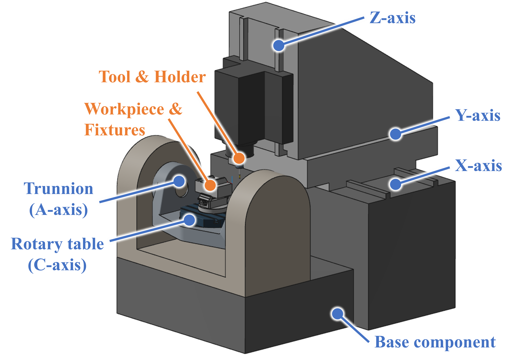

# 機械定義フォーマットの設計

　本ファイルでは、任意の軸構成と形状を持つ多軸工作機械を単一のTOMLファイルで表現するフォーマットを定義する。

## 1. 目的と適用範囲

　本フォーマットは次の用途に必要な情報を保持する。

- 順運動学：各軸のNC指令値を与えたときの全コンポーネントの位置・姿勢の計算と描画
- 逆運動学：工具軸方向から回転軸のNC指令値を求める計算と、制御点を目標点に一致させる直進軸のNC指令値を求める計算
- 干渉計算：機械構造物の形状と、干渉判定を行う対象の組の定義

　次の要素は本フォーマットの対象外とし、別フォーマットで管理する。工具およびワークに関しては、本フォーマットでは取り付けフレーム（工具側`tool_mount`とワーク側`work_mount`）のみを定義する。

- 工具・ホルダ
- ワーク・治具
- G54等のワーク原点オフセット（セットアップ情報）

## 2. 基本方針

### 2.1 木構造とフラット表現

　機械は**コンポーネント**を節点とする運動学ツリーで表現する。運動学ツリーはルート（以下、`base`）から工具側チェーンとワーク側チェーンの2本の枝に分かれ、それぞれの末端が`tool_mount`と`work_mount`となる。

```text
base ─┬─ X ─ Y ─ Z ─ spindle ─ tool_mount   (工具側)
      └─ A ─ C ─ work_mount                 (ワーク側)
```



**図2.1** 工具側チェーンにX/Y/Z軸、ワーク側チェーンにA/C軸を持つ機械の例

　`base`から`tool_mount`までの経路上のコンポーネント列を工具側チェーン、`work_mount`までの経路上の列をワーク側チェーンと呼ぶ。図2.1は工具側チェーンに直進軸X/Y/Z、ワーク側チェーンに回転軸A/Cを持つ機械の例である。
　本フォーマットでは、チェーンに属さない位置のコンポーネント（可動軸を含む）も定義できる（§4.4.3）。

　TOMLは深いネストの定義に向かないため、運動学ツリーは`[[component]]`の配列とし、`parent`キーによる参照で親子関係を定義する。運動の合成順は、この親子関係で表現される。

### 2.2 ゼロポーズ機械座標系

　全コンポーネントの形状、全軸の方向ベクトルと軸上の点、および取り付けフレームは、全軸の軸変位量が0の姿勢（ゼロポーズ）における機械座標系の値で定義する。

<!-- 以下の理由から、親相対のローカルフレームを連鎖させる方式（URDFやVERICUTの方式）は採らない

- 実機の測定値（軸中心の機械座標、傾斜角）をそのまま記述できる
- 運動学を統一的な式（軸方向と軸上の点を固定座標で保持）で扱いやすい
- 記述時に親相対の座標系の合成計算を行う必要がない

-->

　ゼロポーズは定義ファイル記述時の基準姿勢であり、機械が物理的に到達できる必要はない。NC指令値0が`limits`（§4.6）の範囲外となる軸があってもよい（この場合の`initial`の扱いは§4.6を参照）。

　コンポーネント単位で任意のローカル座標系（`local_frame`、§4.5）を宣言し、そのコンポーネント内の座標値をローカル座標で記述することもできる。ただし`local_frame`自体は常にゼロポーズ機械座標系で記述するものとし、親子間で引き継がれず、連鎖もしない（省略時は機械座標系と一致する）。

### 2.3 順運動学の定義

　コンポーネント $c$ について、ルートから $c$ までの経路上で可動軸（`axis`）を持つコンポーネントを根元側から順に $1, \dots, n$ とし、それぞれのNC指令値を $q_k$ とする。各軸について、ワーク側チェーンでは $-1$, それ以外（工具側チェーンおよびチェーン外）では $+1$ の値をとる、符号 $\sigma_k$ を定義する. $c$ に属する形状と取り付けフレームの運動（ゼロポーズ機械座標から、軸変位量 $\boldsymbol{q}$ での機械座標への同次変換）は、以下の式(2.1)で与えられる。

$$F_c(\boldsymbol{q}) = J_1(\sigma_1 q_1) J_2(\sigma_2 q_2) \cdots J_n(\sigma_n q_n) \qquad(2.1)$$

　ここで, $J_k(\theta)$ は、直進軸では方向 $\boldsymbol{d}_k$ に沿った並進 $\theta \boldsymbol{d}_k$, 回転軸では点 $\boldsymbol{p}_k$ を通る軸 $\boldsymbol{d}_k$ まわりの角度 $\theta$ の回転 (回転部 $R(\boldsymbol{d}_k, \theta)$, 並進部 $\boldsymbol{p}_k - R(\boldsymbol{d}_k, \theta) \boldsymbol{p}_k$) である。この $F_c$ を用いて、ゼロポーズにおいて $\boldsymbol{v}$ の位置にある点は $F_c(\boldsymbol{q}) \boldsymbol{v}$ の位置に移動する。

　各コンポーネントの軸は、NC指令値の正方向、すなわち工具のワークに対する相対運動の向きで定義する（§4.6、`direction`）。したがって、ワーク側チェーンのコンポーネントの運動は、NC指令値に対して符号が反転するため、これを表現するために符号 $\sigma_k$ を導入する。

　式(2.1)の $\boldsymbol{d}_k, \boldsymbol{p}_k$ は機械座標系での値である。`local_frame`を持つコンポーネントの軸、取り付けフレーム、形状は、§4.5の変換で機械座標系に移してから式（2.1）を適用する。

### 2.4 回転の表記

　姿勢の記述には次の3形式のいずれかを用いる。形式はキー名で区別し、`local_frame`（§4.5）、`frame`（§4.7）、`geometry`（§4.8）のいずれでも同じキー名を用いる。同一要素について、複数の形式を同時に指定することはできない。

- 軸ベクトル指定（`rotation`）：`rotation = { x_axis = [...], y_axis = [...], z_axis = [...] }`
  - 元の座標系のx、y、z軸方向ベクトルが、回転後に取る値を指定する（回転行列の列ベクトル）
  - 3キーすべてを指定し、正規直交かつ行列式が $+1$ であること
- 軸ベクトルと角度（`rotation_axis_angle`）：`rotation_axis_angle = { axis = [x, y, z], angle = a }`
  - 単位ベクトルまわりの右ねじ回転
  - `angle`の単位は`[units].angle`に従う
- オイラー角（`rotation_euler_ijk`）：`rotation_euler_ijk = [I, J, K]`
  - 式(2.2)のように、固定軸まわりにX→Y→Zの順で適用する（単位は`[units].angle`に従う）
  - $$R(I, J, K) = R_z(K) R_y(J) R_x(I) \qquad(2.2)$$
  - 一般に、オイラー角の回転順序や軸の選択方法は多岐にわたるが、本フォーマットでは式(2.2)のみ指定可能

<!--
- 軸ベクトル指定はVERICUTの`ModelMatrix`（`MatrixXAxis`/`MatrixYAxis`/`MatrixZAxis`）と1対1に対応し、そのまま転記できる。
- 式（2.2）はVERICUTの`<Rotation I J K>`と同一の規約であり、`.mch`の値をそのまま転記できる。
- 行列をオイラー角に変換する際の値はジンバルロック時に一意でないが、これは出力時のみの問題であり、読込は常に一意に定まる。
-->

### 2.5 字句と数値の規約

- 識別子（コンポーネントの`name`/`register`、干渉チェックの対象名等）は大文字/小文字を区別する。
- 本フォーマットで規定するキー名（`type`の値、`mode`の値等）はASCII文字のみとする。
  - `name`や`description`、コメント等の内容については非ASCII文字を使用してよい。
- 実数値はTOML整数リテラルでも指定可能とする（`1`と`1.0`は同義）。
- 本仕様で定義されないキーは無視する。その存在を警告するかは処理系の任意とする（§5.2）。
- 幾何検証（単位ベクトル、直交性、正規直交性）の許容誤差は1e-3とする。方向ベクトルは単位長で記述するものとし、パーサーは許容誤差内の値を再正規化してよい。

## 3. ファイル構成

| セクション | 必須か | 内容 |
|:-:|:-:|-|
| `[format]` | ✅ | フォーマット識別子とバージョン |
| `[machine]` | ✅ | 機械のメタ情報 |
| `[units]` | - | 単位系（省略時はmm/deg） |
| `[[component]]` | ✅ <br> （複数） | 運動学ツリーのコンポーネント定義 |
| `[kinematics]` | - | 逆運動学に関する設定 |
| `[collision]` | - | 干渉チェック設定 |

## 4. セクション仕様

### 4.1 `[format]`

| キー | 型 | 必須か | 内容 |
|:-:|:-:|:-:|-|
| `name` | 文字列 | ✅ | 固定値`"machine-definition"` |
| `version` | 整数[2] | ✅ | フォーマットバージョン`[major, minor]`。本仕様は`[2, 0]` |

　`version`の`major`は後方互換性のない変更を加えた場合に、`minor`はキー追加等の小変更を加えた場合に加算する。パーサーは、`major`が対応値と異なる場合はエラーとし、`minor`が対応値より大きい場合は警告して読込を続行する。

### 4.2 `[machine]`

| キー | 型 | 必須か | 内容 |
|:-:|:-:|:-:|-|
| `name` | 文字列 | ✅ | 機械名 |
| `description` | 文字列 | - | 説明 |
| `author` | 文字列 | - | 作成者 |
| `date` | 日付 | - | 作成日または更新日。TOMLの日付型または日時型のほか、文字列でもよい |

### 4.3 `[units]`

| キー | 型 | 必須か | 内容 |
|:-:|:-:|:-:|-|
| `length` | 文字列 | - | `"mm"`（デフォルト）または`"inch"` |
| `angle` | 文字列 | - | `"deg"`（デフォルト）または`"rad"` |

　ファイル内の全数値（座標、NC指令値、`limits`、送り速度等）の単位。時間の基準（minおよびs）は固定であり、`[units]`からは変更できない（§4.6.1）。
　`geometry`の`unit`キーにより上書きした場合のみ（§4.8）、ここで指定された単位以外が使用されうる。

### 4.4 `[[component]]`

　運動学ツリーの1要素。1つのコンポーネントにつき1つの`[[component]]`テーブルを作成する。

| キー | 型 | 必須か | 内容 |
|:-:|:-:|:-:|-|
| `name` | 文字列 | ✅ | 機械定義内で一意な識別名 |
| `parent` | 文字列 | ✅ | 親コンポーネント名。`base`以外では必須<br>（`base`では指定不可、§4.4.1） |
| `type` | 文字列 | ✅ | 下表のいずれか |

　`type`キーでは以下の要素を指定できる。いずれの`type`も任意で`local_frame`（§4.5）を宣言でき、描画や干渉判定用の形状データ（`[[component.geometry]]`（§4.8））を指定可能。

| `type` | 説明 | サブテーブル |
|:-:|-|:-:|
| `base` | ルート（§4.4.1） | - |
| `linear` | 直進軸 | `axis`必須 |
| `rotary` | 回転軸 | `axis`必須 |
| `spindle` | 主軸（§4.4.2） | `spindle`任意 |
| `tool_mount` | 工具取り付け点<br> (機械定義あたり1つ) | `frame`必須 |
| `work_mount` | ワーク取り付け点<br> (機械定義あたり1つ) | `frame`必須 |
| `fixed` | 動かない構造物<br>（カバー、付属の装置等） | - |

　`tool_mount`/`work_mount`は末端であるため、子コンポーネントは設定できない。工具やホルダー、または加工物や治具等は、[別フォーマット](./project-definition-format_ja.md)で対応する座標系に設定する。

　以下の名前は本フォーマットにおいて予約済みであり、`name`で指定できない。
- `"base"`：ルート専用（§4.4.1）
- `"tool"`/`"work"`は干渉判定用の予約名（§4.10）

　サブテーブルとして、以下のものを指定できる。
| サブテーブル | 説明 |
|:-:|-|
| `[component.spindle]` | 主軸の属性（§4.4.2） <br> （`type = "spindle"`のみ） |
| `[component.local_frame]` | ローカル座標系の宣言（§4.5） |
| `[component.axis]` | 軸の属性（§4.6） <br> （`type = "linear"`/`"rotary"`のみ） |
| `[component.frame]` | 取り付けフレームの定義（§4.7） <br> （`type = "tool_mount"`/`"work_mount"`のみ） |
| `[[component.geometry]]` | 描画や干渉判定用の形状データ（§4.8） |

　各サブテーブルは、指定先のコンポーネントテーブル（`[[component]]`）の直下に記述する。TOMLの仕様として、`[component.axis]`/`[[component.geometry]]`等のサブテーブルは、ファイル中で直前に記述された`[[component]]`の子要素となる。ブロックの並べ替えや挿入により、意図せず別コンポーネントのサブテーブルとなることを避けるため、コンポーネント内では上の順で定義することを推奨する。
　以下は`base`の子要素として、形状データを持つ直進軸Xを定義するコンポーネントテーブルの例である。

```toml
[[component]]
name = "X"
type = "linear"
parent = "base"

[component.axis]
register = "X"
direction = [1.0, 0.0, 0.0]
limits = [-400.0, 400.0]

[component.axis.dynamics]
rapid_feed = 6000.0
max_feed = 6000.0
min_feed = 1.0

[[component.geometry]]
name = "z-axis-lane"
file = "tool-BZX-base-YC-work/z-axis-lane.STL"
color = "#d8d8d8"
```

#### 4.4.1 ルート（`base`）

　名前`"base"`はルートコンポーネントとして予約されており、定義を省略できる。ベッドやカバー等の形状を持たせたい場合にのみ明示的に定義する。明示定義する場合、`type = "base"`のみであり、`parent`とサブテーブル（`axis`/`frame`/`spindle`）は指定できない。

#### 4.4.2 主軸（`spindle`, `[component.spindle]`）

　`type = "spindle"`は主軸を定義するコンポーネントである。位置決め軸ではないため`axis`は持たない。機械内に高々1つとし、指定する場合は工具側チェーンに、`tool_mount`よりもルート側となるよう配置する必要がある。主軸の回転軸は`tool_mount`フレーム（§4.7）のz軸と一致するものとみなす。

　主軸の属性は`[component.spindle]`サブテーブルに記述する（省略可）。

| キー | 型 | 必須か | 内容 |
|:-:|:-:|:-:|-|
| `max_rpm` | 実数 | - | 主軸最大回転数（min⁻¹） |

#### 4.4.3 チェーンとチェーン外の可動軸

- 逆運動学（§4.9）の対象は、工具側チェーンとワーク側チェーン（§2.1）上の可動軸のみである。
- チェーン外にも`linear`/`rotary`を置ける（工具交換装置、扉、パレットチェンジャ等）が、これらは逆運動学の対象外である。順運動学と干渉判定は指定されたNC指令値（デフォルトは`initial`、§4.6）による姿勢で計算する。
- `base`以外のコンポーネントが両チェーンに共通して含まれる構成は、その可動軸が工具とワークを同時に動かして相対運動で相殺されるため、記述ミスの可能性が高く警告対象とする（§5.2）。両チェーンに共通する可動軸は逆運動学の対象外であり、チェーン上の回転軸数の上限（§5.1）にも数えない。

### 4.5 `[component.local_frame]`

　本サブテーブルでは、そのコンポーネント内の座標値を定義する基準となるローカル座標系を定義する。省略時は恒等変換であり、ローカル座標系はゼロポーズ機械座標系と一致する。`local_frame`は親子間で連鎖せず、各コンポーネントの`local_frame`は常にゼロポーズ機械座標系で定義する。

| キー | 型 | 必須か | 内容 |
|:-:|:-:|:-:|-|
| `origin` | 実数[3] | - | ローカル座標系原点の機械座標 $\boldsymbol{o}_\text{lf}$. 省略時は`[0, 0, 0]` |
| `rotation`<br>`rotation_axis_angle`<br>`rotation_euler_ijk` | - | - | §2.4のいずれか1形式で表現した回転行列 $R_\text{lf}$. 省略時は単位行列 |

　ローカル座標系からゼロポーズ機械座標への同次変換を $C_c$ とすると、ローカル座標の点 $\boldsymbol{v}$ と方向ベクトル $\boldsymbol{d}$ はそれぞれ式(4.1)によりゼロポーズ機械座標系に移される。

$$\boldsymbol{v}_\text{machine} = R_\text{lf}\, \boldsymbol{v} + \boldsymbol{o}_\text{lf}, \qquad \boldsymbol{d}_\text{machine} = R_\text{lf}\, \boldsymbol{d} \qquad(4.1)$$

　位置（`axis.point`、`frame.origin`、`geometry`の配置キー）には全体を、方向ベクトル（`axis.direction`、`frame.z_axis`等）には回転部のみを適用する。

　CADですべてのモデルを同じ座標系の下で作成し、すべての形状の原点を共通の位置に置く場合、本サブテーブルは省略できる。

<!-- 主な用途：

- `.mch`からの転記：`local_frame`にゼロポーズでの累積の同次変換 $F_c(0)$ (`.mch`の`Position`/`Rotation`をルートから合成したもの) を設定すると、`Link Axis`（ローカル軸）や`ModelMatrix`の値をそのまま転記できる
- MachAssembler XML（CGS系CAM）からの転記：軸要素の`Matrix`（列優先16値の4×4、並進は第4列）は親相対の同次変換である。このため、ルートから合成した累積の同次変換を`local_frame`に設定する。`Part`要素の`Matrix`は`ModelMatrix`と同じくモデル座標→コンポーネントローカル座標の同次変換であり、`geometry`の配置キーとしてそのまま転記できる
- 共通オフセットの一元化：複数の形状が共通のCAD座標系で作られている場合、そのオフセットを`local_frame`に1回だけ書けばよい
- その他：ロータリテーブルユニット等をローカル座標でモデリングし、配置だけ変更する

-->

### 4.6 `[component.axis]`

　本サブテーブルでは、可動軸の詳細を定義する。`type`が`linear`または`rotary`の場合は必須であり、他の`type`では指定できない。軸が直進か回転かはコンポーネントの`type`から定まるため、`axis`側では指定しない。

| キー | 型 | 必須か | 内容 |
|:-:|:-:|:-:|-|
| `register` | 文字列 | ✅ | 機械内で一意な、NC指令の軸名（`"X"`、`"B"`等）。<br>任意の名前を指定可能だが軸アドレスを用いることが好ましい |
| `direction` | 実数[3] | ✅ | ゼロポーズにおける軸方向単位ベクトル（ローカル座標系基準、§4.5）。<br>詳細は下記を参照 |
| `point` | 実数[3] | ✅<br>(`rotary`) | 回転軸上の1点（ローカル座標系基準、§4.5）。<br>`linear`では指定不可 |
| `limits` | 実数[2]<br>(NC指令値) | 択一 | 可動範囲`[min, max]`。<br>`unlimited`とどちらか一方を必ず指定すること |
| `unlimited` | 真偽値 | 択一 | `true`の場合、可動範囲が無制限であることを表す。<br>旋回軸の全周回転など。<br>`limits`とどちらか一方を必ず指定すること |
| `wrap_start` | 実数 | - | `rotary`かつ`unlimited = true`の場合に指定可能。<br>NC指令値の正規化区間の下端 $w$ (単位は`[units].angle`)。<br>NC指令値は $[w, w + 360°)$ に正規化される。<br>省略時は正規化方式を規定せず、実装側の裁量とする |
| `initial` | 実数<br>(NC指令値) | 条件付 | NC指令値のデフォルト値（省略時は0）。<br>描画やシミュレーションのデフォルト姿勢、および逆運動学対象外の<br>軸（§4.4.3）の順運動学と干渉計算でのデフォルト値に用いる。<br>`limits`指定時に0が範囲外である軸では省略不可 |

　`direction`ではNC指令値の正方向（工具のワークに対する相対運動の正方向）を定義する。NC指令値を増やすと、直進軸では工具がワークに対して`direction`方向に動き、回転軸では工具がワークに対して`direction`まわりの右ねじ方向に回る。ワーク側チェーンのコンポーネントはこの逆向きに運動する (式2.1の $\sigma = -1$)。チェーン外の軸（§4.4.3）では工具のワークに対する相対運動として定義できないため、`direction`はコンポーネント自身の移動方向または回転方向とする ($\sigma = +1$)。

<!-- `limits`/`initial`/`wrap_start`はNC指令値で記述する。転記の指針：

- 転記元がNC符号の反転を別フラグで表す場合（MachAssembler XMLの`Reverse="1"`等）は、`direction`を反転したうえで`limits`を`[-max, -min]`に読み替える
- 転記元がワーク側チェーンの軸方向を機械構造物の物理移動方向（テーブル移動基準）で定義している場合は、NC正方向はその逆であるため`direction`を反転して記述する（NC指令値である`limits`等はそのまま）
- MachAssembler XMLのその他の転記対応は`StrokeRange`→`limits`、`Infinite="True"`→`unlimited = true`、`InitialValue`→`initial`である

-->

#### 4.6.1 `[component.axis.dynamics]`

　本サブテーブルでは、軸の動特性を指定する。全てのキーは任意である。

| キー | 型 | 必須か | 内容 |
|:-:|:-:|:-:|-|
| `rapid_feed` | 実数 | - | 早送り速度 <br> [長さ単位/min] (直進軸) or [角度単位/min] (回転軸) |
| `max_feed` | 実数 | - | 最大切削送り速度 <br> [長さ単位/min] (直進軸) or [角度単位/min] (回転軸) |
| `min_feed` | 実数 | - | 最小切削送り速度。省略時は0（下限なし） <br> [長さ単位/min] (直進軸) or [角度単位/min] (回転軸) |
| `accel` | 実数 | - | 加速度 <br> [長さ単位/s²] (直進軸) or [角度単位/s²] (回転軸) |
| `decel` | 実数 | - | 減速度 <br> [長さ単位/s²] (直進軸) or [角度単位/s²] (回転軸) |
| `resolution` | 実数 | - | 指令最小分解能 <br> [長さ単位] (直進軸) or [角度単位] (回転軸) |

### 4.7 `[component.frame]`

　本サブテーブルでは、`tool_mount`/`work_mount`の取り付け先座標系を定義する。ローカル座標系基準（§4.5）で記述し、チェーンの動きに追従する（式2.1）。

| キー | 型 | 必須か | 内容 |
|:-:|:-:|:-:|-|
| `origin` | 実数[3] | ✅ | 取り付け先の座標系の原点 |
| `z_axis` | 実数[3] | - | 取り付け先の座標系のz軸方向（単位ベクトル）。<br>省略時は`[0, 0, 1]` |
| `x_axis` | 実数[3] | - | 取り付け先の座標系のx軸方向（単位ベクトル）。`z_axis`と直交すること |
| `rotation`<br>`rotation_axis_angle`<br>`rotation_euler_ijk` | - | - | 取り付け先の座標系の回転（§2.4のいずれか1形式）。<br>こちらを指定した場合は、`z_axis`/`x_axis`は指定不可 |

　`z_axis`/`x_axis`で指定した場合、y軸は $\boldsymbol{z} \times \boldsymbol{x}$ で定める。回転形式で指定した場合、取り付けフレームのx、y、z軸は回転の各列となる。各取り付けフレームの意味は次のとおり。

- `tool_mount`：原点は工具軸とゲージラインの交点。z軸は工具軸方向であり、工具先端から主軸に向かう向きを正とする。工具・ホルダのフォーマットはこの取り付け先座標系で定義する。
- `work_mount`：原点はテーブル上面中心などのワーク設置基準点。ワーク・治具はこの座標系を基準に配置する。

<!-- `z_axis`/`x_axis`による指定は次のとおり扱う。

- `x_axis`は`z_axis`の直交平面に射影して正規化したものを用いる（許容誤差内の直交ずれの補正）
- `x_axis`省略時は、ローカル座標系のx軸を`z_axis`の直交平面に射影して正規化した方向とする。この射影が退化する場合（`z_axis`がローカル座標系のx軸と平行）はエラーとする。この場合は`x_axis`を明示すること
-->

### 4.8 `[[component.geometry]]`

　本サブテーブルでは、コンポーネントの形状を定義する。1つのコンポーネントについて複数指定可能である。ファイル参照形式とプリミティブ形式があり、`file`と`primitive`はどちらか一方のみを指定する。位置・姿勢に関するキーは、モデル座標系からコンポーネントのローカル座標系への同次変換を定める。`local_frame`省略時はモデル座標系からゼロポーズ機械座標への同次変換に一致する。

　以下のキーは、`file`/`primitive`のいずれの形式でも共通である。

| キー | 型 | 必須か | 内容 |
|:-:|:-:|:-:|-|
| `name` | 文字列 | - | 形状の表示名。GUIツリー、干渉レポート等での識別用。<br>一意でなくてもよい |
| `origin` | 実数[3] | - | 並進量 $\boldsymbol{o}$. 省略時は`[0, 0, 0]` |
| `rotation` | テーブル | - | 軸ベクトル指定（§2.4）による回転 |
| `rotation_axis_angle` | テーブル | - | `{ axis = [x, y, z], angle = a }`による回転<br>（`angle`の単位は`[units].angle`） |
| `rotation_euler_ijk` | 実数[3] | - | オイラー角`[I, J, K]`（式2.2）による回転<br>（単位は`[units].angle`） |
| `color` | 文字列 | - | `"#RRGGBB"`形式 |
| `opacity` | 実数 | - | 不透明度。0.0〜1.0<br>（0.0が透明、1.0が不透明、省略時は1） |
| `collision` | 真偽値 | - | 干渉計算の対象か。デフォルト`true` |
| `visible` | 真偽値 | - | 描画対象か。デフォルトでは`true`。<br>（ビューアの一時状態ではない） |

　回転に関するキー`rotation`, `rotation_axis_angle`, `rotation_euler_ijk`は、1つの`[[component.geometry]]`テーブルにおいて、いずれか一つのみを指定できる。ここで、`rotation`では`{ x_axis = [...], y_axis = [...], z_axis = [...] }`の形式のみを使用可能である。この各要素は、モデル座標系のx、y、z軸それぞれの、ローカル座標系における回転後のベクトルを指定する。

　回転行列の各列ベクトルを $\boldsymbol{r}_x, \boldsymbol{r}_y, \boldsymbol{r}_z$, `local_frame`による変換を $C_c$ とする。このとき、モデル頂点 $\boldsymbol{v} = (v_x, v_y, v_z)$ の機械座標系での位置は、以下の式(4.2)で表される。

$$\boldsymbol{v}' = C_c(v_x \boldsymbol{r}_x + v_y \boldsymbol{r}_y + v_z \boldsymbol{r}_z + \boldsymbol{o}) \qquad(4.2)$$

<!-- `rotation`の3キーはVERICUTの`ModelMatrix`の`MatrixXAxis`/`MatrixYAxis`/`MatrixZAxis`と、`origin`は`MatrixOrigin`と1対1に対応する。`ModelMatrix`はモデル座標→コンポーネントローカル座標の同次変換なので、`local_frame`に累積の同次変換 $F_c(0)$ を設定すれば`ModelMatrix`の値 $M$ をそのまま転記できる。`local_frame`を使わない場合は, $F_c(0)$ が恒等変換でないコンポーネント（D200ZのB軸配下など）について $F_c(0) M$ を合成した行列を記載する必要がある。 -->

　`visible`と`collision`の組み合わせについて、以下2条件は以下のような形状として扱う。実装側は`visible = false`の形状を干渉計算から除外しない（§5.3）。

- `visible = true`かつ`collision = false`：表示専用の形状（カバー等）
- `visible = false`かつ`collision = true`：干渉計算専用の簡略形状。描画用の詳細メッシュと同一コンポーネントに配置するなど

#### 4.8.1 ファイル参照形式

| キー | 型 | 必須か | 内容 |
|:-:|:-:|:-:|-|
| `file` | 文字列 | ✅ | 形状ファイルのパス |
| `unit` | 文字列 | - | ファイルの長さ単位（`"mm"`/`"inch"`）。STL/OBJのみ有効。省略時は`[units].length` |

　パスの区切り文字には`/`のみを用いる（TOML基本文字列では`\`はエスケープ文字であるため）。`\`を含むパスはエラーとする（§5.1）。TOMLファイルからの相対パスを推奨する。絶対パスおよび`..`による上位ディレクトリの参照も有効だが、警告対象とする（§5.2）。対応形式は拡張子で判別する。

| 拡張子 | 形式 | `unit`キー |
|:-:|:-:|:-:|
| `.stl` | STL（ASCII/バイナリ） | 有効 |
| `.obj` | Wavefront OBJ | 有効 |
| `.igs`/`.iges` | IGES | 不可（ファイル内の単位定義を用いる） |
| `.stp`/`.step` | STEP | 不可（同上） |

　処理系が対応しない形式を指定された場合の扱いは§5.3による。

#### 4.8.2 プリミティブ形式

| キー | 型 | 必須か | 内容 |
|:-:|:-:|:-:|-|
| `primitive` | 文字列 | ✅ | `"box"`または`"cylinder"` |
| `size` | 実数[3] | ✅<br>(`box`) | 各軸方向の辺長`[sx, sy, sz]` |
| `radius` | 実数 | ✅<br>(`cylinder`) | 半径 |
| `height` | 実数 | ✅<br>(`cylinder`) | 高さ |

　プリミティブのローカル形状は次の通り定義し、共通キー（`origin`/`rotation`等）で位置および姿勢を決定する。寸法は`[units].length`に従う（`unit`キーは指定不可）。

- `box`：中心が原点、各辺が座標軸に平行な直方体
- `cylinder`：軸がz軸、高さ方向の中心が原点にある円柱 ($z \in [-h/2, h/2]$)

### 4.9 `[kinematics]`

　本テーブルでは、逆運動学に関する設定を記述する。軸方向、合成順、軸名などの幾何情報はすべて運動学ツリー側（`[[component]]`）で定義し、このセクションでは幾何以外に関する設定を記述する。

| キー | 型 | 必須か | 内容 |
|:-:|:-:|:-:|-|
| `branch` | 文字列 | - | 傾斜角の解の選択方針。デフォルト`"positive"` |

　`branch`の設定の対象は、工具側チェーンとワーク側チェーン上の可動軸のみである（§4.4.3）。

#### 4.9.1 回転角の決定方針

　回転2軸のうち、工具軸の傾きを作る側の軸を傾斜軸、もう一方の軸を旋回軸と呼称する。回転2軸を持つ機械では、指定された工具軸方向を満たす傾斜軸の角度は一般に2つ存在し、軸構成から定まる基準角 $\delta$ に基づき $\theta_I = \delta + \Delta$ と $\theta_I = \delta - \Delta$ となる。一方の解は、他方の解に対して旋回軸を半回転させた姿勢に対応する。例えばA/C構成では $(A, C) = (+\theta,\ \phi)$ と $(-\theta,\ \phi + 180°)$ が同一の工具軸方向を与える。直交構成では $\delta = 0$ で2解は正負対称となり、傾斜軸構成（D200ZのB軸等）では $\delta \neq 0$ となる。

- `"positive"`：常に $+\Delta$ の側を解を採用する
- `"negative"`：常に $-\Delta$ の側を解を採用する
- `"continuous"`：直前の角に近い解を採用する

　`branch`は機械定義に付随する推奨デフォルトであり、逆運動学の呼び出し側はこれを上書きしてよい。

### 4.10 `[collision]`

　本テーブルでは、機械構造物どうしの干渉判定に関する設定を定義する。

| キー | 型 | 必須か | 内容 |
|:-:|:-:|:-:|-|
| `mode` | 文字列 | - | `"pairs"`（デフォルト）<br>または`"all_except_adjacent"` |
| `default_clearance` | 実数 | - | 全ペア共通の許容クリアランス<br>（0以上、デフォルトは0） |
| `pairs` | 文字列[2]の配列 | - | チェックするペアのリスト（簡易形） |
| `exclude` | 文字列[2]の配列 | - | `mode = "all_except_adjacent"`のとき、<br>追加で除外するペアのリスト |

　各ペアについて、2つの対象グループに属する形状間の最小距離が`clearance`未満のとき干渉とする。`clearance = 0`は接触または交差のみを干渉とする。クリアランスの単位は`[units].length`である。

　`mode`の意味は次のとおり。

- `"pairs"`：
  - `pairs`および`[[collision.pair]]`（§4.10.1）に列挙したペアのみをチェックする
- `"all_except_adjacent"`：
  - 全コンポーネントおよび予約名`"tool"`/`"work"`のすべての2要素の組み合わせから、隣接ペアと`exclude`のペアを除いた全ペアをチェックする。
  - 運動学ツリー上の親子にあたるペア、および形状を持たないコンポーネントのみを介して親子方向に連結するペア（主軸と工具、テーブルとワーク等、常時近接し得るペア）を隣接ペアとする。
  - `pairs`/`[[collision.pair]]`は、個別の`clearance`/`subtree`設定を上書き可能である

　ペアの要素として、コンポーネント名のほか、予約名`"tool"`（`tool_mount`以下に取り付けられる工具・ホルダ）および`"work"`（`work_mount`以下に取り付けられるワーク・治具）を指定できる。予約名はコンポーネント名として使用できない（§4.4）。

#### 4.10.1 `[[collision.pair]]`

　本サブテーブルでは、ペアごとの設定を定義する。

| キー | 型 | 必須か | 内容 |
|:-:|:-:|:-:|-|
| `targets` | 文字列[2] | ✅ | チェックする2つの対象<br>（コンポーネント名または予約名） |
| `subtree` | 真偽値[2] | - | 各対象の子孫コンポーネントを含めるか。<br>（省略時は`[false, false]`）<br>予約名の対象について`true`にした場合はエラー |
| `clearance` | 実数 | - | このペアの許容クリアランス<br>（0以上。省略時は`default_clearance`） |
| `enabled` | 真偽値 | - | このペアをチェックするか。省略時は`true`。<br>定義を残したまま一時的に無効化する際に使う |

　`subtree`が`true`の対象は、そのコンポーネント自身と全子孫を1つのグループとして扱う。グループに`tool_mount`/`work_mount`が含まれる場合、そこに取り付けられる工具/ワーク（予約名`"tool"`/`"work"`の対象物）もグループに含まれる。

　簡易形`pairs`の各要素は、`subtree = [false, false]`かつ`clearance`省略の詳細形と等価である。いずれの形式でも、グループに含まれるコンポーネントの形状のうち`collision = false`のものはチェックから除外される。コンポーネント内の一部形状のみをチェック対象としたい場合は、当該形状を`fixed`型の子コンポーネントに分割して表現する。

## 5. バリデーション規則と処理系要件

### 5.1 エラー

パーサーは読込時に以下を検証し、違反をエラーとする。

- `[format]`の`name`が既知であり、`version`のmajorが対応値と一致すること（§4.1）
- コンポーネント名が一意であること。`"base"`はルート専用であり（§4.4.1）、`"tool"`/`"work"`がコンポーネント名に使用されていないこと
- `base`以外の全コンポーネントに`parent`が指定され、存在するコンポーネントを指し、全体が閉路のない木構造となること
- `tool_mount`/`work_mount`がそれぞれちょうど1つ存在し、末端であること
- `spindle`が高々1つであり、存在する場合は`tool_mount`の祖先であること
- `type`とサブテーブル（`axis`/`frame`/`spindle`）の有無が§4.4の表と整合すること
- `register`が一意であること
- チェーン上（§4.4.3）の直進軸の機械座標系での軸方向（`local_frame`適用後の`direction`）が3次元空間を張ること
- チェーン上の回転軸（両チェーンに共通するものを除く、§4.4.3）が2つ以下であること
- チェーン上の直進軸のうち軸名`"X"`/`"Y"`/`"Z"`の3軸について、機械座標系での軸方向をこの順に列として並べた行列式が正（右手系）であること（3軸が揃わない場合は§5.2）
- 方向ベクトル（`direction`、`rotation_axis_angle.axis`、`rotation`の3キー、`frame`の`z_axis`/`x_axis`）が単位ベクトルであること（§2.5の許容誤差内）
- `rotation`の3キーが正規直交系を成し、行列式が $+1$ であること
- 回転を指定するキー（§2.4の3形式、および`frame`の`z_axis`/`x_axis`）が同一要素に複数同時指定されていないこと
- `frame`の`x_axis`が`z_axis`と許容誤差内で直交すること。`x_axis`省略時のデフォルトの方向が退化しないこと（§4.7）
- 各可動軸に`limits`と`unlimited = true`のちょうど一方が指定されていること。`limits`が`min < max`であること
- `wrap_start`が`rotary`かつ`unlimited = true`の軸にのみ指定されていること
- `initial`が`limits`の範囲内であること。`limits`に0が含まれない軸で`initial`が省略されていないこと
- `min_feed`が`max_feed`以下であること（両方指定時）
- 値域
  - 次の各成分が正であること：`max_rpm`/`rapid_feed`/`max_feed`/`accel`/`decel`/`resolution`/`radius`/`height`/`size`
  - 次の各成分が0以上であること：`min_feed`/`clearance`/`default_clearance`
  - $[0, 1]$: `opacity`
- `geometry`で`file`と`primitive`が同時指定されていないこと。プリミティブの必須寸法キーが揃っていること
- ファイル参照形式に`size`/`radius`/`height`が、プリミティブ形式に`unit`が指定されていないこと（§4.8.2）
- `file`の拡張子が§4.8.1の表に含まれること。IGES/STEPファイルに`unit`が指定されていないこと
- `file`のパスに`\`が含まれていないこと（§4.8.1）
- `[collision]`の`pairs`/`exclude`および`targets`の各名前が、存在するコンポーネント名または予約名であること
- 予約名を対象とする`subtree = true`が指定されていないこと（§4.10.1）
- 同一のペア（`targets`の順序不同、`subtree`を含む）が重複して定義されていないこと（`pairs`簡易形は`subtree = [false, false]`として扱う）
- 各ペアについて、`subtree`展開後の2つの対象グループが共通のコンポーネントを持たないこと

### 5.2 警告

以下は警告とし、読込は続行する。

- 本仕様で定義されないキーの存在（§2.5。警告するかは処理系の任意とする）
- `version`のminorが対応値より大きいこと（§4.1）
- `geometry`の`file`が絶対パスであること、または`..`によりTOMLファイルのディレクトリより上位を参照すること（§4.8.1）
- `base`以外のコンポーネントが工具側チェーンとワーク側チェーンの両方に含まれること（§4.4.3）
- 右手系検査（§5.1）について、チェーン上の直進軸の軸名が`"X"`/`"Y"`/`"Z"`の3つに対応しない場合、検査を行わないこと
- `mode = "pairs"`で`exclude`が指定されていること（`exclude`は無視する。§4.10）

### 5.3 処理系要件

- 処理系が対応しない形状ファイル形式（§4.8.1）は、エラーとせず警告して当該形状をスキップする。
- 処理系ごとの対応形式と対応範囲は、本仕様とは別に各処理系のドキュメントで管理する。
- `visible = false`の形状を干渉計算から除外してはならない（§4.8）。
- 許容誤差内の方向ベクトル、回転行列は再正規化してよい（§2.5）。

### 5.4 IGESio（machines拡張）の対応範囲

　IGESioのmachines拡張を処理系とする場合の、本仕様に対する対応範囲は次のとおり。

- 形状ファイル（§4.8.1）：STL（ASCII/バイナリ）、OBJ、IGESを読み込む。STEPは読込時に警告して当該形状をスキップする。IGESはファイルの単位がmmのもののみ読み込み、それ以外は警告してスキップする。拡張子の大文字/小文字は区別しない。
- 本仕様で定義されないキーは検出せず、警告もしない（§2.5）。
- `[collision]`（§4.10）は読込・書き出しで保持するのみで、干渉計算および`mode = "all_except_adjacent"`の隣接ペアの展開は行わない。
- 書き出し時は、読み込んだ内容と同じ機械を表す次の形に統一する。
  - 回転（§2.4）は軸ベクトル指定`rotation`で書き、単位行列なら省略する
  - `frame`（§4.7）は`origin`と`z_axis`で書き、回転が単位行列でなければ`x_axis`も書く
  - 形状も`local_frame`も持たない`base`は省略する
  - `subtree`、個別の`clearance`、`enabled = false`のいずれも持たないペアは簡易形`pairs`に、それ以外は`[[collision.pair]]`に書く

<!--
## 6. 将来の拡張等

　以下はバージョン`[2, 0]`では対応せず、将来のバージョンで検討する。

- 複数サブシステム（多主軸機、多テーブル機）
- 同期軸、ガントリ構成（`register`の重複許可）
- ホーム位置、工具交換位置等の定位置情報
- パレット等による複数`work_mount`
- プリミティブ形状の追加（円錐、回転体等。VERICUTの`Cone`/`SOR`に対応）
- 軸の動特性の詳細（加加速度等。`dynamics`に追加）

-->