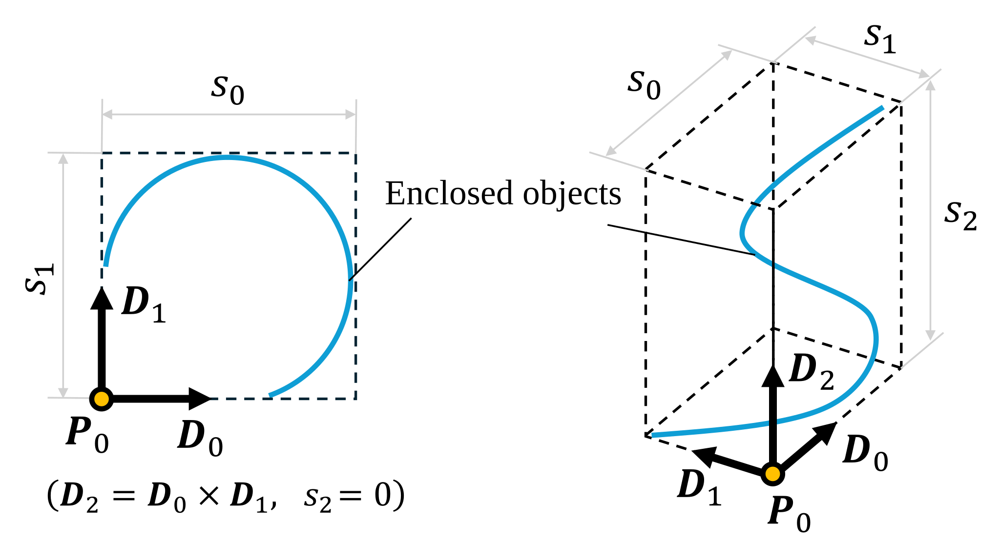

# Bounding Box

Defined in [`igesio/numerics/bounding_box.h`](./../../include/igesio/numerics/bounding_box.h)

## 目次

- [目次](#目次)
- [概要](#概要)
- [メンバ関数](#メンバ関数)
  - [コンストラクタ](#コンストラクタ)
  - [パラメータの設定・取得・変更](#パラメータの設定取得変更)
  - [状態の取得](#状態の取得)
  - [他のオブジェクトとの包含・交差判定](#他のオブジェクトとの包含交差判定)
- [Appendix](#appendix)
  - [BoundingBoxの計算の導出](#boundingboxの計算の導出)
    - [変数の定義](#変数の定義)
    - [BoundingBoxの示す領域と頂点](#boundingboxの示す領域と頂点)
    - [BoundingBox間の包含判定](#boundingbox間の包含判定)
    - [BoundingBoxの統合](#boundingboxの統合)
    - [BoundingBoxと点の包含判定](#boundingboxと点の包含判定)
    - [BoundingBoxと直線の交差判定](#boundingboxと直線の交差判定)

## 概要

　本ドキュメントでは、数値計算におけるバウンディングボックス（Bounding Box）について説明します。バウンディングボックスは、オブジェクトやデータセットの最小限の境界を定義するために使用されます。これにより、空間的な関係や衝突検出、レンダリングの最適化など、多くの応用が可能となります。

　本ライブラリでは、[`igesio/numerics/bounding_box.h`](./../../include/igesio/numerics/bounding_box.h)にバウンディングボックスクラス`BoundingBox`および関連する関数が実装されています。`BoundingBox`クラスは、2Dおよび3D空間でのバウンディングボックスの作成、操作、およびクエリをサポートしています。

　本クラスでは、バウンディングボックスを以下の4種類のパラメータで定義します。

| パラメータ名 | 説明 |
|:---|:---|
| 基準点 $P_0$ | バウンディングボックスの一方の隅を表す点   特にx,y,z軸に直交しているとき、最も座標値の小さい点 |
| 延伸方向 $D_0, D_1, D_2$ | バウンディングボックス（直方体）を形成する、3つの直交する単位ベクトル |
| 辺の長さ $s_0, s_1, s_2$ | 各延伸方向に沿ったバウンディングボックスの辺の長さ   $s_0, s_1 > 0, \quad s_2 \geq 0$ （2次元の場合は $s_2 = 0$） |
| 辺の種類 $\text{type}_0, \text{type}_1, \text{type}_2$ | 各延伸方向に沿った辺の種類を表す列挙型   - `kSegment` : 有限長の線分   - `kRay` : 半無限線（始点から無限に延びる）   - `kLine` : 無限線（両方向に無限に延びる） |

> デフォルトコンストラクタで作成された場合のみ, $P_0 = (0,0,0)$, $s_0 = s_1 = s_2 = 0$ の特殊なバウンディングボックスが生成されます。この場合、`BoundingBox::IsEmpty()`は`true`を返します。

**図1.** 2D/3Dバウンディングボックスの概念図。基準点 $P_0$ から各延伸方向 $D_0, D_1, D_2$ に沿って辺の長さ $s_0, s_1, s_2$ が定義されている。図は $\text{type}_i = \text{kSegment}\ (i = 0,1,2)$ の場合。

## メンバ関数

### コンストラクタ

| 関数名 | 説明 |
|:---|:---|
| `BoundingBox()` | デフォルトコンストラクタ。基準点が原点、大きさが0の空のバウンディングボックスを生成します。 |
| `BoundingBox(control, directions, sizes, is_line)` | 任意方向（2Dまたは3D）のバウンディングボックスを生成します。  - `control`: 基準点 $P_0$  - `directions`: 延伸方向の配列（2D:2要素, 3D:3要素、各要素は単位ベクトル）  - `sizes`: 各方向のサイズ  - `is_line`: 各方向がkLineかどうかを示す配列（省略時は全て`false`）  ※2D/3Dでオーバーロードあり。 |
| `BoundingBox(control, sizes, is_line)` | x,y,z軸（またはx,y軸）に平行なバウンディングボックスを生成します。  - `control`: 基準点 $P_0$  - `sizes`: 各方向のサイズ（3D:3要素, 2D:2要素）  - `is_line`: 各方向がkLineかどうかを示す配列（省略時は全て`false`） |
| `BoundingBox(point1, point2)` | 2点を含むバウンディングボックスを生成します。  - `point1`, `point2`: バウンディングボックスに含まれる2点  - 2点の座標値から、x,y,z軸に平行なバウンディングボックスを自動的に生成  - 同じ座標値を持つ軸が1つの場合は2Dバウンディングボックス（サイズ0の方向を $D_2$ として扱う）  - 例: $x_1=x_2$ の場合は $D_0=e_y, D_1=e_z, D_2=e_x$ |

### パラメータの設定・取得・変更

| 関数名 | 説明 |
|:---|:---|
| `GetControl()`   `SetControl(point)` | 基準点 $P_0$ の設定および取得 |
|  `GetDirections()`   `SetDirections(directions, types)` | 延伸方向 $D_0, D_1, D_2$ の設定および取得   （`types`は`BoundingBox::DirectionType`の配列） |
| `GetSizes()`   `SetSizes(sizes, is_line)`   `SetSize(index, size, is_line)` | 辺の長さ $s_0, s_1, s_2$ の設定および取得   `kRay`および`kLine`の場合は $+\infty$, `kSegment`の場合は $[0, +\infty)$ の値を指定   `is_line`が`true`の場合は`kLine`、`false`の場合は`kRay`または`kSegment`として扱う |
| `GetDirectionTypes()` | 辺の種類 $\text{type}_0, \text{type}_1, \text{type}_2$ の取得   （`types`は`BoundingBox::DirectionType`の配列） |
| `GetIsLines()` | 各辺が`kLine`かどうかの真偽値配列の取得 |
| `Translate(vector)`   `Rotate(matrix)`   `Transform(matrix, vector)` | バウンディングボックスの変換   - 平行移動ベクトル`vector`による基点の移動: $P_0 \leftarrow P_0 + \text{vector}$   - 回転行列`matrix`による基点・延伸方向の回転: $D_i \leftarrow \text{matrix} D_i$ |
| `ExpandToInclude(box)` | 他の`BoundingBox`(`box`)を完全に包含するように拡張する   基底 $D_0, D_1, D_2$ は変更されず、基準点 $P_0$ と辺の長さ $s_0, s_1, s_2$ のみが変更される |

### 状態の取得

| 関数名 | 説明 |
|:---|:---|
| `IsEmpty()` | 空であるか判定   （辺の長さ $s_0 = s_1 = s_2 = 0$ の場合に`true`を返す） |
| `Is2D()`   `Is3D()` | 2Dまたは3Dであるかを判定   （ $s_2 = 0$ の場合に2Dと判定） |
| `IsOnZPlane()` | Z=0平面上にあるかを判定   （`Is2D()==true`かつ $D_2 \parallel e_z$ かつ $P_0.z = 0$ の場合に`true`を返す） |
| `IsFinite()` | （体積が）有限であるかを判定   （全ての辺の種類が`kSegment`の場合に`true`を返す） |
| `GetVertices()` | 全頂点を取得   （無限長の辺がある場合、頂点座標が $\pm \infty$ となる場合がある） |
| `GetFiniteVertices()` | 有限な頂点のみを取得   （無限長の辺がある場合、空のベクトルを返す） |

### 他のオブジェクトとの包含・交差判定

| 関数名 | 説明 |
|:---|:---|
| `Contains(point)` | 3次元空間上の点 `point` を含むかを判定 |
| `Contains(box)` | 他の`BoundingBox`(`box`) を完全に含むかを判定   一部でも外側に出ている場合は`false`を返す |
| `Intersects(start, end, type)` | 直線（線分、半直線を含む）と交差するか判定する   `type`は`BoundingBox::DirectionType`のいずれか |
| `DistanceTo(point)` | 点との最短距離を計算する   点がバウンディングボックス内にある場合は0を返す |

## Appendix

### BoundingBoxの計算の導出

#### 変数の定義

　`BoundingBox`クラスでは、以下の4種類のパラメータを使用してバウンディングボックスを定義します。

- 基準点 $P_0 \in \mathbb{R}^3$ : バウンディングボックスの一方の隅を表す点、特にx,y,z軸に直交しているとき、最も座標値の小さい点
- 延伸方向 $D_0, D_1, D_2 \in \mathbb{R}^3$ : バウンディングボックス（直方体）を形成する3つの直交する方向ベクトル
  - $\|D_i\| = 1\ (i=0,1,2)$
  - $D_0 \cdot D_1 = 0, \quad D_0 \times D_1 = D_2$
- 辺の長さ $s_0, s_1, s_2 \in \mathbb{R}$ : 各延伸方向に沿ったバウンディングボックスの辺の長さ
  - $s_0, s_1 > 0, \quad s_2 \geq 0$ （2次元の場合は $s_2 = 0$）
- 辺の種類 $\text{type}_0, \text{type}_1, \text{type}_2$ : 各延伸方向に沿った辺の種類を表す列挙型
  - `kSegment` : 有限長の線分
  - `kRay` : 半無限線（始点から無限に延びる）
  - `kLine` : 無限線（両方向に無限に延びる）

> コンストラクタで何も指定しない場合（デフォルトコンストラクタ）、辺の長さは $s_0 = s_1 = s_2 = 0$ を満たします。これは`BoundingBox::IsEmpty()`は`true`となる特殊ケースです。以下では明示的には扱いませんが、`BoundingBox::Contains(point)`は常に`false`を返す、などの動作をします。
>
> このケースを含め、`BoundingBox::GetDirectionTypes()`において $\text{type}_i$ は以下のように計算されます
>
> $$\text{type}_i = \begin{cases} \text{kRay} & (s_i = +\infty) \\\ \text{kLine} & (s_i = -\infty) \\\ \text{kSegment} & (\text{otherwise}) \end{cases}$$

#### BoundingBoxの示す領域と頂点

　バウンディングボックスの示す領域は、全ての $\text{type}_i$ が`kSegment`である場合にのみ有限な領域となります。この領域は, $s_2 = 0$ の場合は2次元の長方形, $s_2 > 0$ の場合は3次元の直方体を表します。いずれかの辺が無限長である場合（`kRay`または`kLine`）、バウンディングボックスの示す領域は無限に広がります。この場合、`BoundingBox::GetFiniteVertices()`は空のベクトルを返します。一方、`BoundingBox::GetVertices()`は、座標値が $\pm \infty$ となる頂点も含めて計算します。

　バウンディングボックスの示す領域が長方形または直方体の場合の、バウンディングボックスの頂点は以下のように計算されます。

| 頂点名   $V_{D}$ | 長方形   (頂点数 4) | 直方体   (頂点数 8) |
|:----|:---:|:---:|
| $V_{LFB}$ | $P_0$ | $P_0$ |
| $V_{RFB}$ | $P_0 + s_1 D_1$ | $P_0 + s_1 D_1$ |
| $V_{RBB}$ | $P_0 + s_2 D_2$ | $P_0 + s_2 D_2$ |
| $V_{LBB}$ | $P_0 + s_1 D_1 + s_2 D_2$ | $P_0 + s_1 D_1 + s_2 D_2$ |
| $V_{LFT}$ | - | $P_0 + s_3 D_3$ |
| $V_{RFT}$ | - | $P_0 + s_1 D_1 + s_3 D_3$ |
| $V_{RBT}$ | - | $P_0 + s_2 D_2 + s_3 D_3$ |
| $V_{LBT}$ | - | $P_0 + s_1 D_1 + s_2 D_2 + s_3 D_3$ |

> `GetVertices()`で返される座標値について、例えば $D_0 = (1,0,0), s_0 = +\infty$ かつ $s_1, s_2 < \infty$ の場合、頂点 $V_{RFB}, V_{RBB}, V_{RFT}, V_{RBT}$ のx成分は $+\infty$ となります。また、本ライブラリでは, $s_i = \infty$ かつ $D_{i,j} = 0\ (j = x,y,z)$ の場合、対応する頂点の成分は0に置き換えられます。

#### BoundingBox間の包含判定

　以下の2つのバウンディングボックス $\mathcal{B}\_A$ と $\mathcal{B}\_B$ が与えられたとします。以下をそれぞれ`box_a`、`box_b`とし、`box_a.Contains(box_b)`という判定を行う場合を考えます。 $\mathcal{B}_A \equiv \mathcal{B}_B$ である場合を除き、この操作は**非対称**であることに注意してください。つまり、`box_a.Contains(box_b)` と `box_b.Contains(box_a)` は一般に異なる結果を返します。

$$\begin{aligned}
    \mathcal{B}_A &= (P_{0,A}, D_{0,A}, D_{1,A}, D_{2,A}, s_{0,A}, s_{1,A}, s_{2,A}, \text{type}_{0,A}, \text{type}_{1,A}, \text{type}_{2,A}) \\\
    \mathcal{B}_B &= (P_{0,B}, D_{0,B}, D_{1,B}, D_{2,B}, s_{0,B}, s_{1,B}, s_{2,B}, \text{type}_{0,B}, \text{type}_{1,B}, \text{type}_{2,B})
\end{aligned}$$

 まず, $\mathcal{B}\_{B}$ の各頂点が $\mathcal{B}\_{A}$ に含まれているかを判別するために, $D_{0, A}, D_{1, A}, D_{2, A}$ を基底とする座標系 $\Sigma_A$ に変換します。まず、ワールド座標系 $\Sigma_W = \lbrace e_x, e_y, e_z \rbrace$ における、点 $P$ の座標を $(x_W, y_W, z_W)$, $\Sigma_A$ における座標を $(x_A, y_A, z_A)$ とします。3軸 $D_{0,A}, D_{1,A}, D_{2,A}$ は直交座標系を形成するため、以下の変換が成り立ちます。

$$\begin{aligned}
    &\quad\begin{bmatrix} x_W \\\ y_W \\\ z_W \\\ 1 \end{bmatrix} =
    \begin{bmatrix} D_{0,A} & D_{1,A} & D_{2,A} & P_{0,A} \\\ 0 & 0 & 0& 1\end{bmatrix}
    \begin{bmatrix} x_A \\\ y_A \\\ z_A \\\ 1 \end{bmatrix} =: T_A \\\
    &\Rightarrow \begin{bmatrix} x_A \\\ y_A \\\ z_A \\\ 1 \end{bmatrix} =
    T_A^{-1} \begin{bmatrix} x_W \\\ y_W \\\ z_W \\\ 1 \end{bmatrix}
\end{aligned}$$

　次に $\mathcal{B}\_B$ の各頂点 $V_{D,B}$ を $\Sigma_A$ に変換し、その座標を $V_{D,B}'(x_{D,A}, y_{D,A}, z_{D,A})$ とします。 $x_{D,A}$ が $\mathcal{B}_A$ に含まれる条件は以下のようになります。

$$\begin{cases}
    \text{true} & (\text{type}_{0,A} = \text{kLine}) \\\
    0 \leq x_{D,A} \leq s_{0,A} & (\text{otherwise})
\end{cases}$$

同様に, $y_{D,A}$ および $z_{D,A}$ についても同様の条件が成り立ちます。したがって, $\mathcal{B}_B$ の全ての頂点が $\mathcal{B}_A$ に含まれるための必要十分条件は以下のようになります。

$$\begin{aligned}
    &\forall D: \\\
    &\quad\begin{cases}
        \text{true} & (\text{type}_{0,A} = \text{kLine}) \\\
        0 \leq x_{D,A} \leq s_{0,A} & (\text{otherwise})
    \end{cases} \\\
    &\land \begin{cases}
        \text{true} & (\text{type}_{1,A} = \text{kLine}) \\\
        0 \leq y_{D,A} \leq s_{1,A} & (\text{otherwise})
    \end{cases} \\\
    &\land \begin{cases}
        \text{true} & (\text{type}_{2,A} = \text{kLine}) \\\
        0 \leq z_{D,A} \leq s_{2,A} & (\text{otherwise})
    \end{cases}
\end{aligned}$$

#### BoundingBoxの統合

　[前節](#boundingbox間の包含判定)で述べた2つのバウンディングボックス $\mathcal{B}_A$ と $\mathcal{B}_B$ を考えます。`box_a.ExpandToInclude(box_b)`という操作は、呼び出し元の $\mathcal{B}_A$ を、引数の $\mathcal{B}_B$ を完全には違法するように拡張する操作として定義します。注意点として、この操作は**可換ではありません**。つまり、`box_a.ExpandToInclude(box_b)` と `box_b.ExpandToInclude(box_a)` は一般に異なる結果を返します。

　統合後のバウンディングボックス $\mathcal{B}\_M$ は, $\mathcal{B}\_A$ と同じ延伸方向 $D_{0,M} = D_{0,A}, D_{1,M} = D_{1,A}, D_{2,M} = D_{2,A}$ を持ちますが、基点 $P_{0,M}$ と辺の長さ $s_{0,M}, s_{1,M}, s_{2,M}$ は変化します。

**$\Sigma_A$ における $\mathcal{B}_B$ の区間の計算**

　まず、元の $\mathcal{B}\_A$ の $\Sigma_A$ における $i$ 軸方向の区間 $I_{i,A}$ は以下のように定義されます。

$$I_{i,A} = \begin{cases}
    (-\infty, +\infty) & (\text{type}_{i,A} = \text{kLine}) \\\
    [0, +\infty) & (\text{type}_{i,A} = \text{kRay}) \\\
    [0, s_{i,A}] & (\text{type}_{i,A} = \text{kSegment})
\end{cases}$$

　次に、 $\mathcal{B}_B$ の各頂点 $\text{vertices}_B$ は以下のように定義されます。

$$\text{vertices}_B = \begin{cases}
    \lbrace V_{LFB}, V_{RFB}, V_{RBB}, V_{LBB} \rbrace & (s_{2,B} = 0) \\\
    \lbrace V_{LFB}, V_{RFB}, V_{RBB}, V_{LBB}, V_{LFT}, V_{RFT}, V_{RBT}, V_{LBT} \rbrace & (s_{2,B} > 0)
\end{cases}$$

この各頂点を $\Sigma_A$ に変換し、その座標を $V_{D,B}'(x_{D,A}, y_{D,A}, z_{D,A})$ とします。これらの頂点のうち、各軸方向における最小値と最大値をそれぞれ以下のように定義します。

$$\begin{aligned}
    x_{\text{min},B} &= \min_{V_{D,B}' \in \text{vertices}_B} x_{D,A}, \quad x_{\text{max},B} = \max_{V_{D,B}' \in \text{vertices}_B} x_{D,A} \\\
    y_{\text{min},B} &= \min_{V_{D,B}' \in \text{vertices}_B} y_{D,A}, \quad y_{\text{max},B} = \max_{V_{D,B}' \in \text{vertices}_B} y_{D,A} \\\
    z_{\text{min},B} &= \min_{V_{D,B}' \in \text{vertices}_B} z_{D,A}, \quad z_{\text{max},B} = \max_{V_{D,B}' \in \text{vertices}_B} z_{D,A}
\end{aligned}$$

　このとき, $\mathcal{B}\_M$ が $\Sigma_A$ における $i$ 軸方向に含むべき区間 $I_{i,M}$ は以下のように定義されます。

$$\begin{aligned}
    I_{i,M} &= [i_{\text{min},M}, i_{\text{max},M}] \\\
    &= I_{i,A} \cup [i_{\text{min},B}, i_{\text{max},B}] \\\
    &= \begin{cases}
        (-\infty, +\infty) & (\text{type}_{i,A} = \text{kLine}) \\\
        [\min(0, i_{\text{min},B}), \max(s_{i,A}, i_{\text{max},B})] & (\text{otherwise})
    \end{cases}
\end{aligned}$$

> この数式は厳密には間違っており, $i_{\text{min},B}$ が $-\infty$ または $i_{\text{max},B}$ が $+\infty$ となる場合の取り扱いが必要です（例えば, $[0, \infty]$ は本来 $[0, \infty)$ であるべきです）。しかしながら、実装においてはこの場合も正しく動作するため、ここでは簡潔にするために省略しています。

**$\mathcal{B}_M$ の基点と辺の長さの計算**

　最後に、$\mathcal{B}\_M$ の基点 $P_{0,M}$ と辺の長さ $s_{0,M}, s_{1,M}, s_{2,M}$ は以下のように計算されます。ただし、プログラム上では, $s_{i,M}$ のいずれかが`undefined`となる場合、`box_a.ExpandToInclude(box_b)`は例外を投げます（基底ベクトルを変更する必要があるため）。

$$\begin{aligned}
    P_{0,M} &= P_{0,A} + x_{\text{min},M} D_{0,A} + y_{\text{min},M} D_{1,A} + z_{\text{min},M} D_{2,A} \\\
    s_{0,M} &= \begin{cases}
        \text{undefined} & (x_{\text{min},B} = -\infty \ \land\ x_{\text{max},M} < \infty) \\\
        +\infty & (\text{type}_{0,A} = \text{kLine}) \\\
        \max(0, x_{\text{max},M} - x_{\text{min},M}) & (\text{otherwise})
    \end{cases} \\\
    s_{1,M} &= \begin{cases}
        \text{undefined} & (y_{\text{min},B} = -\infty \ \land\ y_{\text{max},M} < \infty) \\\
        +\infty & (\text{type}_{1,A} = \text{kLine}) \\\
        \max(0, y_{\text{max},M} - y_{\text{min},M}) & (\text{otherwise})
    \end{cases} \\\
    s_{2,M} &= \begin{cases}
        \text{undefined} & (z_{\text{min},B} = -\infty \ \land\ z_{\text{max},M} < \infty) \\\
        +\infty & (\text{type}_{2,A} = \text{kLine}) \\\
        \max(0, z_{\text{max},M} - z_{\text{min},M}) & (\text{otherwise})
    \end{cases}
\end{aligned}$$

#### BoundingBoxと点の包含判定

　バウンディングボックス $\mathcal{B}$ と点 $P$ が与えられたとします。以下をそれぞれ`box`、`point`とし、`box.Contains(point)`という判定を行う場合を考えます。この場合の処理は、`point`を $V_{LFB}$ として扱い、単一の頂点についてのみ[前節](#boundingbox間の包含判定)で述べた方法を適用することで実現されます。

#### BoundingBoxと直線の交差判定

　バウンディングボックス $\mathcal{B}$ と直線 (線分、半直線を含む) $\mathcal{L}$ が与えられたとします。直線 $\mathcal{L}$ は、始点 $P_{\text{start}}$ と終点 $P_{\text{end}}$, および線の種類 $\text{line-type}$ (`kSegment`, `kRay`, `kLine`) によって定義されます。ただし、半直線の場合は $P_{\text{end}}$ が、直線の場合は両方の点は通過点として扱われます。このとき、この直線の方向ベクトル $V_{\text{dir}} \in \mathbb{R}^3$ と直線 $L(t)$ のパラメトリック方程式は以下のように定義されます。

$$\begin{aligned}
    V_{\text{dir}} &= P_{\text{end}} - P_{\text{start}} \\\
    L(t) &= P_{\text{start}} + t V_{\text{dir}}, \quad t \in T_{\text{line}} \\\
    T_{\text{line}} &= \begin{cases}
        [0, 1] & (\text{line-type} = \text{kSegment}) \\\
        [0, +\infty) & (\text{line-type} = \text{kRay}) \\\
        (-\infty, +\infty) & (\text{line-type} = \text{kLine})
    \end{cases}
\end{aligned}$$

　ここで, $\mathcal{B}$ を`box`、直線の始点・終点を`start`, `end`とし、`box.Intersects(start, end, line_type)`という判定を行う場合を考えます。まず、直線 $\mathcal{L}$ を $\mathcal{B}$ の局所座標系 $\Sigma$ (基点 $P_0$, 延伸方向 $D_0, D_1, D_2$ ) における表現 $L'(t)$ に変換します。

$$\begin{aligned}
    \begin{bmatrix} L'(t) \\\ 1 \end{bmatrix} &= T^{-1} \begin{bmatrix} L(t) \\\ 1 \end{bmatrix} \\\
    &= T^{-1} \begin{bmatrix} P_{\text{start}} \\\ 1 \end{bmatrix} + t T^{-1} \begin{bmatrix} V_{\text{dir}} \\\ 0 \end{bmatrix} \\\
    &= P_{\text{start}}' + t V_{\text{dir}}'
\end{aligned}$$

**Slab法による交差判定**

　[BoundingBoxの統合](#boundingboxの統合)で述べたように、バウンディングボックス $\mathcal{B}$ は、その局所座標系 $\Sigma$ において、各軸 $i$ ごとの区間 $I_i$ の積集合として定義されます（下式）。Slab法では、直線 $L'(t)$ が各軸 $i$ ごとのスラブ（区間） $I_i$ と交差するパラメータ $t$ の区間 $[t_{\text{near},i}, t_{\text{far},i}]$ を計算し、これらの区間の積集合を求めることで、直線とバウンディングボックスの交差を判定します。

$$I_i = [i_{\text{min}}, i_{\text{max}}] = \begin{cases}
    (-\infty, +\infty) & (\text{type}_i = \text{kLine}) \\\
    [0, +\infty) & (\text{type}_i = \text{kRay}) \\\
    [0, s_i] & (\text{type}_i = \text{kSegment})
\end{cases}$$

**A: $V_{\text{dir},i}' \neq 0$ の場合**

　直線がSlabの境界面 $i_{\text{min}}$ および $i_{\text{max}}$ と交差するパラメータ $t$ は以下のように計算されます。

$$t_1 = \frac{i_{\text{min}} - P_{\text{start},i}'}{V_{\text{dir},i}'}, \quad t_2 = \frac{i_{\text{max}} - P_{\text{start},i}'}{V_{\text{dir},i}'}$$

ここで, $V_{\text{dir},i}' > 0$ の場合は $t_1$ が近点, $t_2$ が遠点となり, $V_{\text{dir},i}' < 0$ の場合はその逆となります。したがって、区間 $[t_{\text{near},i}, t_{\text{far},i}]$ は以下のように定義されます。ただし, $\text{type}\_i$ が`kRay`または`kLine`の場合, $i_{\text{min}}$ や $i_{\text{max}}$ は無限大となるため $t_1$ や $t_2$ も無限大となることに注意してください。

$$[t_{\text{near},i}, t_{\text{far},i}] = \begin{cases}
    [t_1, t_2] & (V_{\text{dir},i}' > 0) \\\
    [t_2, t_1] & (V_{\text{dir},i}' < 0)
\end{cases}$$

**B: $V_{\text{dir},i}' = 0$ の場合**

　この場合、直線はSlabに対して平行であり、交差するかどうかは直線の始点 $P_{\text{start},i}'$ がSlab内にあるかどうかによって決まります。したがって、区間は以下のように定義されます。

$$[t_{\text{near},i}, t_{\text{far},i}] = \begin{cases}
    [-\infty, +\infty] & (i_{\text{min}} \leq P_{\text{start},i}' \leq i_{\text{max}}) \\\
    \text{undefined} & (\text{otherwise})
\end{cases}$$

**最終的な交差判定**

　バウンディングボックス $\mathcal{B}$ は3つのSlab $I_0, I_1, I_2$ の積集合として定義されるため、(無限)直線 $L'(t)$ とバウンディングボックス $\mathcal{B}$ が交差する $t$ の区間 $[t_{\text{inf,min}}, t_{\text{inf,max}}]$ は以下のように計算されます。

$$\begin{aligned}
    t_{\text{inf,min}} &= \max_{i=0,1,2} t_{\text{near},i} \\\
    t_{\text{inf,max}} &= \min_{i=0,1,2} t_{\text{far},i}
\end{aligned}$$

もしいずれかの $t_{\text{near},i}, t_{\text{far},i}$ が`undefined`である場合、または $t_{\text{inf,min}} > t_{\text{inf,max}}$ である場合、直線 $L'(t)$ とバウンディングボックス $\mathcal{B}$ は交差しないと判定します。そうでない場合、直線 $L'(t)$ とバウンディングボックス $\mathcal{B}$ は交差すると判定します。ただし、この区間は無限直線としての交差を示しているため、元の直線 $\mathcal{L}$ のパラメータ範囲 $T_{\text{line}}$ とも交差するかどうかを確認する必要があります。最終的な交差判定は以下のように行います。

$$\begin{aligned}
    t_{\text{final,min}} &= \max(t_{\text{inf,min}}, \min T_{\text{line}}) \\\
    t_{\text{final,max}} &= \min(t_{\text{inf,max}}, \max T_{\text{line}})
\end{aligned}$$

したがって、`box.Intersects(start, end, line_type)`は、この区間が成り立つ場合、すなわち $t_{\text{final,min}} \leq t_{\text{final,max}}$ である場合に`true`を返し、そうでない場合に`false`を返します。
