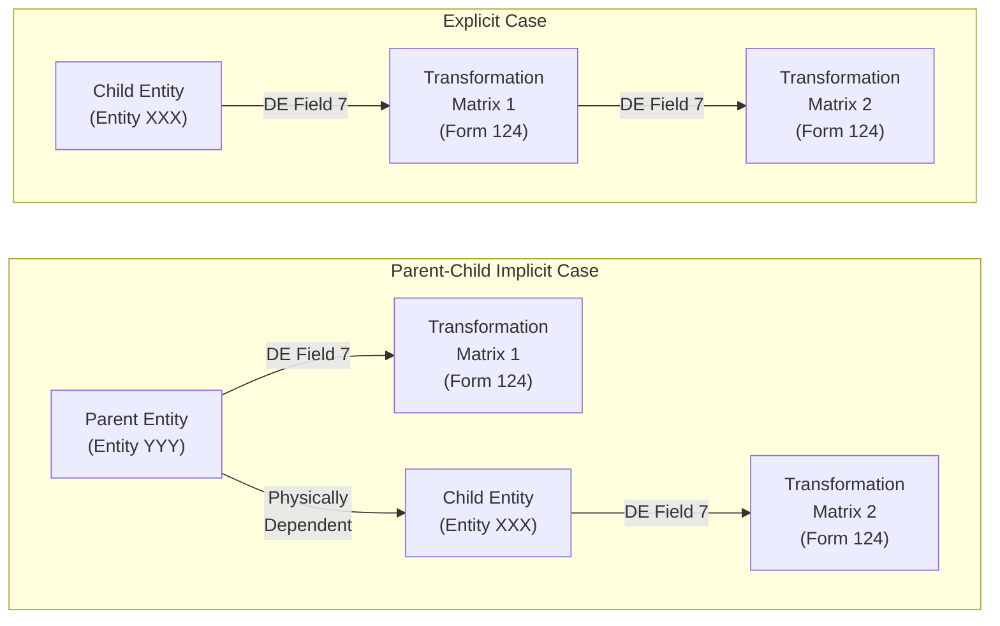

# 方針

　以下の方針は、IGES 5.3の仕様書に基づくものである。実装に際して、以下に示す方針に従うようにする。

　すべてのセクションにおいて、末尾の`(Section X.Y.Z)`は、その記述のソースとなるIGES 5.3の仕様書のセクション番号を示す。

## 目次

- [目次](#目次)
- [ライブラリ全体](#ライブラリ全体)
  - [データ型](#データ型)
- [エンティティ](#エンティティ)
  - [モデルの情報構造の概念](#モデルの情報構造の概念)
    - [従属状態 (Subordinate Entity Switch)](#従属状態-subordinate-entity-switch)
    - [ディレクトリエントリセクションにおける指定](#ディレクトリエントリセクションにおける指定)
  - [座標系と変換行列](#座標系と変換行列)
    - [変換行列の適用](#変換行列の適用)
- [Appendix](#appendix)
  - [エンティティタイプと分類](#エンティティタイプと分類)
    - [エンティティタイプと分類の一覧](#エンティティタイプと分類の一覧)

## ライブラリ全体

- [ ] 不正なレコード構造を持つか、本仕様書で定義されたデータを含まないために処理出来ない場合、エラーメッセージを発効する必要がある (Section 1.4.7)。
- [ ] ライブラリは、ユーザが編集しなかったエンティティに影響を与えてはならない (Section 1.4.7.1)。ただし、これはポインタ、行番号、エンティティ数などの、他のエンティティを編集した際に更新される情報を除く。

### データ型

　IGES 5.3では、フィールド値に対して6種類のデータ型が定義されている (Section Section 2.2.2)。

| データ型 | 説明 |
| :---: | :--- |
| 整数 (固定小数点値) | 絶対値が $2^{N-1} - 1$ を越えない範囲の、正、負、ゼロの値をとる整数値。ここで、$N$ はグローバルパラメータ7で定義されるビット数。  例) `1` `150` `2147483647` `+3451` `0` `-10` `-2147483647` |
| 実数 (浮動小数点値) | `[<符号>]<整数部>.<小数部>[<指数部>]`の形式で表される実数値。整数部と小数部は、どちらか一方のみであれば省略可能である。指数部は、`E`または`D`の後に整数値を続けることで表され、前者が単精度、後者が倍精度を表す。単精度の場合はグローバルセクション8～9で、倍精度の場合はグローバルセクション10～11で定義される値を越えてはならない。  例) `1.0` `-0.0001` `+3.14159E+2` `-2.71828D-1` `.15` `-1.E+3` |
| 文字列 | 制御文字 (`\x00`～`\x1F`) を除くASCII文字の並び。冒頭に文字列全体の文字数を`<文字数>H`の形式で付加する。  例) `5HHello` `3HHi!` `10HABC ., ; A` |
| ポインタデータ | $-9999999$ から $9999999$ の範囲の整数値。ディレクトリエントリまたはパラメータデータセクションにおける74～80文字目の値を指す。負値の場合はその絶対値が行番号を指し、ゼロ値を持つポインタはヌルポインタを表す。|
| 言語 ステートメント | `<文字数>H`を含まない、制御文字 (`\x00`～`\x1F`) を除くASCII文字の並び。|
| 論理データ | 論理データ型は「TRUE」と「FALSE」の2つの値のみを持つ。符号なし整数0はFALSEを表し、符号なし整数1はTRUEを表す。|

そのほか以下の指令に従う。

- 空白は文字列と言語ステートメントにおいてのみ値となり、それ以外のデータ型ではデフォルト値として扱われる。
- 数値フィールドの先頭の空白は無視する。また、グローバルセクション1に関わらず、数値内に`,`を含めてはならない。

## エンティティ

　ファイル内で、データの基本単位はエンティティであり、**幾何学的エンティティ**と**非幾何学的エンティティ**に分類される (Section 1.5)。

- 幾何学的エンティティ：製品の物理的形状を定義する。
- 非幾何学的エンティティ：注釈、定義、構造の指定など、主に表示メカニズムに関連する情報を定義する。

### モデルの情報構造の概念

　製品の幾何学的モデルは、一般的に互いに独立して定義されるため、以下に示すエンティティがそれらの関係を補強する (Section 1.6)。

**表**. 情報構造を定義するエンティティ. "エンティティ番号"列の名前は、全て"Entity"を省略している (e.g. "Property Entity (Type 406)" -> "Property (406)")。

| タイプ | エンティティ番号 | 説明 |
|:---:|:---:|:---|
| プロパティ | Property (406) | 非幾何学的数値・テキストを、それを参照するエンティティに関連付ける。レベル番号による関連付けも存在 (後述)。 |
| 関連性 | Associativity Definition (302) Group Associativity (402) | 複数のエンティティを互いに関連づける。 |
| ビュー | View (410) View Visible Associativity (402, Form 3,4,19) | 幾何学的モデルの選択されたサブセットの2次元投影を描画する。 |
| 図面 | Drawing (404) | 人間の表示のための、ビューと注釈の組み合わせ。 |
| 変換行列 | Transformation Matrix (124) | 任意のエンティティに適用される、平行移動と回転を定義する。 |
| 実装者定義 | - | 実装者が定義したエンティティ。 |

> レベル番号による関連付け：
>
> プロパティエンティティが指定されていない場合には、プロパティエンティティのレベル番号を共有するすべてのエンティティが、そのプロパティを参照する。

#### 従属状態 (Subordinate Entity Switch)

　IGES 5.3では、エンティティの従属状態 (ファイル内の他のエンティティにより参照されるかどうか) を、ディレクトリエントリセクションの9番目のフィールド（1行目、67～68文字目）で指定する。エンティティの従属状態は以下の4つの値のいずれかである (Section 2.2.4.4)。

| 値 | タイプ | 説明 |
|:---:|:---:|:---|
| `00` | Independent | エンティティは単独で存在し、他のエンティティから参照されない。 |
| `01` | Physically Dependent | エンティティは他のエンティティから参照され、そのエンティティの変換 (行列) を継承する。 |
| `02` | Logically Dependent | エンティティは単独で存在できるが、他のエンティティと合わせてグループ化される。 |
| `03` | Both Dependencies | Physically DependentとLogically Dependentの両方の状態を持つ。 |

　エンティティAがエンティティBに従属するのは、エンティティBのパラメータデータエントリにおいて、エンティティAを参照する場合のみである。各エンティティのエントリの後に付加される追加ポインタ（バックポインタ; Section 2.2.4.5.2）は、この定義の目的では無視される。

#### ディレクトリエントリセクションにおける指定

　ディレクトリエントリセクションにおいては、以下のポインタが定義される (Section 2.2.4.4)。

**表**. ディレクトリエントリセクションにおいて定義されるポインタ. `L1C3`は、そのエンティティに関する1行目の17～24文字目の数値を指す。

| 位置 | フィールド名 | 説明 |
|:---:|:---:|:---|
| `L1C2` | Parameter Data | (1) このエンティティの最初のパラメータデータレコードのシーケンス番号 (2) または0 |
| `L1C3` | Structure | (1) 負値の場合、その絶対値はスキーマを指定する構造定義エンティティを参照する (2) または0 ※このフィールドは、以下のエンティティタイプでのみ負値を取る:   - Macro Instance (UNTESTED; 600-699, 10000-99999)   - Associativity Instance (402, Forms 5001-9999) Attribute Table Instance (422, Forms 0-1) |
| `L1C4` | Line Font Pattern | (1) 0以上の値は、後述する線種パターンを使用して表示する (2) 負値の場合、その絶対値は線種パターンを定義するLine Font Definition (304)を参照する |
| `L1C5` | Level | (1) 正値の場合、このエンティティに関連付けられるレベル番号を示す (2) 負値の場合、その絶対値はレベル番号を定義するDefinition Levels Property (460, Form 1)を参照する (3) または0 (デフォルト) |
| `L1C6` | View | (1)0の場合、 エンティティは全てのビューで可視であり、かつ表示特性が同じである (2) 正値の場合、その値は以下のどちらかのエンティティを参照する   - View (402): エンティティが1つのビューでのみ可視である場合   - Views Visible Associativity (402, Form 3,4,19): それ以外の場合、特に表示特性が全てのビューで同じでない場合、Form 4または19を使用する |
| `L1C7` | Transformation Matrix | (1) 正値の場合、Transformation Matrix (124)を参照する (2) 0の場合、無変換 (単位回転行列とゼロ変換ベクトル) を意味する |
| `L1C8` | Label Display Assoc. | (1) 正値の場合、Label Display Associativity (402, Form 5) を参照する (2) 0の場合は参照しない |
| `L2C3` | Color Number | (1) 0以上の値は、後述する色番号を使用して表示する (2) 負値の場合、その絶対値はColor Definition (314)を参照する |

> 線種パターン：
> | 値 | パターン |
> |:---:|:---:|
> | 0 | パターン未指定 (デフォルト) |
> | 1 | 実線 |
> | 2 | 破線 |
> | 3 | ファントム線 |
> | 4 | 中心線 |
> | 5 | 点線 |

> 色番号：
> | 値 | 色 |
> |:---:|:---:|
> | 0 | 色未指定 (デフォルト) |
> | 1 | 黒 |
> | 2 | 赤 |
> | 3 | 緑 |
> | 4 | 青 |
> | 5 | 黄 |
> | 6 | マゼンタ |
> | 7 | シアン |
> | 8 | 白 |

### 座標系と変換行列

　IGES 5.3では、座標系としてモデル空間と定義空間の2つが存在する (Section 3.2.2)。定義空間からモデル空間への変換において、Transformation Matrix (124)エンティティが使用される。

| 座標系 | 説明 |
| --- | --- |
| モデル空間  $(X, Y, Z)$ | 　表現される「モデル」（または製品）が配置される、右手系の直交座標系であり、モデルに対して固定されている。 |
| 定義空間  $(X_T, Y_T, Z_T)$ | 　エンティティごとに存在する (可能性のある) 右手系の直交座標系である。原点はモデル空間内の任意の位置に配置され、また向きも任意である。ただし、長さの単位はモデル空間と同じである。  　幾何エンティティが単一平面内に含まれる場合、基本的には $Z_T = 0$ の平面に配置される。 |

#### 変換行列の適用

　エンティティは、基本的にディレクトリエントリセクションのフィールド7で指定される変換エンティティによって、モデル空間に配置される。複数の変換エンティティによって操作されるケースは以下の2つのケースのみである (Section 3.2.3)。以下、エンティティXXXを構成する点の集合の要素を $\bm{p}_i = [x_i\; y_i\; z_i\; 1]^\top$、(同時) 変換行列 $j$ を $M_j$ とする。

| ケース | 説明 |
| --- | --- |
| 明示的なケース | エンティティXXXがDEフィールド7で指定する変換行列1が、同様にDEフィールドで別の変換行列2を指定する場合。このとき、変換は以下の式で定義される:  $$\bm{p}_i' = M_2 M_1 \bm{p}_i$$|
| 親子の暗黙的なケース | エンティティXXXが、エンティティYYYに物理的に従属していて、それぞれDEフィールド7で変換行列2,1を指定する場合。このとき、変換は以下の式で定義される:  $$\bm{p}_i' = M_1 M_2 \bm{p}_i$$ |

## Appendix

　本節では、本文に記述するには長いために省略した内容を補足する。

### エンティティタイプと分類

　IGES 5.3では、エンティティは以下の5つのエンティティクラスに分類される (Section 3.1)。

| クラス | 説明 |
| --- | --- |
| Curve and Surface Geometry | 曲線と曲面の幾何学的エンティティ |
| Constructive Solid Geometry (CSG) | CSGのプリミティブエンティティであり、ソリッドモデラで使用される基本構成要素 |
| Boundary Representation Solid (B-Rep) | 境界表現ソリッドエンティティには、ソリッドモデル用に面や辺など、いくつかのトポロジーエンティティが定義される。面のデータなどは一部のCurve and Surface Geometryエンティティで定義される。 |
| Annotation | 他のエンティティを使用して構成される注釈エンティティ。注釈は、図面やビューの情報を提供するために使用される。 |
| Structure | グルーピングしたり、オブジェクト間の論理的接続性を定義するなどの、エンティティの構造を定義するためのエンティティ |

#### エンティティタイプと分類の一覧

**表**. エンティティタイプと分類. "C&S"はCurve and Surface Geometryを示す。また、表中の"#20-40"はForms 20～40を指す

| No. | Type | Class | Pointer | Implicit[4] |
|:---:|------|-------|:---:|:---:|
|   0 | Null | Structure | - | - |
| 100 | Circular Arc | C&S | ^ | ^ |
| 102 | Composite Curve | ^ | ✅[3a] | ✅ all constituents |
| 104 | Conic Arc | ^ | - | - |
| 106 | Copious Data | Annotation 　(#20-40) C&S 　(Others) | ^ | ^ |
| 108 | Plane | C&S | ✅[3a] (#-1,#1) | ✅ bounding curve |
| 110 | Line | ^ | - | - |
| 112 | Parametric Spline Curve | ^ | ^ | ^ |
| 114 | Parametric Spline Surface | ^ | ^ | ^ |
| 116 | Point | ^ | ✅[3b] | ✅ display symbol|
| 118 | Ruled Surface | ^ | ✅[3a] | ✅ rail curves |
| 120 | Surface Of Revolution | ^ | ^ | ✅ axis, generatrix |
| 122 | Tabulated Cylinder | ^ | ^ | ✅ directrix |
| 123 | Direction | [2] | - | - |
| 124 | Transformation Matrix | C&S | ^ | ^ |
| 125 | Flash | ^ | ✅[3b] | ✅ defining entity |
| 126 | Rational B Spline Curve | ^ | - | - |
| 128 | Rational B Spline Surface | ^ | ^ | ^ |
| 130 | Offset Curve | ^ | ✅[3a] ✅[3b] | ✅ base curve |
| 132 | Connect Point | Structure | ✅[3c] | ✅ display symbol Text Display Templates |
| 134 | Node | ^ | ✅[3b] | - |
| 136 | Finite Element | ^ | ✅[3a] | ^ |
| 138 | Nodal Displacement and Rotation | ^ | ^ | ^ |
| 140 | Offset Surface | C&S | ^ | ✅ surface |
| 141 | Boundary | ^ | ^ | - |
| 142 | Curve on a Parametric Surface | ^ | ^ | ^ |
| 143 | Bounded Surface | ^ | ^ | ^ |
| 144 | Trimmed Surface | ^ | ✅[3a] ✅[3b] | ✅ surface |
| 146 | Nodal Results | Structure | ✅[3a] | - |
| 148 | Element Results | ^ | ✅[3a] | ^ |
| 150 | Block | CSG | - | ^ |
| 152 | Right Angular Wedge | ^ | ^ | ^ |
| 154 | Right Circular Cylinder | ^ | ^ | ^ |
| 156 | Right Circular Cone | ^ | ^ | ^ |
| 158 | Sphere | ^ | ^ | ^ |
| 160 | Torus | ^ | ^ | ^ |
| 162 | Solid Of Revolution | ^ | ✅[3a] | ^ |
| 164 | Solid Of Linear Extrusion | ^ | ^ | ^ |
| 168 | Ellipsoid | ^ | - | ^ |
| 180 | Boolean Tree | CSG[1] | ✅[3d] | ^ |
| 182 | Selected Component | ^ | ✅[3a] | ^ |
| 184 | Solid Assembly | ^ | ^ | ^ |
| 186 | Manifold Solid B-Rep Object | B-Rep | ^ | ^ |
| 190 | Plane Surface | C&S[2] | ^ | ^ |
| 192 | Right Circular Cylinder Surface | ^ | ^ | ^ |
| 194 | Right Circular Conical Surface | ^ | ^ | ^ |
| 196 | Spherical Surface | ^ | ^ | ^ |
| 198 | Toroidal Surface | ^ | ^ | ^ |
| 202 | Angular Dimension | Annotation | ✅[3a] ✅[3b] | ✅ all subordinate entities |
| 204 | Curve Dimension | ^ | ^ | - |
| 206 | Diameter Dimension | ^ | ^ | ✅ all subordinate entities |
| 208 | Flag Note | ^ | ✅[3a] | ^ |
| 210 | General Label | ^ | ^ | ^ |
| 212 | General Note | ^ | ✅[3d] | - |
| 213 | New General Note | ^ | ^ | ^ |
| 214 | Leader Arrow | ^ | - | ^ |
| 216 | Linear Dimension | ^ | ✅[3a] ✅[3b] | ✅ all subordinate entities |
| 218 | Ordinate Dimension | ^ | ✅[3a] | ^ |
| 220 | Point Dimension | ^ | ^ | ^ |
| 222 | Radius Dimension | ^ | ✅[3a] ✅[3b] | ^ |
| 228 | General Symbol | ^ | ✅[3a] | ^ |
| 230 | Sectioned Area | ^ | ^ | ^ |
| 302 | Associativity Definition | Structure | - | - |
| 304 | Line Font Definition | ^ | ✅[3a] (#1) | ^ |
| 306 | Macro Definition | ^ | - | ^ |
| 308 | Subfigure Definition | ^ | ✅[3a] | ✅ all associated entities |
| 310 | Text Font | ^ | ✅[3d] | - |
| 312 | Text Display Template | ^ | ^ | ^ |
| 314 | Color Definition | ^ | - | ^ |
| 316 | Units Data | ^ | ^ | ^ |
| 320 | Network Subfigure Definition | ^ | ✅[3a] ✅[3b] | ✅ all associated entities Text Display Templates and Connect Points |
| 322 | Attribute Table Definition | ^ | ✅[3a] (#2) | - |
| 402 | Associativity Instance | ^ | ✅[3a] | ^ |
| 404 | Drawing | ^ | ✅[3a] | ✅ all annotation entities |
| 406 | Property | ^ | - | - |
| 408 | Singular Subfigure Instance | ^ | ✅[3a] | ^ |
| 410 | View | ^ | ✅[3b] (#0) | ^ |
| 412 | Rectangular Array Subfigure Instance | ^ | ✅[3a] | ^ |
| 414 | Circular Array Subfigure Instance | ^ | ^ | ^ |
| 416 | External Reference | ^ | - | ^ |
| 418 | Nodal Load Constraint | ^ | ✅[3a] | ^ |
| 420 | Network Subfigure Instance | ^ | ✅[3a] ✅[3b] ✅[3c] | ^ |
| 422 | Attribute Table Instance | ^ | - | ^ |
| 430 | Solid Instance | CSG[1] | ✅[3a] | ^ |
| 502 | Vertex | B-Rep | - | ^ |
| 504 | Edge | ^ | ✅[3a] | ^ |
| 508 | Loop | ^ | ^ | ^ |
| 510 | Face | ^ | ^ | ^ |
| 514 | Shell | ^ | ^ | ^ |

> Note [1]: プリミティブエンティティ (これ以外のCSGエンティティ) またはB-Repオブジェクトを統合し、より複雑なCSGエンティティに結合するために使用される。

> Note [2]: B-Repソリッドモデル用の、解析的面エンティティとしても使用される。

> Note [3]: "Pointer"列の"✅"は、パラメータデータセクションにおいて、エンティティが他のエンティティを参照することを示す。ただし、追加ポインタは除く。ただし、[3b]から[3d]については、パラメータの値により、ポインターであるかどうかが異なる。
> - [3a] 数値に関わらず、常にポインタである。
> - [3b] 数値が0の場合はポインタでない。
> - [3c] 数値がnullの場合はポインタでない。
> - [3d] 数値が負の場合、その絶対値がポインタである。

> Note [4]: "Implicit"列は、パラメータデータセクションにおいてポインターの指定がある場合に、その指定先と[親子の暗黙的なケース](#変換行列の適用)を満たすかどうかを示す (Section 3.2.3)。
